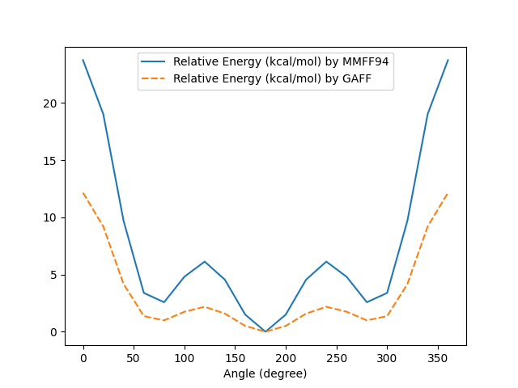

[TOC]

# BIM2005: Homework I

> In this report, the 'we' term may be preferred by convention rather than by a result of collaboration.

## Preparation

- Headers are added to to the initial .gzmat code as below.

```.gzmat
#

C2H4Cl2

0 1
	C
	C 1 1.54
	H 1 1.0 2 109.5
	H 1 1.0 2 109.5 3 120.0
	Cl 1 1.67 2 109.5 4 120.0
	H 2 1.0 1 109.5 5 -120.0
	H 2 1.0 1 109.5 5 120.0
	Cl 2 1.67 1 109.5 5 0.0
```

## Procedure

> Details of implementation could be found in the GitHub repository [zcorn2017/BIM2001-HWK1 (github.com)](https://github.com/zcorn2017/BIM2001-HWK1).
>
> **The comments to and styles of the code has been organised well to make it highly readable.**

1. We [added the headers to the code manually](#Preparation) for it to be recognised by [OpenBabel][]
2. We modify the code in order to change $\tau(Cl^8-C^2-C^1-Cl^{5})$ by $20\times N\degree$. (As the reference plane, which is the $2-1-5$ plane, is the same for the last three definitions of atoms, we only need to change the dihedral angles of the last three lines by an increment of $20\degree$.)
3. We convert the code from the .gzmat format to the .xyz. one via [the Python bindings to the OpenBabel C++ library][bindings].
4. During the conversion, we use the python bindings to set up the force fields for MMFF94 and GAFF respectively, then calculating the energy, where the analysis process is recorded (See [Appendix I](#II-Analysis-of the Energy)). 
5. The energy are stored in lists for further analysis.
6. We repeat the steps 2-5 for $N = 0\dots18$, which means 19 times.
7. All the .xyz and .gzmat files could be found in [Reuslts I](#I-.gzmat-and-.xyz-Files-for-a-Specific-Torsion-Angle). 
8. Pre-processing of the data includes conversion between kcal/mol and kJ/mol and calculations of the relative energy.
9. A table where all the data for the angles is established by [Pandas][] and it could be found in [Results II](#II-Energy-Overview).
10. A lineplot of relative energy in kcal/mol with respect to angle in degrees is displayed by [Seaborn][https://seaborn.pydata.org/]. For details, please refer to [Result III](#III-Lineplot-of-Relative-Energy-in-Kcal-by-MMFF94-and-GAFF)

## Results
### I .gzmat and .xyz Files for a Specific Torsion Angle

#### Torsion Angle at 0$\degree$


- ./CODE/C2H4Cl2_0_degrees.gzmat

```gzmat

#

C2H4Cl2-0-degrees

0 1
C
C 1 1.54
H 1 1.0 2 109.5
H 1 1.0 2 109.5 3 120.0
Cl 1 1.67 2 109.5 4 120.0
H 2 1.0 1 109.5 5 -120.0
H 2 1.0 1 109.5 5 120.0
Cl 2 1.67 1 109.5 5 0.0


```

- ./CODE/C2H4Cl2_0_degrees.xyz

```xyz
8
./CODE/C2H4Cl2_0_degrees.gzmat
C          0.00000        0.00000        0.00000
C          1.54000        0.00000        0.00000
H         -0.33381        0.00000       -0.94264
H         -0.33381       -0.81635        0.47132
Cl        -0.55746        1.36331        0.78711
H          1.87381        0.00000       -0.94264
H          1.87381       -0.81635        0.47132
Cl         2.09746        1.36331        0.78711

```

#### Torsion Angle at 20$\degree$


- ./CODE/C2H4Cl2_20_degrees.gzmat

```gzmat

#

C2H4Cl2-20-degrees

0 1
C
C 1 1.54
H 1 1.0 2 109.5
H 1 1.0 2 109.5 3 120.0
Cl 1 1.67 2 109.5 4 120.0
H 2 1.0 1 109.5 5 -100.0
H 2 1.0 1 109.5 5 140.0
Cl 2 1.67 1 109.5 5 20.0


```

- ./CODE/C2H4Cl2_20_degrees.xyz

```xyz
8
./CODE/C2H4Cl2_20_degrees.gzmat
C          0.00000        0.00000        0.00000
C          1.54000        0.00000        0.00000
H         -0.33381        0.00000       -0.94264
H         -0.33381       -0.81635        0.47132
Cl        -0.55746        1.36331        0.78711
H          1.87381        0.32240       -0.88579
H          1.87381       -0.92832        0.16369
Cl         2.09746        1.01188        1.20592

```

#### Torsion Angle at 40$\degree$


- ./CODE/C2H4Cl2_40_degrees.gzmat

```gzmat

#

C2H4Cl2-40-degrees

0 1
C
C 1 1.54
H 1 1.0 2 109.5
H 1 1.0 2 109.5 3 120.0
Cl 1 1.67 2 109.5 4 120.0
H 2 1.0 1 109.5 5 -80.0
H 2 1.0 1 109.5 5 160.0
Cl 2 1.67 1 109.5 5 40.0


```

- ./CODE/C2H4Cl2_40_degrees.xyz

```xyz
8
./CODE/C2H4Cl2_40_degrees.gzmat
C          0.00000        0.00000        0.00000
C          1.54000        0.00000        0.00000
H         -0.33381        0.00000       -0.94264
H         -0.33381       -0.81635        0.47132
Cl        -0.55746        1.36331        0.78711
H          1.87381        0.60592       -0.72211
H          1.87381       -0.92832       -0.16369
Cl         2.09746        0.53841        1.47927

```

#### Torsion Angle at 60$\degree$


- ./CODE/C2H4Cl2_60_degrees.gzmat

```gzmat

#

C2H4Cl2-60-degrees

0 1
C
C 1 1.54
H 1 1.0 2 109.5
H 1 1.0 2 109.5 3 120.0
Cl 1 1.67 2 109.5 4 120.0
H 2 1.0 1 109.5 5 -60.0
H 2 1.0 1 109.5 5 180.0
Cl 2 1.67 1 109.5 5 60.0


```

- ./CODE/C2H4Cl2_60_degrees.xyz

```xyz
8
./CODE/C2H4Cl2_60_degrees.gzmat
C          0.00000        0.00000        0.00000
C          1.54000        0.00000        0.00000
H         -0.33381        0.00000       -0.94264
H         -0.33381       -0.81635        0.47132
Cl        -0.55746        1.36331        0.78711
H          1.87381        0.81635       -0.47132
H          1.87381       -0.81635       -0.47132
Cl         2.09746       -0.00000        1.57421

```

#### Torsion Angle at 80$\degree$


- ./CODE/C2H4Cl2_80_degrees.gzmat

```gzmat

#

C2H4Cl2-80-degrees

0 1
C
C 1 1.54
H 1 1.0 2 109.5
H 1 1.0 2 109.5 3 120.0
Cl 1 1.67 2 109.5 4 120.0
H 2 1.0 1 109.5 5 -40.0
H 2 1.0 1 109.5 5 200.0
Cl 2 1.67 1 109.5 5 80.0


```

- ./CODE/C2H4Cl2_80_degrees.xyz

```xyz
8
./CODE/C2H4Cl2_80_degrees.gzmat
C          0.00000        0.00000        0.00000
C          1.54000        0.00000        0.00000
H         -0.33381        0.00000       -0.94264
H         -0.33381       -0.81635        0.47132
Cl        -0.55746        1.36331        0.78711
H          1.87381        0.92832       -0.16369
H          1.87381       -0.60592       -0.72211
Cl         2.09746       -0.53841        1.47927

```

#### Torsion Angle at 100$\degree$


- ./CODE/C2H4Cl2_100_degrees.gzmat

```gzmat

#

C2H4Cl2-100-degrees

0 1
C
C 1 1.54
H 1 1.0 2 109.5
H 1 1.0 2 109.5 3 120.0
Cl 1 1.67 2 109.5 4 120.0
H 2 1.0 1 109.5 5 -20.0
H 2 1.0 1 109.5 5 220.0
Cl 2 1.67 1 109.5 5 100.0


```

- ./CODE/C2H4Cl2_100_degrees.xyz

```xyz
8
./CODE/C2H4Cl2_100_degrees.gzmat
C          0.00000        0.00000        0.00000
C          1.54000        0.00000        0.00000
H         -0.33381        0.00000       -0.94264
H         -0.33381       -0.81635        0.47132
Cl        -0.55746        1.36331        0.78711
H          1.87381        0.92832        0.16369
H          1.87381       -0.32240       -0.88579
Cl         2.09746       -1.01188        1.20592

```

#### Torsion Angle at 120$\degree$


- ./CODE/C2H4Cl2_120_degrees.gzmat

```gzmat

#

C2H4Cl2-120-degrees

0 1
C
C 1 1.54
H 1 1.0 2 109.5
H 1 1.0 2 109.5 3 120.0
Cl 1 1.67 2 109.5 4 120.0
H 2 1.0 1 109.5 5 0.0
H 2 1.0 1 109.5 5 240.0
Cl 2 1.67 1 109.5 5 120.0


```

- ./CODE/C2H4Cl2_120_degrees.xyz

```xyz
8
./CODE/C2H4Cl2_120_degrees.gzmat
C          0.00000        0.00000        0.00000
C          1.54000        0.00000        0.00000
H         -0.33381        0.00000       -0.94264
H         -0.33381       -0.81635        0.47132
Cl        -0.55746        1.36331        0.78711
H          1.87381        0.81635        0.47132
H          1.87381        0.00000       -0.94264
Cl         2.09746       -1.36331        0.78711

```

#### Torsion Angle at 140$\degree$


- ./CODE/C2H4Cl2_140_degrees.gzmat

```gzmat

#

C2H4Cl2-140-degrees

0 1
C
C 1 1.54
H 1 1.0 2 109.5
H 1 1.0 2 109.5 3 120.0
Cl 1 1.67 2 109.5 4 120.0
H 2 1.0 1 109.5 5 20.0
H 2 1.0 1 109.5 5 260.0
Cl 2 1.67 1 109.5 5 140.0


```

- ./CODE/C2H4Cl2_140_degrees.xyz

```xyz
8
./CODE/C2H4Cl2_140_degrees.gzmat
C          0.00000        0.00000        0.00000
C          1.54000        0.00000        0.00000
H         -0.33381        0.00000       -0.94264
H         -0.33381       -0.81635        0.47132
Cl        -0.55746        1.36331        0.78711
H          1.87381        0.60592        0.72211
H          1.87381        0.32240       -0.88579
Cl         2.09746       -1.55030        0.27336

```

#### Torsion Angle at 160$\degree$


- ./CODE/C2H4Cl2_160_degrees.gzmat

```gzmat

#

C2H4Cl2-160-degrees

0 1
C
C 1 1.54
H 1 1.0 2 109.5
H 1 1.0 2 109.5 3 120.0
Cl 1 1.67 2 109.5 4 120.0
H 2 1.0 1 109.5 5 40.0
H 2 1.0 1 109.5 5 280.0
Cl 2 1.67 1 109.5 5 160.0


```

- ./CODE/C2H4Cl2_160_degrees.xyz

```xyz
8
./CODE/C2H4Cl2_160_degrees.gzmat
C          0.00000        0.00000        0.00000
C          1.54000        0.00000        0.00000
H         -0.33381        0.00000       -0.94264
H         -0.33381       -0.81635        0.47132
Cl        -0.55746        1.36331        0.78711
H          1.87381        0.32240        0.88579
H          1.87381        0.60592       -0.72211
Cl         2.09746       -1.55030       -0.27336

```

#### Torsion Angle at 180$\degree$


- ./CODE/C2H4Cl2_180_degrees.gzmat

```gzmat

#

C2H4Cl2-180-degrees

0 1
C
C 1 1.54
H 1 1.0 2 109.5
H 1 1.0 2 109.5 3 120.0
Cl 1 1.67 2 109.5 4 120.0
H 2 1.0 1 109.5 5 60.0
H 2 1.0 1 109.5 5 300.0
Cl 2 1.67 1 109.5 5 180.0


```

- ./CODE/C2H4Cl2_180_degrees.xyz

```xyz
8
./CODE/C2H4Cl2_180_degrees.gzmat
C          0.00000        0.00000        0.00000
C          1.54000        0.00000        0.00000
H         -0.33381        0.00000       -0.94264
H         -0.33381       -0.81635        0.47132
Cl        -0.55746        1.36331        0.78711
H          1.87381       -0.00000        0.94264
H          1.87381        0.81635       -0.47132
Cl         2.09746       -1.36331       -0.78711

```

#### Torsion Angle at 200$\degree$


- ./CODE/C2H4Cl2_200_degrees.gzmat

```gzmat

#

C2H4Cl2-200-degrees

0 1
C
C 1 1.54
H 1 1.0 2 109.5
H 1 1.0 2 109.5 3 120.0
Cl 1 1.67 2 109.5 4 120.0
H 2 1.0 1 109.5 5 80.0
H 2 1.0 1 109.5 5 320.0
Cl 2 1.67 1 109.5 5 200.0


```

- ./CODE/C2H4Cl2_200_degrees.xyz

```xyz
8
./CODE/C2H4Cl2_200_degrees.gzmat
C          0.00000        0.00000        0.00000
C          1.54000        0.00000        0.00000
H         -0.33381        0.00000       -0.94264
H         -0.33381       -0.81635        0.47132
Cl        -0.55746        1.36331        0.78711
H          1.87381       -0.32240        0.88579
H          1.87381        0.92832       -0.16369
Cl         2.09746       -1.01188       -1.20592

```

#### Torsion Angle at 220$\degree$


- ./CODE/C2H4Cl2_220_degrees.gzmat

```gzmat

#

C2H4Cl2-220-degrees

0 1
C
C 1 1.54
H 1 1.0 2 109.5
H 1 1.0 2 109.5 3 120.0
Cl 1 1.67 2 109.5 4 120.0
H 2 1.0 1 109.5 5 100.0
H 2 1.0 1 109.5 5 340.0
Cl 2 1.67 1 109.5 5 220.0


```

- ./CODE/C2H4Cl2_220_degrees.xyz

```xyz
8
./CODE/C2H4Cl2_220_degrees.gzmat
C          0.00000        0.00000        0.00000
C          1.54000        0.00000        0.00000
H         -0.33381        0.00000       -0.94264
H         -0.33381       -0.81635        0.47132
Cl        -0.55746        1.36331        0.78711
H          1.87381       -0.60592        0.72211
H          1.87381        0.92832        0.16369
Cl         2.09746       -0.53841       -1.47927

```

#### Torsion Angle at 240$\degree$


- ./CODE/C2H4Cl2_240_degrees.gzmat

```gzmat

#

C2H4Cl2-240-degrees

0 1
C
C 1 1.54
H 1 1.0 2 109.5
H 1 1.0 2 109.5 3 120.0
Cl 1 1.67 2 109.5 4 120.0
H 2 1.0 1 109.5 5 120.0
H 2 1.0 1 109.5 5 0.0
Cl 2 1.67 1 109.5 5 240.0


```

- ./CODE/C2H4Cl2_240_degrees.xyz

```xyz
8
./CODE/C2H4Cl2_240_degrees.gzmat
C          0.00000        0.00000        0.00000
C          1.54000        0.00000        0.00000
H         -0.33381        0.00000       -0.94264
H         -0.33381       -0.81635        0.47132
Cl        -0.55746        1.36331        0.78711
H          1.87381       -0.81635        0.47132
H          1.87381        0.81635        0.47132
Cl         2.09746        0.00000       -1.57421

```

#### Torsion Angle at 260$\degree$


- ./CODE/C2H4Cl2_260_degrees.gzmat

```gzmat

#

C2H4Cl2-260-degrees

0 1
C
C 1 1.54
H 1 1.0 2 109.5
H 1 1.0 2 109.5 3 120.0
Cl 1 1.67 2 109.5 4 120.0
H 2 1.0 1 109.5 5 140.0
H 2 1.0 1 109.5 5 20.0
Cl 2 1.67 1 109.5 5 260.0


```

- ./CODE/C2H4Cl2_260_degrees.xyz

```xyz
8
./CODE/C2H4Cl2_260_degrees.gzmat
C          0.00000        0.00000        0.00000
C          1.54000        0.00000        0.00000
H         -0.33381        0.00000       -0.94264
H         -0.33381       -0.81635        0.47132
Cl        -0.55746        1.36331        0.78711
H          1.87381       -0.92832        0.16369
H          1.87381        0.60592        0.72211
Cl         2.09746        0.53841       -1.47927

```

#### Torsion Angle at 280$\degree$


- ./CODE/C2H4Cl2_280_degrees.gzmat

```gzmat

#

C2H4Cl2-280-degrees

0 1
C
C 1 1.54
H 1 1.0 2 109.5
H 1 1.0 2 109.5 3 120.0
Cl 1 1.67 2 109.5 4 120.0
H 2 1.0 1 109.5 5 160.0
H 2 1.0 1 109.5 5 40.0
Cl 2 1.67 1 109.5 5 280.0


```

- ./CODE/C2H4Cl2_280_degrees.xyz

```xyz
8
./CODE/C2H4Cl2_280_degrees.gzmat
C          0.00000        0.00000        0.00000
C          1.54000        0.00000        0.00000
H         -0.33381        0.00000       -0.94264
H         -0.33381       -0.81635        0.47132
Cl        -0.55746        1.36331        0.78711
H          1.87381       -0.92832       -0.16369
H          1.87381        0.32240        0.88579
Cl         2.09746        1.01188       -1.20592

```

#### Torsion Angle at 300$\degree$


- ./CODE/C2H4Cl2_300_degrees.gzmat

```gzmat

#

C2H4Cl2-300-degrees

0 1
C
C 1 1.54
H 1 1.0 2 109.5
H 1 1.0 2 109.5 3 120.0
Cl 1 1.67 2 109.5 4 120.0
H 2 1.0 1 109.5 5 180.0
H 2 1.0 1 109.5 5 60.0
Cl 2 1.67 1 109.5 5 300.0


```

- ./CODE/C2H4Cl2_300_degrees.xyz

```xyz
8
./CODE/C2H4Cl2_300_degrees.gzmat
C          0.00000        0.00000        0.00000
C          1.54000        0.00000        0.00000
H         -0.33381        0.00000       -0.94264
H         -0.33381       -0.81635        0.47132
Cl        -0.55746        1.36331        0.78711
H          1.87381       -0.81635       -0.47132
H          1.87381       -0.00000        0.94264
Cl         2.09746        1.36331       -0.78711

```

#### Torsion Angle at 320$\degree$


- ./CODE/C2H4Cl2_320_degrees.gzmat

```gzmat

#

C2H4Cl2-320-degrees

0 1
C
C 1 1.54
H 1 1.0 2 109.5
H 1 1.0 2 109.5 3 120.0
Cl 1 1.67 2 109.5 4 120.0
H 2 1.0 1 109.5 5 200.0
H 2 1.0 1 109.5 5 80.0
Cl 2 1.67 1 109.5 5 320.0


```

- ./CODE/C2H4Cl2_320_degrees.xyz

```xyz
8
./CODE/C2H4Cl2_320_degrees.gzmat
C          0.00000        0.00000        0.00000
C          1.54000        0.00000        0.00000
H         -0.33381        0.00000       -0.94264
H         -0.33381       -0.81635        0.47132
Cl        -0.55746        1.36331        0.78711
H          1.87381       -0.60592       -0.72211
H          1.87381       -0.32240        0.88579
Cl         2.09746        1.55030       -0.27336

```

#### Torsion Angle at 340$\degree$


- ./CODE/C2H4Cl2_340_degrees.gzmat

```gzmat

#

C2H4Cl2-340-degrees

0 1
C
C 1 1.54
H 1 1.0 2 109.5
H 1 1.0 2 109.5 3 120.0
Cl 1 1.67 2 109.5 4 120.0
H 2 1.0 1 109.5 5 220.0
H 2 1.0 1 109.5 5 100.0
Cl 2 1.67 1 109.5 5 340.0


```

- ./CODE/C2H4Cl2_340_degrees.xyz

```xyz
8
./CODE/C2H4Cl2_340_degrees.gzmat
C          0.00000        0.00000        0.00000
C          1.54000        0.00000        0.00000
H         -0.33381        0.00000       -0.94264
H         -0.33381       -0.81635        0.47132
Cl        -0.55746        1.36331        0.78711
H          1.87381       -0.32240       -0.88579
H          1.87381       -0.60592        0.72211
Cl         2.09746        1.55030        0.27336

```

#### Torsion Angle at 360$\degree$


- ./CODE/C2H4Cl2_360_degrees.gzmat

```gzmat

#

C2H4Cl2-360-degrees

0 1
C
C 1 1.54
H 1 1.0 2 109.5
H 1 1.0 2 109.5 3 120.0
Cl 1 1.67 2 109.5 4 120.0
H 2 1.0 1 109.5 5 240.0
H 2 1.0 1 109.5 5 120.0
Cl 2 1.67 1 109.5 5 0.0


```

- ./CODE/C2H4Cl2_360_degrees.xyz

```xyz
8
./CODE/C2H4Cl2_360_degrees.gzmat
C          0.00000        0.00000        0.00000
C          1.54000        0.00000        0.00000
H         -0.33381        0.00000       -0.94264
H         -0.33381       -0.81635        0.47132
Cl        -0.55746        1.36331        0.78711
H          1.87381        0.00000       -0.94264
H          1.87381       -0.81635        0.47132
Cl         2.09746        1.36331        0.78711

```
### II Energy Overview

| Angle (degree) | Absolute Energy (kcal/mol) by MMFF94 | Absolute Energy (kcal/mol) by GAFF | Relative Energy (kcal/mol) by MMFF94 | Relative Energy (kcal/mol) by GAFF | Absolute Energy (kJ/mol) by MMFF94 | Absolute Energy (kJ/mol) by GAFF | Relative Energy (kJ/mol) by MMFF94 | Relative Energy (kJ/mol) by GAFF |
| -------------- | ------------------------------------ | ---------------------------------- | ------------------------------------ | ---------------------------------- | ---------------------------------- | -------------------------------- | ---------------------------------- | -------------------------------- |
| 0              | 50.104                               | 32.032                             | 23.741                               | 12.153                             | 209.633                            | 134.023                          | 99.331                             | 50.847                           |
| 20             | 45.389                               | 29.078                             | 19.027                               | 9.198                              | 189.91                             | 121.662                          | 79.607                             | 38.485                           |
| 40             | 36.065                               | 24.052                             | 9.702                                | 4.172                              | 150.897                            | 100.634                          | 40.595                             | 17.458                           |
| 60             | 29.755                               | 21.245                             | 3.392                                | 1.366                              | 124.494                            | 88.891                           | 14.192                             | 5.715                            |
| 80             | 28.942                               | 20.874                             | 2.579                                | 0.994                              | 121.095                            | 87.337                           | 10.792                             | 4.16                             |
| 100            | 31.171                               | 21.627                             | 4.808                                | 1.747                              | 130.418                            | 90.486                           | 20.115                             | 7.31                             |
| 120            | 32.494                               | 22.063                             | 6.131                                | 2.183                              | 135.953                            | 92.31                            | 25.651                             | 9.133                            |
| 140            | 30.91                                | 21.462                             | 4.547                                | 1.582                              | 129.326                            | 89.796                           | 19.023                             | 6.62                             |
| 160            | 27.863                               | 20.389                             | 1.5                                  | 0.509                              | 116.58                             | 85.306                           | 6.278                              | 2.129                            |
| 180            | 26.363                               | 19.88                              | 0.0                                  | 0.0                                | 110.302                            | 83.176                           | 0.0                                | 0.0                              |
| 200            | 27.863                               | 20.389                             | 1.5                                  | 0.509                              | 116.58                             | 85.306                           | 6.278                              | 2.129                            |
| 220            | 30.91                                | 21.462                             | 4.547                                | 1.582                              | 129.326                            | 89.796                           | 19.023                             | 6.62                             |
| 240            | 32.494                               | 22.063                             | 6.131                                | 2.183                              | 135.953                            | 92.31                            | 25.651                             | 9.133                            |
| 260            | 31.171                               | 21.627                             | 4.808                                | 1.747                              | 130.418                            | 90.486                           | 20.115                             | 7.31                             |
| 280            | 28.942                               | 20.874                             | 2.579                                | 0.994                              | 121.095                            | 87.337                           | 10.792                             | 4.16                             |
| 300            | 29.755                               | 21.245                             | 3.392                                | 1.366                              | 124.494                            | 88.891                           | 14.192                             | 5.715                            |
| 320            | 36.065                               | 24.052                             | 9.702                                | 4.172                              | 150.897                            | 100.634                          | 40.595                             | 17.458                           |
| 340            | 45.389                               | 29.078                             | 19.027                               | 9.198                              | 189.91                             | 121.662                          | 79.607                             | 38.485                           |
| 360            | 50.104                               | 32.032                             | 23.741                               | 12.153                             | 209.633                            | 134.023                          | 99.331                             | 50.847                           |

### III Lineplot of Relative Energy in Kcal by MMFF94 and GAFF



## Appendix

### I Code


### II Analysis of the Energy

```

A T O M   T Y P E S

IDX	TYPE	RING
1	1	NO
2	1	NO
3	5	NO
4	5	NO
5	12	NO
6	5	NO
7	5	NO
8	12	NO

F O R M A L   C H A R G E S

IDX	CHARGE
1	0.000000
2	0.000000
3	0.000000
4	0.000000
5	0.000000
6	0.000000
7	0.000000
8	0.000000

P A R T I A L   C H A R G E S

IDX	CHARGE
1	0.290000
2	0.290000
3	0.000000
4	0.000000
5	-0.290000
6	0.000000
7	0.000000
8	-0.290000

S E T T I N G   U P   C A L C U L A T I O N S

SETTING UP BOND CALCULATIONS...
SETTING UP ANGLE & STRETCH-BEND CALCULATIONS...
SETTING UP TORSION CALCULATIONS...
SETTING UP OOP CALCULATIONS...
SETTING UP VAN DER WAALS CALCULATIONS...
SETTING UP ELECTROSTATIC CALCULATIONS...

A T O M   T Y P E S

IDX	TYPE	RING
1	c3	NO
2	c3	NO
3	h1	NO
4	h1	NO
5	cl	NO
6	h1	NO
7	h1	NO
8	cl	NO

C H A R G E S

IDX	CHARGE
1	0.036009
2	0.036009
3	0.044101
4	0.044101
5	-0.124211
6	0.044101
7	0.044101
8	-0.124211

S E T T I N G   U P   C A L C U L A T I O N S

SETTING UP BOND CALCULATIONS...
SETTING UP ANGLE CALCULATIONS...
SETTING UP TORSION CALCULATIONS...
SETTING UP IMPROPER TORSION CALCULATIONS...
SETTING UP VAN DER WAALS CALCULATIONS...
SETTING UP ELECTROSTATIC CALCULATIONS...

E N E R G Y


B O N D   S T R E T C H I N G

ATOM TYPES   FF    BOND       IDEAL       FORCE
 I    J     CLASS  LENGTH     LENGTH     CONSTANT      DELTA      ENERGY
------------------------------------------------------------------------
 5    1      0      1.000      1.093        4.766     -0.093      3.578
 5    1      0      1.000      1.093        4.766     -0.093      3.578
 1    1      0      1.540      1.508        4.258      0.032      0.294
 1    5      0      1.000      1.093        4.766     -0.093      3.578
 1   12      0      1.670      1.773        2.974     -0.103      2.795
 1    5      0      1.000      1.093        4.766     -0.093      3.578
 1   12      0      1.670      1.773        2.974     -0.103      2.795
     TOTAL BOND STRETCHING ENERGY = 20.19629 kcal/mol

A N G L E   B E N D I N G

ATOM TYPES        FF    VALENCE     IDEAL      FORCE
 I    J    K     CLASS   ANGLE      ANGLE     CONSTANT      DELTA      ENERGY
-----------------------------------------------------------------------------
 1    1    5      0    109.500    110.549        0.636     -1.049      0.015
 5    1    5      0    109.442    108.836        0.516      0.606      0.004
 5    1   12      0    109.442    108.162        0.698      1.280      0.025
 1    1    5      0    109.500    110.549        0.636     -1.049      0.015
 1    1   12      0    109.500    108.679        1.056      0.821      0.016
 5    1   12      0    109.442    108.162        0.698      1.280      0.025
 1    1    5      0    109.500    110.549        0.636     -1.049      0.015
 5    1    5      0    109.442    108.836        0.516      0.606      0.004
 5    1   12      0    109.442    108.162        0.698      1.280      0.025
 1    1    5      0    109.500    110.549        0.636     -1.049      0.015
 1    1   12      0    109.500    108.679        1.056      0.821      0.016
 5    1   12      0    109.442    108.162        0.698      1.280      0.025
     TOTAL ANGLE BENDING ENERGY =  0.20058 kcal/mol

S T R E T C H   B E N D I N G

ATOM TYPES        FF    VALENCE     DELTA        FORCE CONSTANT
 I    J    K     CLASS   ANGLE      ANGLE        I J        J K      ENERGY
---------------------------------------------------------------------------
 1    1    5      0    109.500     -1.049      0.227      0.070     -0.002
 5    1    5      0    109.442      0.606      0.115      0.115     -0.033
 5    1   12      0    109.442      1.280     -0.018      0.380     -0.121
 1    1    5      0    109.500     -1.049      0.227      0.070     -0.002
 1    1   12      0    109.500      0.821      0.176      0.386     -0.070
 5    1   12      0    109.442      1.280     -0.018      0.380     -0.121
 1    1    5      0    109.500     -1.049      0.227      0.070     -0.002
 5    1    5      0    109.442      0.606      0.115      0.115     -0.033
 5    1   12      0    109.442      1.280     -0.018      0.380     -0.121
 1    1    5      0    109.500     -1.049      0.227      0.070     -0.002
 1    1   12      0    109.500      0.821      0.176      0.386     -0.070
 5    1   12      0    109.442      1.280     -0.018      0.380     -0.121
     TOTAL STRETCH BENDING ENERGY = -0.69593 kcal/mol

T O R S I O N A L

ATOM TYPES             FF     TORSION       FORCE CONSTANT
 I    J    K    L     CLASS    ANGLE         V1   V2   V3     ENERGY
--------------------------------------------------------------------
 5    1    1    5      0      0.000    0.284   -1.386    0.314      0.598
 5    1    1    5      0   -120.000    0.284   -1.386    0.314     -0.655
 5    1    1   12      0    120.000    0.678   -0.602    0.398      0.116
 5    1    1    5      0    120.000    0.284   -1.386    0.314     -0.654
 5    1    1    5      0      0.000    0.284   -1.386    0.314      0.598
 5    1    1   12      0   -120.000    0.678   -0.602    0.398      0.116
12    1    1    5      0   -120.000    0.678   -0.602    0.398      0.116
12    1    1    5      0    120.000    0.678   -0.602    0.398      0.116
12    1    1   12      0     -0.000    0.000    0.000    0.893      0.893
     TOTAL TORSIONAL ENERGY =  1.24400 kcal/mol

O U T - O F - P L A N E   B E N D I N G

ATOM TYPES             FF       OOP     FORCE
 I    J    K    L     CLASS    ANGLE   CONSTANT     ENERGY
----------------------------------------------------------
     TOTAL OUT-OF-PLANE BENDING ENERGY =  0.00000 kcal/mol

V A N   D E R   W A A L S

ATOM TYPES
 I    J        Rij       R*IJ    EPSILON    ENERGY
--------------------------------------------------
 5    5        2.208     2.970     0.022     0.377
 5    5        2.746     2.970     0.022    -0.014
 5   12        3.280     3.713     0.053     0.009
 5    5        2.746     2.970     0.022    -0.014
 5    5        2.208     2.970     0.022     0.377
 5   12        3.280     3.713     0.053     0.009
12    5        3.280     3.713     0.053     0.009
12    5        3.280     3.713     0.053     0.009
12   12        2.655     4.089     0.276    20.655
     TOTAL VAN DER WAALS ENERGY = 21.41512 kcal/mol

E L E C T R O S T A T I C   I N T E R A C T I O N S

ATOM TYPES
 I    J        Rij        Qi         Qj        ENERGY
-----------------------------------------------------
12   12      2.705    -0.290    -0.290     7.743
     TOTAL ELECTROSTATIC ENERGY =  7.74347 kcal/mol

TOTAL ENERGY = 50.10353 kcal/mol

E N E R G Y


B O N D   S T R E T C H I N G

ATOM TYPES  BOND       IDEAL       FORCE
 I    J     LENGTH     LENGTH     CONSTANT      DELTA      ENERGY
------------------------------------------------------------------------
h1 c3     1.000      1.093     1406.346     -0.093     12.163
h1 c3     1.000      1.093     1406.346     -0.093     12.163
c3 c3     1.540      1.535     1269.019      0.005      0.032
c3 h1     1.000      1.093     1406.346     -0.093     12.163
c3 cl     1.670      1.786     1168.117     -0.116     15.718
c3 h1     1.000      1.093     1406.346     -0.093     12.163
c3 cl     1.670      1.786     1168.117     -0.116     15.718
     TOTAL BOND STRETCHING ENERGY =   80.122 kJ/mol

A N G L E   B E N D I N G

ATOM TYPES       VALENCE     IDEAL      FORCE
 I    J    K      ANGLE      ANGLE     CONSTANT      DELTA      ENERGY
-----------------------------------------------------------------------------
c3 c3 h1   109.500    110.070      194.100     -0.010      0.019
h1 c3 h1   109.442    109.550      164.039     -0.002      0.001
h1 c3 cl   109.442    105.930      183.005      0.061      0.688
c3 c3 h1   109.500    110.070      194.100     -0.010      0.019
c3 c3 cl   109.500    110.330      260.419     -0.014      0.055
h1 c3 cl   109.442    105.930      183.005      0.061      0.688
c3 c3 h1   109.500    110.070      194.100     -0.010      0.019
h1 c3 h1   109.442    109.550      164.039     -0.002      0.001
h1 c3 cl   109.442    105.930      183.005      0.061      0.688
c3 c3 h1   109.500    110.070      194.100     -0.010      0.019
c3 c3 cl   109.500    110.330      260.419     -0.014      0.055
h1 c3 cl   109.442    105.930      183.005      0.061      0.688
     TOTAL ANGLE BENDING ENERGY =    2.938 kJ/mol

T O R S I O N A L

----ATOM TYPES-----    FORCE              TORSION
 I    J    K    L     CONSTANT     s       ANGLE    n    ENERGY
----------------------------------------------------------------
h1 c3 c3 h1     0.651        0      0.000   3      1.303
h1 c3 c3 h1     0.651        0   -120.000   3      1.303
h1 c3 c3 cl     0.000        0    120.000   3      0.000
h1 c3 c3 h1     0.651        0    120.000   3      1.303
h1 c3 c3 h1     0.651        0      0.000   3      1.303
h1 c3 c3 cl     0.000        0   -120.000   3      0.000
cl c3 c3 h1     0.000        0   -120.000   3      0.000
cl c3 c3 h1     0.000        0    120.000   3      0.000
cl c3 c3 cl     0.000        0     -0.000   3      0.000
     TOTAL TORSIONAL ENERGY =    5.210 kJ/mol

I M P R O P E R   T O R S I O N A L

----ATOM TYPES-----    FORCE     IMPROPER_TORSION
 I    J    K    L     CONSTANT     s       ANGLE    n    ENERGY
----------------------------------------------------------------
     TOTAL IMPROPER-TORSIONAL ENERGY =    0.000 kJ/mol

V A N   D E R   W A A L S

ATOM TYPES
 I    J        Rij       kij       ENERGY
-----------------------------------------
h1 h1      2.208     0.251
h1 h1      2.746    -0.033
h1 cl      3.280    -0.134
h1 h1      2.746    -0.033
h1 h1      2.208     0.251
h1 cl      3.280    -0.134
cl h1      3.280    -0.134
cl h1      3.280    -0.134
cl cl      2.655    44.245
     TOTAL VAN DER WAALS ENERGY =   44.146 kJ/mol

E L E C T R O S T A T I C   I N T E R A C T I O N S

ATOM TYPES
 I    J           Rij   332.17*QiQj  ENERGY
-------------------------------------------
h1 h1      2.208     1.352     0.613
h1 h1      2.746     1.352     0.493
h1 cl      3.280    -3.809    -1.161
h1 h1      2.746     1.352     0.493
h1 h1      2.208     1.352     0.613
h1 cl      3.280    -3.809    -1.161
cl h1      3.280    -3.809    -1.161
cl h1      3.280    -3.809    -1.161
cl cl      2.655    10.728     4.041
     TOTAL ELECTROSTATIC ENERGY =    1.607 kJ/mol

TOTAL ENERGY =  134.023 kJ/mol

A T O M   T Y P E S

IDX	TYPE	RING
1	1	NO
2	1	NO
3	5	NO
4	5	NO
5	12	NO
6	5	NO
7	5	NO
8	12	NO

F O R M A L   C H A R G E S

IDX	CHARGE
1	0.290000
2	0.290000
3	0.000000
4	0.000000
5	-0.290000
6	0.000000
7	0.000000
8	-0.290000

P A R T I A L   C H A R G E S

IDX	CHARGE
1	0.290000
2	0.290000
3	0.000000
4	0.000000
5	-0.290000
6	0.000000
7	0.000000
8	-0.290000

A T O M   T Y P E S

IDX	TYPE	RING
1	c3	NO
2	c3	NO
3	h1	NO
4	h1	NO
5	cl	NO
6	h1	NO
7	h1	NO
8	cl	NO

F O R M A L   C H A R G E S

IDX	CHARGE
1	0.036009
2	0.036009
3	0.044101
4	0.044101
5	-0.124211
6	0.044101
7	0.044101
8	-0.124211

P A R T I A L   C H A R G E S

IDX	CHARGE
1	0.036009
2	0.036009
3	0.044101
4	0.044101
5	-0.124211
6	0.044101
7	0.044101
8	-0.124211

E N E R G Y


B O N D   S T R E T C H I N G

ATOM TYPES   FF    BOND       IDEAL       FORCE
 I    J     CLASS  LENGTH     LENGTH     CONSTANT      DELTA      ENERGY
------------------------------------------------------------------------
 5    1      0      1.000      1.093        4.766     -0.093      3.578
 5    1      0      1.000      1.093        4.766     -0.093      3.578
 1    1      0      1.540      1.508        4.258      0.032      0.294
 1    5      0      1.000      1.093        4.766     -0.093      3.578
 1   12      0      1.670      1.773        2.974     -0.103      2.795
 1    5      0      1.000      1.093        4.766     -0.093      3.578
 1   12      0      1.670      1.773        2.974     -0.103      2.795
     TOTAL BOND STRETCHING ENERGY = 20.19629 kcal/mol

A N G L E   B E N D I N G

ATOM TYPES        FF    VALENCE     IDEAL      FORCE
 I    J    K     CLASS   ANGLE      ANGLE     CONSTANT      DELTA      ENERGY
-----------------------------------------------------------------------------
 1    1    5      0    109.500    110.549        0.636     -1.049      0.015
 5    1    5      0    109.442    108.836        0.516      0.606      0.004
 5    1   12      0    109.442    108.162        0.698      1.280      0.025
 1    1    5      0    109.500    110.549        0.636     -1.049      0.015
 1    1   12      0    109.500    108.679        1.056      0.821      0.016
 5    1   12      0    109.442    108.162        0.698      1.280      0.025
 1    1    5      0    109.500    110.549        0.636     -1.049      0.015
 5    1    5      0    109.442    108.836        0.516      0.606      0.004
 5    1   12      0    109.442    108.162        0.698      1.280      0.025
 1    1    5      0    109.500    110.549        0.636     -1.049      0.015
 1    1   12      0    109.500    108.679        1.056      0.821      0.016
 5    1   12      0    109.442    108.162        0.698      1.280      0.025
     TOTAL ANGLE BENDING ENERGY =  0.20058 kcal/mol

S T R E T C H   B E N D I N G

ATOM TYPES        FF    VALENCE     DELTA        FORCE CONSTANT
 I    J    K     CLASS   ANGLE      ANGLE        I J        J K      ENERGY
---------------------------------------------------------------------------
 1    1    5      0    109.500     -1.049      0.227      0.070     -0.002
 5    1    5      0    109.442      0.606      0.115      0.115     -0.033
 5    1   12      0    109.442      1.280     -0.018      0.380     -0.121
 1    1    5      0    109.500     -1.049      0.227      0.070     -0.002
 1    1   12      0    109.500      0.821      0.176      0.386     -0.070
 5    1   12      0    109.442      1.280     -0.018      0.380     -0.121
 1    1    5      0    109.500     -1.049      0.227      0.070     -0.002
 5    1    5      0    109.442      0.606      0.115      0.115     -0.033
 5    1   12      0    109.442      1.280     -0.018      0.380     -0.121
 1    1    5      0    109.500     -1.049      0.227      0.070     -0.002
 1    1   12      0    109.500      0.821      0.176      0.386     -0.070
 5    1   12      0    109.442      1.280     -0.018      0.380     -0.121
     TOTAL STRETCH BENDING ENERGY = -0.69593 kcal/mol

T O R S I O N A L

ATOM TYPES             FF     TORSION       FORCE CONSTANT
 I    J    K    L     CLASS    ANGLE         V1   V2   V3     ENERGY
--------------------------------------------------------------------
 5    1    1    5      0     20.000    0.284   -1.386    0.314      0.349
 5    1    1    5      0   -100.000    0.284   -1.386    0.314     -0.991
 5    1    1   12      0    140.000    0.678   -0.602    0.398      0.129
 5    1    1    5      0    140.000    0.284   -1.386    0.314     -0.304
 5    1    1    5      0     20.000    0.284   -1.386    0.314      0.349
 5    1    1   12      0   -100.000    0.678   -0.602    0.398     -0.005
12    1    1    5      0   -100.000    0.678   -0.602    0.398     -0.005
12    1    1    5      0    140.000    0.678   -0.602    0.398      0.129
12    1    1   12      0     20.000    0.000    0.000    0.893      0.670
     TOTAL TORSIONAL ENERGY =  0.31978 kcal/mol

O U T - O F - P L A N E   B E N D I N G

ATOM TYPES             FF       OOP     FORCE
 I    J    K    L     CLASS    ANGLE   CONSTANT     ENERGY
----------------------------------------------------------
     TOTAL OUT-OF-PLANE BENDING ENERGY =  0.00000 kcal/mol

V A N   D E R   W A A L S

ATOM TYPES
 I    J        Rij       R*IJ    EPSILON    ENERGY
--------------------------------------------------
 5    5        2.232     2.970     0.022     0.328
 5    5        2.638     2.970     0.022     0.001
 5   12        3.399     3.713     0.053    -0.028
 5    5        2.831     2.970     0.022    -0.019
 5    5        2.232     2.970     0.022     0.328
 5   12        3.129     3.713     0.053     0.104
12    5        3.129     3.713     0.053     0.104
12    5        3.399     3.713     0.053    -0.028
12   12        2.711     4.089     0.276    16.993
     TOTAL VAN DER WAALS ENERGY = 17.78153 kcal/mol

E L E C T R O S T A T I C   I N T E R A C T I O N S

ATOM TYPES
 I    J        Rij        Qi         Qj        ENERGY
-----------------------------------------------------
12   12      2.761    -0.290    -0.290     7.587
     TOTAL ELECTROSTATIC ENERGY =  7.58721 kcal/mol

TOTAL ENERGY = 45.38946 kcal/mol

E N E R G Y


B O N D   S T R E T C H I N G

ATOM TYPES  BOND       IDEAL       FORCE
 I    J     LENGTH     LENGTH     CONSTANT      DELTA      ENERGY
------------------------------------------------------------------------
h1 c3     1.000      1.093     1406.346     -0.093     12.163
h1 c3     1.000      1.093     1406.346     -0.093     12.163
c3 c3     1.540      1.535     1269.019      0.005      0.032
c3 h1     1.000      1.093     1406.346     -0.093     12.163
c3 cl     1.670      1.786     1168.117     -0.116     15.718
c3 h1     1.000      1.093     1406.346     -0.093     12.163
c3 cl     1.670      1.786     1168.117     -0.116     15.718
     TOTAL BOND STRETCHING ENERGY =   80.122 kJ/mol

A N G L E   B E N D I N G

ATOM TYPES       VALENCE     IDEAL      FORCE
 I    J    K      ANGLE      ANGLE     CONSTANT      DELTA      ENERGY
-----------------------------------------------------------------------------
c3 c3 h1   109.500    110.070      194.100     -0.010      0.019
h1 c3 h1   109.442    109.550      164.039     -0.002      0.001
h1 c3 cl   109.442    105.930      183.005      0.061      0.688
c3 c3 h1   109.500    110.070      194.100     -0.010      0.019
c3 c3 cl   109.500    110.330      260.419     -0.014      0.055
h1 c3 cl   109.442    105.930      183.005      0.061      0.688
c3 c3 h1   109.500    110.070      194.100     -0.010      0.019
h1 c3 h1   109.442    109.550      164.039     -0.002      0.001
h1 c3 cl   109.442    105.930      183.005      0.061      0.688
c3 c3 h1   109.500    110.070      194.100     -0.010      0.019
c3 c3 cl   109.500    110.330      260.419     -0.014      0.055
h1 c3 cl   109.442    105.930      183.005      0.061      0.688
     TOTAL ANGLE BENDING ENERGY =    2.938 kJ/mol

T O R S I O N A L

----ATOM TYPES-----    FORCE              TORSION
 I    J    K    L     CONSTANT     s       ANGLE    n    ENERGY
----------------------------------------------------------------
h1 c3 c3 h1     0.651        0     20.000   3      0.977
h1 c3 c3 h1     0.651        0   -100.000   3      0.977
h1 c3 c3 cl     0.000        0    140.000   3      0.000
h1 c3 c3 h1     0.651        0    140.000   3      0.977
h1 c3 c3 h1     0.651        0     20.000   3      0.977
h1 c3 c3 cl     0.000        0   -100.000   3      0.000
cl c3 c3 h1     0.000        0   -100.000   3      0.000
cl c3 c3 h1     0.000        0    140.000   3      0.000
cl c3 c3 cl     0.000        0     20.000   3      0.000
     TOTAL TORSIONAL ENERGY =    3.908 kJ/mol

I M P R O P E R   T O R S I O N A L

----ATOM TYPES-----    FORCE     IMPROPER_TORSION
 I    J    K    L     CONSTANT     s       ANGLE    n    ENERGY
----------------------------------------------------------------
     TOTAL IMPROPER-TORSIONAL ENERGY =    0.000 kJ/mol

V A N   D E R   W A A L S

ATOM TYPES
 I    J        Rij       kij       ENERGY
-----------------------------------------
h1 h1      2.232     0.205
h1 h1      2.638    -0.029
h1 cl      3.399    -0.133
h1 h1      2.831    -0.032
h1 h1      2.232     0.205
h1 cl      3.129    -0.106
cl h1      3.129    -0.106
cl h1      3.399    -0.133
cl cl      2.711    33.340
     TOTAL VAN DER WAALS ENERGY =   33.209 kJ/mol

E L E C T R O S T A T I C   I N T E R A C T I O N S

ATOM TYPES
 I    J           Rij   332.17*QiQj  ENERGY
-------------------------------------------
h1 h1      2.232     1.352     0.606
h1 h1      2.638     1.352     0.513
h1 cl      3.399    -3.809    -1.121
h1 h1      2.831     1.352     0.478
h1 h1      2.232     1.352     0.606
h1 cl      3.129    -3.809    -1.217
cl h1      3.129    -3.809    -1.217
cl h1      3.399    -3.809    -1.121
cl cl      2.711    10.728     3.958
     TOTAL ELECTROSTATIC ENERGY =    1.484 kJ/mol

TOTAL ENERGY =  121.662 kJ/mol

A T O M   T Y P E S

IDX	TYPE	RING
1	1	NO
2	1	NO
3	5	NO
4	5	NO
5	12	NO
6	5	NO
7	5	NO
8	12	NO

F O R M A L   C H A R G E S

IDX	CHARGE
1	0.000000
2	0.000000
3	0.000000
4	0.000000
5	0.000000
6	0.000000
7	0.000000
8	0.000000

P A R T I A L   C H A R G E S

IDX	CHARGE
1	0.290000
2	0.290000
3	0.000000
4	0.000000
5	-0.290000
6	0.000000
7	0.000000
8	-0.290000

S E T T I N G   U P   C A L C U L A T I O N S

SETTING UP BOND CALCULATIONS...
SETTING UP ANGLE & STRETCH-BEND CALCULATIONS...
SETTING UP TORSION CALCULATIONS...
SETTING UP OOP CALCULATIONS...
SETTING UP VAN DER WAALS CALCULATIONS...
SETTING UP ELECTROSTATIC CALCULATIONS...

A T O M   T Y P E S

IDX	TYPE	RING
1	c3	NO
2	c3	NO
3	h1	NO
4	h1	NO
5	cl	NO
6	h1	NO
7	h1	NO
8	cl	NO

C H A R G E S

IDX	CHARGE
1	0.036009
2	0.036009
3	0.044101
4	0.044101
5	-0.124211
6	0.044101
7	0.044101
8	-0.124211

S E T T I N G   U P   C A L C U L A T I O N S

SETTING UP BOND CALCULATIONS...
SETTING UP ANGLE CALCULATIONS...
SETTING UP TORSION CALCULATIONS...
SETTING UP IMPROPER TORSION CALCULATIONS...
SETTING UP VAN DER WAALS CALCULATIONS...
SETTING UP ELECTROSTATIC CALCULATIONS...

E N E R G Y


B O N D   S T R E T C H I N G

ATOM TYPES   FF    BOND       IDEAL       FORCE
 I    J     CLASS  LENGTH     LENGTH     CONSTANT      DELTA      ENERGY
------------------------------------------------------------------------
 5    1      0      1.000      1.093        4.766     -0.093      3.578
 5    1      0      1.000      1.093        4.766     -0.093      3.578
 5    1      0      1.000      1.093        4.766     -0.093      3.578
 1    1      0      1.540      1.508        4.258      0.032      0.294
 1    5      0      1.000      1.093        4.766     -0.093      3.578
 1   12      0      1.670      1.773        2.974     -0.103      2.795
 1   12      0      1.670      1.773        2.974     -0.103      2.795
     TOTAL BOND STRETCHING ENERGY = 20.19629 kcal/mol

A N G L E   B E N D I N G

ATOM TYPES        FF    VALENCE     IDEAL      FORCE
 I    J    K     CLASS   ANGLE      ANGLE     CONSTANT      DELTA      ENERGY
-----------------------------------------------------------------------------
 1    1    5      0    109.500    110.549        0.636     -1.049      0.015
 5    1    5      0    109.442    108.836        0.516      0.606      0.004
 5    1   12      0    109.442    108.162        0.698      1.280      0.025
 1    1    5      0    109.500    110.549        0.636     -1.049      0.015
 1    1   12      0    109.500    108.679        1.056      0.821      0.016
 5    1   12      0    109.442    108.162        0.698      1.280      0.025
 5    1    5      0    109.442    108.836        0.516      0.606      0.004
 1    1    5      0    109.500    110.549        0.636     -1.049      0.015
 5    1   12      0    109.442    108.162        0.698      1.280      0.025
 1    1    5      0    109.500    110.549        0.636     -1.049      0.015
 5    1   12      0    109.442    108.162        0.698      1.280      0.025
 1    1   12      0    109.500    108.679        1.056      0.821      0.016
     TOTAL ANGLE BENDING ENERGY =  0.20058 kcal/mol

S T R E T C H   B E N D I N G

ATOM TYPES        FF    VALENCE     DELTA        FORCE CONSTANT
 I    J    K     CLASS   ANGLE      ANGLE        I J        J K      ENERGY
---------------------------------------------------------------------------
 1    1    5      0    109.500     -1.049      0.227      0.070     -0.002
 5    1    5      0    109.442      0.606      0.115      0.115     -0.033
 5    1   12      0    109.442      1.280     -0.018      0.380     -0.121
 1    1    5      0    109.500     -1.049      0.227      0.070     -0.002
 1    1   12      0    109.500      0.821      0.176      0.386     -0.070
 5    1   12      0    109.442      1.280     -0.018      0.380     -0.121
 5    1    5      0    109.442      0.606      0.115      0.115     -0.033
 1    1    5      0    109.500     -1.049      0.227      0.070     -0.002
 5    1   12      0    109.442      1.280     -0.018      0.380     -0.121
 1    1    5      0    109.500     -1.049      0.227      0.070     -0.002
 5    1   12      0    109.442      1.280     -0.018      0.380     -0.121
 1    1   12      0    109.500      0.821      0.176      0.386     -0.070
     TOTAL STRETCH BENDING ENERGY = -0.69593 kcal/mol

T O R S I O N A L

ATOM TYPES             FF     TORSION       FORCE CONSTANT
 I    J    K    L     CLASS    ANGLE         V1   V2   V3     ENERGY
--------------------------------------------------------------------
 5    1    1    5      0     40.000    0.284   -1.386    0.314     -0.243
 5    1    1    5      0    -80.000    0.284   -1.386    0.314     -1.099
 5    1    1   12      0    160.000    0.678   -0.602    0.398      0.050
 5    1    1    5      0    160.000    0.284   -1.386    0.314     -0.075
 5    1    1    5      0     40.000    0.284   -1.386    0.314     -0.243
 5    1    1   12      0    -80.000    0.678   -0.602    0.398     -0.086
12    1    1    5      0    -80.000    0.678   -0.602    0.398     -0.086
12    1    1    5      0    160.000    0.678   -0.602    0.398      0.050
12    1    1   12      0     40.000    0.000    0.000    0.893      0.223
     TOTAL TORSIONAL ENERGY = -1.51155 kcal/mol

O U T - O F - P L A N E   B E N D I N G

ATOM TYPES             FF       OOP     FORCE
 I    J    K    L     CLASS    ANGLE   CONSTANT     ENERGY
----------------------------------------------------------
     TOTAL OUT-OF-PLANE BENDING ENERGY =  0.00000 kcal/mol

V A N   D E R   W A A L S

ATOM TYPES
 I    J        Rij       R*IJ    EPSILON    ENERGY
--------------------------------------------------
 5    5        2.300     2.970     0.022     0.215
 5    5        2.518     2.970     0.022     0.036
 5   12        3.474     3.713     0.053    -0.041
 5    5        2.885     2.970     0.022    -0.021
 5    5        2.300     2.970     0.022     0.215
 5   12        2.960     3.713     0.053     0.331
12    5        2.960     3.713     0.053     0.331
12    5        3.474     3.713     0.053    -0.041
12   12        2.865     4.089     0.276     9.664
     TOTAL VAN DER WAALS ENERGY = 10.69051 kcal/mol

E L E C T R O S T A T I C   I N T E R A C T I O N S

ATOM TYPES
 I    J        Rij        Qi         Qj        ENERGY
-----------------------------------------------------
12   12      2.915    -0.290    -0.290     7.185
     TOTAL ELECTROSTATIC ENERGY =  7.18544 kcal/mol

TOTAL ENERGY = 36.06534 kcal/mol

E N E R G Y


B O N D   S T R E T C H I N G

ATOM TYPES  BOND       IDEAL       FORCE
 I    J     LENGTH     LENGTH     CONSTANT      DELTA      ENERGY
------------------------------------------------------------------------
h1 c3     1.000      1.093     1406.346     -0.093     12.163
h1 c3     1.000      1.093     1406.346     -0.093     12.163
h1 c3     1.000      1.093     1406.346     -0.093     12.163
c3 c3     1.540      1.535     1269.019      0.005      0.032
c3 h1     1.000      1.093     1406.346     -0.093     12.163
c3 cl     1.670      1.786     1168.117     -0.116     15.718
c3 cl     1.670      1.786     1168.117     -0.116     15.718
     TOTAL BOND STRETCHING ENERGY =   80.122 kJ/mol

A N G L E   B E N D I N G

ATOM TYPES       VALENCE     IDEAL      FORCE
 I    J    K      ANGLE      ANGLE     CONSTANT      DELTA      ENERGY
-----------------------------------------------------------------------------
c3 c3 h1   109.500    110.070      194.100     -0.010      0.019
h1 c3 h1   109.442    109.550      164.039     -0.002      0.001
h1 c3 cl   109.442    105.930      183.005      0.061      0.688
c3 c3 h1   109.500    110.070      194.100     -0.010      0.019
c3 c3 cl   109.500    110.330      260.419     -0.014      0.055
h1 c3 cl   109.442    105.930      183.005      0.061      0.688
h1 c3 h1   109.442    109.550      164.039     -0.002      0.001
c3 c3 h1   109.500    110.070      194.100     -0.010      0.019
h1 c3 cl   109.442    105.930      183.005      0.061      0.688
c3 c3 h1   109.500    110.070      194.100     -0.010      0.019
h1 c3 cl   109.442    105.930      183.005      0.061      0.688
c3 c3 cl   109.500    110.330      260.419     -0.014      0.055
     TOTAL ANGLE BENDING ENERGY =    2.938 kJ/mol

T O R S I O N A L

----ATOM TYPES-----    FORCE              TORSION
 I    J    K    L     CONSTANT     s       ANGLE    n    ENERGY
----------------------------------------------------------------
h1 c3 c3 h1     0.651        0     40.000   3      0.326
h1 c3 c3 h1     0.651        0    -80.000   3      0.326
h1 c3 c3 cl     0.000        0    160.000   3      0.000
h1 c3 c3 h1     0.651        0    160.000   3      0.326
h1 c3 c3 h1     0.651        0     40.000   3      0.326
h1 c3 c3 cl     0.000        0    -80.000   3      0.000
cl c3 c3 h1     0.000        0    -80.000   3      0.000
cl c3 c3 h1     0.000        0    160.000   3      0.000
cl c3 c3 cl     0.000        0     40.000   3      0.000
     TOTAL TORSIONAL ENERGY =    1.303 kJ/mol

I M P R O P E R   T O R S I O N A L

----ATOM TYPES-----    FORCE     IMPROPER_TORSION
 I    J    K    L     CONSTANT     s       ANGLE    n    ENERGY
----------------------------------------------------------------
     TOTAL IMPROPER-TORSIONAL ENERGY =    0.000 kJ/mol

V A N   D E R   W A A L S

ATOM TYPES
 I    J        Rij       kij       ENERGY
-----------------------------------------
h1 h1      2.300     0.109
h1 h1      2.518    -0.013
h1 cl      3.474    -0.129
h1 h1      2.885    -0.031
h1 h1      2.300     0.109
h1 cl      2.960     0.012
cl h1      2.960     0.012
cl h1      3.474    -0.129
cl cl      2.865    15.169
     TOTAL VAN DER WAALS ENERGY =   15.111 kJ/mol

E L E C T R O S T A T I C   I N T E R A C T I O N S

ATOM TYPES
 I    J           Rij   332.17*QiQj  ENERGY
-------------------------------------------
h1 h1      2.300     1.352     0.588
h1 h1      2.518     1.352     0.537
h1 cl      3.474    -3.809    -1.097
h1 h1      2.885     1.352     0.469
h1 h1      2.300     1.352     0.588
h1 cl      2.960    -3.809    -1.287
cl h1      2.960    -3.809    -1.287
cl h1      3.474    -3.809    -1.097
cl cl      2.865    10.728     3.745
     TOTAL ELECTROSTATIC ENERGY =    1.160 kJ/mol

TOTAL ENERGY =  100.634 kJ/mol

A T O M   T Y P E S

IDX	TYPE	RING
1	1	NO
2	1	NO
3	5	NO
4	5	NO
5	12	NO
6	5	NO
7	5	NO
8	12	NO

F O R M A L   C H A R G E S

IDX	CHARGE
1	0.290000
2	0.290000
3	0.000000
4	0.000000
5	-0.290000
6	0.000000
7	0.000000
8	-0.290000

P A R T I A L   C H A R G E S

IDX	CHARGE
1	0.290000
2	0.290000
3	0.000000
4	0.000000
5	-0.290000
6	0.000000
7	0.000000
8	-0.290000

A T O M   T Y P E S

IDX	TYPE	RING
1	c3	NO
2	c3	NO
3	h1	NO
4	h1	NO
5	cl	NO
6	h1	NO
7	h1	NO
8	cl	NO

F O R M A L   C H A R G E S

IDX	CHARGE
1	0.036009
2	0.036009
3	0.044101
4	0.044101
5	-0.124211
6	0.044101
7	0.044101
8	-0.124211

P A R T I A L   C H A R G E S

IDX	CHARGE
1	0.036009
2	0.036009
3	0.044101
4	0.044101
5	-0.124211
6	0.044101
7	0.044101
8	-0.124211

E N E R G Y


B O N D   S T R E T C H I N G

ATOM TYPES   FF    BOND       IDEAL       FORCE
 I    J     CLASS  LENGTH     LENGTH     CONSTANT      DELTA      ENERGY
------------------------------------------------------------------------
 5    1      0      1.000      1.093        4.766     -0.093      3.578
 5    1      0      1.000      1.093        4.766     -0.093      3.578
 5    1      0      1.000      1.093        4.766     -0.093      3.578
 1    1      0      1.540      1.508        4.258      0.032      0.294
 1    5      0      1.000      1.093        4.766     -0.093      3.578
 1   12      0      1.670      1.773        2.974     -0.103      2.795
 1   12      0      1.670      1.773        2.974     -0.103      2.795
     TOTAL BOND STRETCHING ENERGY = 20.19629 kcal/mol

A N G L E   B E N D I N G

ATOM TYPES        FF    VALENCE     IDEAL      FORCE
 I    J    K     CLASS   ANGLE      ANGLE     CONSTANT      DELTA      ENERGY
-----------------------------------------------------------------------------
 1    1    5      0    109.500    110.549        0.636     -1.049      0.015
 5    1    5      0    109.442    108.836        0.516      0.606      0.004
 5    1   12      0    109.442    108.162        0.698      1.280      0.025
 1    1    5      0    109.500    110.549        0.636     -1.049      0.015
 1    1   12      0    109.500    108.679        1.056      0.821      0.016
 5    1   12      0    109.442    108.162        0.698      1.280      0.025
 5    1    5      0    109.442    108.836        0.516      0.606      0.004
 1    1    5      0    109.500    110.549        0.636     -1.049      0.015
 5    1   12      0    109.442    108.162        0.698      1.280      0.025
 1    1    5      0    109.500    110.549        0.636     -1.049      0.015
 5    1   12      0    109.442    108.162        0.698      1.280      0.025
 1    1   12      0    109.500    108.679        1.056      0.821      0.016
     TOTAL ANGLE BENDING ENERGY =  0.20058 kcal/mol

S T R E T C H   B E N D I N G

ATOM TYPES        FF    VALENCE     DELTA        FORCE CONSTANT
 I    J    K     CLASS   ANGLE      ANGLE        I J        J K      ENERGY
---------------------------------------------------------------------------
 1    1    5      0    109.500     -1.049      0.227      0.070     -0.002
 5    1    5      0    109.442      0.606      0.115      0.115     -0.033
 5    1   12      0    109.442      1.280     -0.018      0.380     -0.121
 1    1    5      0    109.500     -1.049      0.227      0.070     -0.002
 1    1   12      0    109.500      0.821      0.176      0.386     -0.070
 5    1   12      0    109.442      1.280     -0.018      0.380     -0.121
 5    1    5      0    109.442      0.606      0.115      0.115     -0.033
 1    1    5      0    109.500     -1.049      0.227      0.070     -0.002
 5    1   12      0    109.442      1.280     -0.018      0.380     -0.121
 1    1    5      0    109.500     -1.049      0.227      0.070     -0.002
 5    1   12      0    109.442      1.280     -0.018      0.380     -0.121
 1    1   12      0    109.500      0.821      0.176      0.386     -0.070
     TOTAL STRETCH BENDING ENERGY = -0.69593 kcal/mol

T O R S I O N A L

ATOM TYPES             FF     TORSION       FORCE CONSTANT
 I    J    K    L     CLASS    ANGLE         V1   V2   V3     ENERGY
--------------------------------------------------------------------
 5    1    1    5      0     60.000    0.284   -1.386    0.314     -0.827
 5    1    1    5      0    -60.000    0.284   -1.386    0.314     -0.826
 5    1    1   12      0   -180.000    0.678   -0.602    0.398      0.000
 5    1    1    5      0   -180.000    0.284   -1.386    0.314      0.000
 5    1    1    5      0     60.000    0.284   -1.386    0.314     -0.827
 5    1    1   12      0    -60.000    0.678   -0.602    0.398      0.057
12    1    1    5      0    -60.000    0.678   -0.602    0.398      0.057
12    1    1    5      0    180.000    0.678   -0.602    0.398      0.000
12    1    1   12      0     60.000    0.000    0.000    0.893      0.000
     TOTAL TORSIONAL ENERGY = -2.36550 kcal/mol

O U T - O F - P L A N E   B E N D I N G

ATOM TYPES             FF       OOP     FORCE
 I    J    K    L     CLASS    ANGLE   CONSTANT     ENERGY
----------------------------------------------------------
     TOTAL OUT-OF-PLANE BENDING ENERGY =  0.00000 kcal/mol

V A N   D E R   W A A L S

ATOM TYPES
 I    J        Rij       R*IJ    EPSILON    ENERGY
--------------------------------------------------
 5    5        2.400     2.970     0.022     0.107
 5    5        2.400     2.970     0.022     0.107
 5   12        3.499     3.713     0.053    -0.044
 5    5        2.903     2.970     0.022    -0.021
 5    5        2.400     2.970     0.022     0.107
 5   12        2.792     3.713     0.053     0.792
12    5        2.792     3.713     0.053     0.792
12    5        3.499     3.713     0.053    -0.044
12   12        3.087     4.089     0.276     3.947
     TOTAL VAN DER WAALS ENERGY =  5.74158 kcal/mol

E L E C T R O S T A T I C   I N T E R A C T I O N S

ATOM TYPES
 I    J        Rij        Qi         Qj        ENERGY
-----------------------------------------------------
12   12      3.137    -0.290    -0.290     6.678
     TOTAL ELECTROSTATIC ENERGY =  6.67788 kcal/mol

TOTAL ENERGY = 29.75490 kcal/mol

E N E R G Y


B O N D   S T R E T C H I N G

ATOM TYPES  BOND       IDEAL       FORCE
 I    J     LENGTH     LENGTH     CONSTANT      DELTA      ENERGY
------------------------------------------------------------------------
h1 c3     1.000      1.093     1406.346     -0.093     12.163
h1 c3     1.000      1.093     1406.346     -0.093     12.163
h1 c3     1.000      1.093     1406.346     -0.093     12.163
c3 c3     1.540      1.535     1269.019      0.005      0.032
c3 h1     1.000      1.093     1406.346     -0.093     12.163
c3 cl     1.670      1.786     1168.117     -0.116     15.718
c3 cl     1.670      1.786     1168.117     -0.116     15.718
     TOTAL BOND STRETCHING ENERGY =   80.122 kJ/mol

A N G L E   B E N D I N G

ATOM TYPES       VALENCE     IDEAL      FORCE
 I    J    K      ANGLE      ANGLE     CONSTANT      DELTA      ENERGY
-----------------------------------------------------------------------------
c3 c3 h1   109.500    110.070      194.100     -0.010      0.019
h1 c3 h1   109.442    109.550      164.039     -0.002      0.001
h1 c3 cl   109.442    105.930      183.005      0.061      0.688
c3 c3 h1   109.500    110.070      194.100     -0.010      0.019
c3 c3 cl   109.500    110.330      260.419     -0.014      0.055
h1 c3 cl   109.442    105.930      183.005      0.061      0.688
h1 c3 h1   109.442    109.550      164.039     -0.002      0.001
c3 c3 h1   109.500    110.070      194.100     -0.010      0.019
h1 c3 cl   109.442    105.930      183.005      0.061      0.688
c3 c3 h1   109.500    110.070      194.100     -0.010      0.019
h1 c3 cl   109.442    105.930      183.005      0.061      0.688
c3 c3 cl   109.500    110.330      260.419     -0.014      0.055
     TOTAL ANGLE BENDING ENERGY =    2.938 kJ/mol

T O R S I O N A L

----ATOM TYPES-----    FORCE              TORSION
 I    J    K    L     CONSTANT     s       ANGLE    n    ENERGY
----------------------------------------------------------------
h1 c3 c3 h1     0.651        0     60.000   3      0.000
h1 c3 c3 h1     0.651        0    -60.000   3      0.000
h1 c3 c3 cl     0.000        0   -180.000   3      0.000
h1 c3 c3 h1     0.651        0   -180.000   3      0.000
h1 c3 c3 h1     0.651        0     60.000   3      0.000
h1 c3 c3 cl     0.000        0    -60.000   3      0.000
cl c3 c3 h1     0.000        0    -60.000   3      0.000
cl c3 c3 h1     0.000        0    180.000   3      0.000
cl c3 c3 cl     0.000        0     60.000   3      0.000
     TOTAL TORSIONAL ENERGY =    0.000 kJ/mol

I M P R O P E R   T O R S I O N A L

----ATOM TYPES-----    FORCE     IMPROPER_TORSION
 I    J    K    L     CONSTANT     s       ANGLE    n    ENERGY
----------------------------------------------------------------
     TOTAL IMPROPER-TORSIONAL ENERGY =    0.000 kJ/mol

V A N   D E R   W A A L S

ATOM TYPES
 I    J        Rij       kij       ENERGY
-----------------------------------------
h1 h1      2.400     0.030
h1 h1      2.400     0.030
h1 cl      3.499    -0.127
h1 h1      2.903    -0.031
h1 h1      2.400     0.030
h1 cl      2.792     0.356
cl h1      2.792     0.356
cl h1      3.499    -0.127
cl cl      3.087     4.588
     TOTAL VAN DER WAALS ENERGY =    5.105 kJ/mol

E L E C T R O S T A T I C   I N T E R A C T I O N S

ATOM TYPES
 I    J           Rij   332.17*QiQj  ENERGY
-------------------------------------------
h1 h1      2.400     1.352     0.563
h1 h1      2.400     1.352     0.563
h1 cl      3.499    -3.809    -1.089
h1 h1      2.903     1.352     0.466
h1 h1      2.400     1.352     0.563
h1 cl      2.792    -3.809    -1.364
cl h1      2.792    -3.809    -1.364
cl h1      3.499    -3.809    -1.089
cl cl      3.087    10.728     3.476
     TOTAL ELECTROSTATIC ENERGY =    0.726 kJ/mol

TOTAL ENERGY =   88.891 kJ/mol

A T O M   T Y P E S

IDX	TYPE	RING
1	1	NO
2	1	NO
3	5	NO
4	5	NO
5	12	NO
6	5	NO
7	5	NO
8	12	NO

F O R M A L   C H A R G E S

IDX	CHARGE
1	0.290000
2	0.290000
3	0.000000
4	0.000000
5	-0.290000
6	0.000000
7	0.000000
8	-0.290000

P A R T I A L   C H A R G E S

IDX	CHARGE
1	0.290000
2	0.290000
3	0.000000
4	0.000000
5	-0.290000
6	0.000000
7	0.000000
8	-0.290000

A T O M   T Y P E S

IDX	TYPE	RING
1	c3	NO
2	c3	NO
3	h1	NO
4	h1	NO
5	cl	NO
6	h1	NO
7	h1	NO
8	cl	NO

F O R M A L   C H A R G E S

IDX	CHARGE
1	0.036009
2	0.036009
3	0.044101
4	0.044101
5	-0.124211
6	0.044101
7	0.044101
8	-0.124211

P A R T I A L   C H A R G E S

IDX	CHARGE
1	0.036009
2	0.036009
3	0.044101
4	0.044101
5	-0.124211
6	0.044101
7	0.044101
8	-0.124211

E N E R G Y


B O N D   S T R E T C H I N G

ATOM TYPES   FF    BOND       IDEAL       FORCE
 I    J     CLASS  LENGTH     LENGTH     CONSTANT      DELTA      ENERGY
------------------------------------------------------------------------
 5    1      0      1.000      1.093        4.766     -0.093      3.578
 5    1      0      1.000      1.093        4.766     -0.093      3.578
 5    1      0      1.000      1.093        4.766     -0.093      3.578
 1    1      0      1.540      1.508        4.258      0.032      0.294
 1    5      0      1.000      1.093        4.766     -0.093      3.578
 1   12      0      1.670      1.773        2.974     -0.103      2.795
 1   12      0      1.670      1.773        2.974     -0.103      2.795
     TOTAL BOND STRETCHING ENERGY = 20.19629 kcal/mol

A N G L E   B E N D I N G

ATOM TYPES        FF    VALENCE     IDEAL      FORCE
 I    J    K     CLASS   ANGLE      ANGLE     CONSTANT      DELTA      ENERGY
-----------------------------------------------------------------------------
 1    1    5      0    109.500    110.549        0.636     -1.049      0.015
 5    1    5      0    109.442    108.836        0.516      0.606      0.004
 5    1   12      0    109.442    108.162        0.698      1.280      0.025
 1    1    5      0    109.500    110.549        0.636     -1.049      0.015
 1    1   12      0    109.500    108.679        1.056      0.821      0.016
 5    1   12      0    109.442    108.162        0.698      1.280      0.025
 5    1    5      0    109.442    108.836        0.516      0.606      0.004
 1    1    5      0    109.500    110.549        0.636     -1.049      0.015
 5    1   12      0    109.442    108.162        0.698      1.280      0.025
 1    1    5      0    109.500    110.549        0.636     -1.049      0.015
 5    1   12      0    109.442    108.162        0.698      1.280      0.025
 1    1   12      0    109.500    108.679        1.056      0.821      0.016
     TOTAL ANGLE BENDING ENERGY =  0.20058 kcal/mol

S T R E T C H   B E N D I N G

ATOM TYPES        FF    VALENCE     DELTA        FORCE CONSTANT
 I    J    K     CLASS   ANGLE      ANGLE        I J        J K      ENERGY
---------------------------------------------------------------------------
 1    1    5      0    109.500     -1.049      0.227      0.070     -0.002
 5    1    5      0    109.442      0.606      0.115      0.115     -0.033
 5    1   12      0    109.442      1.280     -0.018      0.380     -0.121
 1    1    5      0    109.500     -1.049      0.227      0.070     -0.002
 1    1   12      0    109.500      0.821      0.176      0.386     -0.070
 5    1   12      0    109.442      1.280     -0.018      0.380     -0.121
 5    1    5      0    109.442      0.606      0.115      0.115     -0.033
 1    1    5      0    109.500     -1.049      0.227      0.070     -0.002
 5    1   12      0    109.442      1.280     -0.018      0.380     -0.121
 1    1    5      0    109.500     -1.049      0.227      0.070     -0.002
 5    1   12      0    109.442      1.280     -0.018      0.380     -0.121
 1    1   12      0    109.500      0.821      0.176      0.386     -0.070
     TOTAL STRETCH BENDING ENERGY = -0.69593 kcal/mol

T O R S I O N A L

ATOM TYPES             FF     TORSION       FORCE CONSTANT
 I    J    K    L     CLASS    ANGLE         V1   V2   V3     ENERGY
--------------------------------------------------------------------
 5    1    1    5      0     80.000    0.284   -1.386    0.314     -1.099
 5    1    1    5      0    -40.000    0.284   -1.386    0.314     -0.243
 5    1    1   12      0   -160.000    0.678   -0.602    0.398      0.050
 5    1    1    5      0   -160.000    0.284   -1.386    0.314     -0.075
 5    1    1    5      0     80.000    0.284   -1.386    0.314     -1.099
 5    1    1   12      0    -40.000    0.678   -0.602    0.398      0.449
12    1    1    5      0    -40.000    0.678   -0.602    0.398      0.449
12    1    1    5      0   -160.000    0.678   -0.602    0.398      0.050
12    1    1   12      0     80.000    0.000    0.000    0.893      0.223
     TOTAL TORSIONAL ENERGY = -1.29534 kcal/mol

O U T - O F - P L A N E   B E N D I N G

ATOM TYPES             FF       OOP     FORCE
 I    J    K    L     CLASS    ANGLE   CONSTANT     ENERGY
----------------------------------------------------------
     TOTAL OUT-OF-PLANE BENDING ENERGY =  0.00000 kcal/mol

V A N   D E R   W A A L S

ATOM TYPES
 I    J        Rij       R*IJ    EPSILON    ENERGY
--------------------------------------------------
 5    5        2.518     2.970     0.022     0.036
 5    5        2.300     2.970     0.022     0.215
 5   12        3.474     3.713     0.053    -0.041
 5    5        2.885     2.970     0.022    -0.021
 5    5        2.518     2.970     0.022     0.036
 5   12        2.647     3.713     0.053     1.520
12    5        2.647     3.713     0.053     1.520
12    5        3.474     3.713     0.053    -0.041
12   12        3.338     4.089     0.276     1.129
     TOTAL VAN DER WAALS ENERGY =  4.35500 kcal/mol

E L E C T R O S T A T I C   I N T E R A C T I O N S

ATOM TYPES
 I    J        Rij        Qi         Qj        ENERGY
-----------------------------------------------------
12   12      3.388    -0.290    -0.290     6.182
     TOTAL ELECTROSTATIC ENERGY =  6.18170 kcal/mol

TOTAL ENERGY = 28.94230 kcal/mol

E N E R G Y


B O N D   S T R E T C H I N G

ATOM TYPES  BOND       IDEAL       FORCE
 I    J     LENGTH     LENGTH     CONSTANT      DELTA      ENERGY
------------------------------------------------------------------------
h1 c3     1.000      1.093     1406.346     -0.093     12.163
h1 c3     1.000      1.093     1406.346     -0.093     12.163
h1 c3     1.000      1.093     1406.346     -0.093     12.163
c3 c3     1.540      1.535     1269.019      0.005      0.032
c3 h1     1.000      1.093     1406.346     -0.093     12.163
c3 cl     1.670      1.786     1168.117     -0.116     15.718
c3 cl     1.670      1.786     1168.117     -0.116     15.718
     TOTAL BOND STRETCHING ENERGY =   80.122 kJ/mol

A N G L E   B E N D I N G

ATOM TYPES       VALENCE     IDEAL      FORCE
 I    J    K      ANGLE      ANGLE     CONSTANT      DELTA      ENERGY
-----------------------------------------------------------------------------
c3 c3 h1   109.500    110.070      194.100     -0.010      0.019
h1 c3 h1   109.442    109.550      164.039     -0.002      0.001
h1 c3 cl   109.442    105.930      183.005      0.061      0.688
c3 c3 h1   109.500    110.070      194.100     -0.010      0.019
c3 c3 cl   109.500    110.330      260.419     -0.014      0.055
h1 c3 cl   109.442    105.930      183.005      0.061      0.688
h1 c3 h1   109.442    109.550      164.039     -0.002      0.001
c3 c3 h1   109.500    110.070      194.100     -0.010      0.019
h1 c3 cl   109.442    105.930      183.005      0.061      0.688
c3 c3 h1   109.500    110.070      194.100     -0.010      0.019
h1 c3 cl   109.442    105.930      183.005      0.061      0.688
c3 c3 cl   109.500    110.330      260.419     -0.014      0.055
     TOTAL ANGLE BENDING ENERGY =    2.938 kJ/mol

T O R S I O N A L

----ATOM TYPES-----    FORCE              TORSION
 I    J    K    L     CONSTANT     s       ANGLE    n    ENERGY
----------------------------------------------------------------
h1 c3 c3 h1     0.651        0     80.000   3      0.326
h1 c3 c3 h1     0.651        0    -40.000   3      0.326
h1 c3 c3 cl     0.000        0   -160.000   3      0.000
h1 c3 c3 h1     0.651        0   -160.000   3      0.326
h1 c3 c3 h1     0.651        0     80.000   3      0.326
h1 c3 c3 cl     0.000        0    -40.000   3      0.000
cl c3 c3 h1     0.000        0    -40.000   3      0.000
cl c3 c3 h1     0.000        0   -160.000   3      0.000
cl c3 c3 cl     0.000        0     80.000   3      0.000
     TOTAL TORSIONAL ENERGY =    1.303 kJ/mol

I M P R O P E R   T O R S I O N A L

----ATOM TYPES-----    FORCE     IMPROPER_TORSION
 I    J    K    L     CONSTANT     s       ANGLE    n    ENERGY
----------------------------------------------------------------
     TOTAL IMPROPER-TORSIONAL ENERGY =    0.000 kJ/mol

V A N   D E R   W A A L S

ATOM TYPES
 I    J        Rij       kij       ENERGY
-----------------------------------------
h1 h1      2.518    -0.013
h1 h1      2.300     0.109
h1 cl      3.474    -0.129
h1 h1      2.885    -0.031
h1 h1      2.518    -0.013
h1 cl      2.647     1.083
cl h1      2.647     1.083
cl h1      3.474    -0.129
cl cl      3.338     0.738
     TOTAL VAN DER WAALS ENERGY =    2.701 kJ/mol

E L E C T R O S T A T I C   I N T E R A C T I O N S

ATOM TYPES
 I    J           Rij   332.17*QiQj  ENERGY
-------------------------------------------
h1 h1      2.518     1.352     0.537
h1 h1      2.300     1.352     0.588
h1 cl      3.474    -3.809    -1.097
h1 h1      2.885     1.352     0.469
h1 h1      2.518     1.352     0.537
h1 cl      2.647    -3.809    -1.439
cl h1      2.647    -3.809    -1.439
cl h1      3.474    -3.809    -1.097
cl cl      3.338    10.728     3.214
     TOTAL ELECTROSTATIC ENERGY =    0.273 kJ/mol

TOTAL ENERGY =   87.337 kJ/mol

A T O M   T Y P E S

IDX	TYPE	RING
1	1	NO
2	1	NO
3	5	NO
4	5	NO
5	12	NO
6	5	NO
7	5	NO
8	12	NO

F O R M A L   C H A R G E S

IDX	CHARGE
1	0.000000
2	0.000000
3	0.000000
4	0.000000
5	0.000000
6	0.000000
7	0.000000
8	0.000000

P A R T I A L   C H A R G E S

IDX	CHARGE
1	0.290000
2	0.290000
3	0.000000
4	0.000000
5	-0.290000
6	0.000000
7	0.000000
8	-0.290000

S E T T I N G   U P   C A L C U L A T I O N S

SETTING UP BOND CALCULATIONS...
SETTING UP ANGLE & STRETCH-BEND CALCULATIONS...
SETTING UP TORSION CALCULATIONS...
SETTING UP OOP CALCULATIONS...
SETTING UP VAN DER WAALS CALCULATIONS...
SETTING UP ELECTROSTATIC CALCULATIONS...

A T O M   T Y P E S

IDX	TYPE	RING
1	c3	NO
2	c3	NO
3	h1	NO
4	h1	NO
5	cl	NO
6	h1	NO
7	h1	NO
8	cl	NO

C H A R G E S

IDX	CHARGE
1	0.036009
2	0.036009
3	0.044101
4	0.044101
5	-0.124211
6	0.044101
7	0.044101
8	-0.124211

S E T T I N G   U P   C A L C U L A T I O N S

SETTING UP BOND CALCULATIONS...
SETTING UP ANGLE CALCULATIONS...
SETTING UP TORSION CALCULATIONS...
SETTING UP IMPROPER TORSION CALCULATIONS...
SETTING UP VAN DER WAALS CALCULATIONS...
SETTING UP ELECTROSTATIC CALCULATIONS...

E N E R G Y


B O N D   S T R E T C H I N G

ATOM TYPES   FF    BOND       IDEAL       FORCE
 I    J     CLASS  LENGTH     LENGTH     CONSTANT      DELTA      ENERGY
------------------------------------------------------------------------
 5    1      0      1.000      1.093        4.766     -0.093      3.578
 5    1      0      1.000      1.093        4.766     -0.093      3.578
 1    1      0      1.540      1.508        4.258      0.032      0.294
 1    5      0      1.000      1.093        4.766     -0.093      3.578
 1   12      0      1.670      1.773        2.974     -0.103      2.795
 1    5      0      1.000      1.093        4.766     -0.093      3.578
 1   12      0      1.670      1.773        2.974     -0.103      2.795
     TOTAL BOND STRETCHING ENERGY = 20.19629 kcal/mol

A N G L E   B E N D I N G

ATOM TYPES        FF    VALENCE     IDEAL      FORCE
 I    J    K     CLASS   ANGLE      ANGLE     CONSTANT      DELTA      ENERGY
-----------------------------------------------------------------------------
 1    1    5      0    109.500    110.549        0.636     -1.049      0.015
 5    1    5      0    109.442    108.836        0.516      0.606      0.004
 5    1   12      0    109.442    108.162        0.698      1.280      0.025
 1    1    5      0    109.500    110.549        0.636     -1.049      0.015
 1    1   12      0    109.500    108.679        1.056      0.821      0.016
 5    1   12      0    109.442    108.162        0.698      1.280      0.025
 1    1    5      0    109.500    110.549        0.636     -1.049      0.015
 5    1    5      0    109.442    108.836        0.516      0.606      0.004
 5    1   12      0    109.442    108.162        0.698      1.280      0.025
 1    1    5      0    109.500    110.549        0.636     -1.049      0.015
 1    1   12      0    109.500    108.679        1.056      0.821      0.016
 5    1   12      0    109.442    108.162        0.698      1.280      0.025
     TOTAL ANGLE BENDING ENERGY =  0.20058 kcal/mol

S T R E T C H   B E N D I N G

ATOM TYPES        FF    VALENCE     DELTA        FORCE CONSTANT
 I    J    K     CLASS   ANGLE      ANGLE        I J        J K      ENERGY
---------------------------------------------------------------------------
 1    1    5      0    109.500     -1.049      0.227      0.070     -0.002
 5    1    5      0    109.442      0.606      0.115      0.115     -0.033
 5    1   12      0    109.442      1.280     -0.018      0.380     -0.121
 1    1    5      0    109.500     -1.049      0.227      0.070     -0.002
 1    1   12      0    109.500      0.821      0.176      0.386     -0.070
 5    1   12      0    109.442      1.280     -0.018      0.380     -0.121
 1    1    5      0    109.500     -1.049      0.227      0.070     -0.002
 5    1    5      0    109.442      0.606      0.115      0.115     -0.033
 5    1   12      0    109.442      1.280     -0.018      0.380     -0.121
 1    1    5      0    109.500     -1.049      0.227      0.070     -0.002
 1    1   12      0    109.500      0.821      0.176      0.386     -0.070
 5    1   12      0    109.442      1.280     -0.018      0.380     -0.121
     TOTAL STRETCH BENDING ENERGY = -0.69593 kcal/mol

T O R S I O N A L

ATOM TYPES             FF     TORSION       FORCE CONSTANT
 I    J    K    L     CLASS    ANGLE         V1   V2   V3     ENERGY
--------------------------------------------------------------------
 5    1    1    5      0    -20.000    0.284   -1.386    0.314      0.349
 5    1    1    5      0    100.000    0.284   -1.386    0.314     -0.991
 5    1    1   12      0   -140.000    0.678   -0.602    0.398      0.129
 5    1    1    5      0    100.000    0.284   -1.386    0.314     -0.991
 5    1    1    5      0   -140.000    0.284   -1.386    0.314     -0.304
 5    1    1   12      0    -20.000    0.678   -0.602    0.398      0.886
12    1    1    5      0   -140.000    0.678   -0.602    0.398      0.129
12    1    1    5      0    -20.000    0.678   -0.602    0.398      0.886
12    1    1   12      0    100.000    0.000    0.000    0.893      0.670
     TOTAL TORSIONAL ENERGY =  0.76131 kcal/mol

O U T - O F - P L A N E   B E N D I N G

ATOM TYPES             FF       OOP     FORCE
 I    J    K    L     CLASS    ANGLE   CONSTANT     ENERGY
----------------------------------------------------------
     TOTAL OUT-OF-PLANE BENDING ENERGY =  0.00000 kcal/mol

V A N   D E R   W A A L S

ATOM TYPES
 I    J        Rij       R*IJ    EPSILON    ENERGY
--------------------------------------------------
 5    5        2.638     2.970     0.022     0.001
 5    5        2.232     2.970     0.022     0.328
 5   12        3.399     3.713     0.053    -0.028
 5    5        2.831     2.970     0.022    -0.019
 5    5        2.638     2.970     0.022     0.001
 5   12        2.547     3.713     0.053     2.298
12    5        2.547     3.713     0.053     2.298
12    5        3.399     3.713     0.053    -0.028
12   12        3.587     4.089     0.276     0.100
     TOTAL VAN DER WAALS ENERGY =  4.94916 kcal/mol

E L E C T R O S T A T I C   I N T E R A C T I O N S

ATOM TYPES
 I    J        Rij        Qi         Qj        ENERGY
-----------------------------------------------------
12   12      3.637    -0.290    -0.290     5.759
     TOTAL ELECTROSTATIC ENERGY =  5.75922 kcal/mol

TOTAL ENERGY = 31.17064 kcal/mol

E N E R G Y


B O N D   S T R E T C H I N G

ATOM TYPES  BOND       IDEAL       FORCE
 I    J     LENGTH     LENGTH     CONSTANT      DELTA      ENERGY
------------------------------------------------------------------------
h1 c3     1.000      1.093     1406.346     -0.093     12.163
h1 c3     1.000      1.093     1406.346     -0.093     12.163
c3 c3     1.540      1.535     1269.019      0.005      0.032
c3 h1     1.000      1.093     1406.346     -0.093     12.163
c3 cl     1.670      1.786     1168.117     -0.116     15.718
c3 h1     1.000      1.093     1406.346     -0.093     12.163
c3 cl     1.670      1.786     1168.117     -0.116     15.718
     TOTAL BOND STRETCHING ENERGY =   80.122 kJ/mol

A N G L E   B E N D I N G

ATOM TYPES       VALENCE     IDEAL      FORCE
 I    J    K      ANGLE      ANGLE     CONSTANT      DELTA      ENERGY
-----------------------------------------------------------------------------
c3 c3 h1   109.500    110.070      194.100     -0.010      0.019
h1 c3 h1   109.442    109.550      164.039     -0.002      0.001
h1 c3 cl   109.442    105.930      183.005      0.061      0.688
c3 c3 h1   109.500    110.070      194.100     -0.010      0.019
c3 c3 cl   109.500    110.330      260.419     -0.014      0.055
h1 c3 cl   109.442    105.930      183.005      0.061      0.688
c3 c3 h1   109.500    110.070      194.100     -0.010      0.019
h1 c3 h1   109.442    109.550      164.039     -0.002      0.001
h1 c3 cl   109.442    105.930      183.005      0.061      0.688
c3 c3 h1   109.500    110.070      194.100     -0.010      0.019
c3 c3 cl   109.500    110.330      260.419     -0.014      0.055
h1 c3 cl   109.442    105.930      183.005      0.061      0.688
     TOTAL ANGLE BENDING ENERGY =    2.938 kJ/mol

T O R S I O N A L

----ATOM TYPES-----    FORCE              TORSION
 I    J    K    L     CONSTANT     s       ANGLE    n    ENERGY
----------------------------------------------------------------
h1 c3 c3 h1     0.651        0    -20.000   3      0.977
h1 c3 c3 h1     0.651        0    100.000   3      0.977
h1 c3 c3 cl     0.000        0   -140.000   3      0.000
h1 c3 c3 h1     0.651        0    100.000   3      0.977
h1 c3 c3 h1     0.651        0   -140.000   3      0.977
h1 c3 c3 cl     0.000        0    -20.000   3      0.000
cl c3 c3 h1     0.000        0   -140.000   3      0.000
cl c3 c3 h1     0.000        0    -20.000   3      0.000
cl c3 c3 cl     0.000        0    100.000   3      0.000
     TOTAL TORSIONAL ENERGY =    3.908 kJ/mol

I M P R O P E R   T O R S I O N A L

----ATOM TYPES-----    FORCE     IMPROPER_TORSION
 I    J    K    L     CONSTANT     s       ANGLE    n    ENERGY
----------------------------------------------------------------
     TOTAL IMPROPER-TORSIONAL ENERGY =    0.000 kJ/mol

V A N   D E R   W A A L S

ATOM TYPES
 I    J        Rij       kij       ENERGY
-----------------------------------------
h1 h1      2.638    -0.029
h1 h1      2.232     0.205
h1 cl      3.399    -0.133
h1 h1      2.831    -0.032
h1 h1      2.638    -0.029
h1 cl      2.547     2.064
cl h1      2.547     2.064
cl h1      3.399    -0.133
cl cl      3.587    -0.326
     TOTAL VAN DER WAALS ENERGY =    3.650 kJ/mol

E L E C T R O S T A T I C   I N T E R A C T I O N S

ATOM TYPES
 I    J           Rij   332.17*QiQj  ENERGY
-------------------------------------------
h1 h1      2.638     1.352     0.513
h1 h1      2.232     1.352     0.606
h1 cl      3.399    -3.809    -1.121
h1 h1      2.831     1.352     0.478
h1 h1      2.638     1.352     0.513
h1 cl      2.547    -3.809    -1.495
cl h1      2.547    -3.809    -1.495
cl h1      3.399    -3.809    -1.121
cl cl      3.587    10.728     2.991
     TOTAL ELECTROSTATIC ENERGY =   -0.132 kJ/mol

TOTAL ENERGY =   90.486 kJ/mol

A T O M   T Y P E S

IDX	TYPE	RING
1	1	NO
2	1	NO
3	5	NO
4	5	NO
5	12	NO
6	5	NO
7	5	NO
8	12	NO

F O R M A L   C H A R G E S

IDX	CHARGE
1	0.290000
2	0.290000
3	0.000000
4	0.000000
5	-0.290000
6	0.000000
7	0.000000
8	-0.290000

P A R T I A L   C H A R G E S

IDX	CHARGE
1	0.290000
2	0.290000
3	0.000000
4	0.000000
5	-0.290000
6	0.000000
7	0.000000
8	-0.290000

A T O M   T Y P E S

IDX	TYPE	RING
1	c3	NO
2	c3	NO
3	h1	NO
4	h1	NO
5	cl	NO
6	h1	NO
7	h1	NO
8	cl	NO

F O R M A L   C H A R G E S

IDX	CHARGE
1	0.036009
2	0.036009
3	0.044101
4	0.044101
5	-0.124211
6	0.044101
7	0.044101
8	-0.124211

P A R T I A L   C H A R G E S

IDX	CHARGE
1	0.036009
2	0.036009
3	0.044101
4	0.044101
5	-0.124211
6	0.044101
7	0.044101
8	-0.124211

E N E R G Y


B O N D   S T R E T C H I N G

ATOM TYPES   FF    BOND       IDEAL       FORCE
 I    J     CLASS  LENGTH     LENGTH     CONSTANT      DELTA      ENERGY
------------------------------------------------------------------------
 5    1      0      1.000      1.093        4.766     -0.093      3.578
 5    1      0      1.000      1.093        4.766     -0.093      3.578
 1    1      0      1.540      1.508        4.258      0.032      0.294
 1    5      0      1.000      1.093        4.766     -0.093      3.578
 1   12      0      1.670      1.773        2.974     -0.103      2.795
 1    5      0      1.000      1.093        4.766     -0.093      3.578
 1   12      0      1.670      1.773        2.974     -0.103      2.795
     TOTAL BOND STRETCHING ENERGY = 20.19629 kcal/mol

A N G L E   B E N D I N G

ATOM TYPES        FF    VALENCE     IDEAL      FORCE
 I    J    K     CLASS   ANGLE      ANGLE     CONSTANT      DELTA      ENERGY
-----------------------------------------------------------------------------
 1    1    5      0    109.500    110.549        0.636     -1.049      0.015
 5    1    5      0    109.442    108.836        0.516      0.606      0.004
 5    1   12      0    109.442    108.162        0.698      1.280      0.025
 1    1    5      0    109.500    110.549        0.636     -1.049      0.015
 1    1   12      0    109.500    108.679        1.056      0.821      0.016
 5    1   12      0    109.442    108.162        0.698      1.280      0.025
 1    1    5      0    109.500    110.549        0.636     -1.049      0.015
 5    1    5      0    109.442    108.836        0.516      0.606      0.004
 5    1   12      0    109.442    108.162        0.698      1.280      0.025
 1    1    5      0    109.500    110.549        0.636     -1.049      0.015
 1    1   12      0    109.500    108.679        1.056      0.821      0.016
 5    1   12      0    109.442    108.162        0.698      1.280      0.025
     TOTAL ANGLE BENDING ENERGY =  0.20058 kcal/mol

S T R E T C H   B E N D I N G

ATOM TYPES        FF    VALENCE     DELTA        FORCE CONSTANT
 I    J    K     CLASS   ANGLE      ANGLE        I J        J K      ENERGY
---------------------------------------------------------------------------
 1    1    5      0    109.500     -1.049      0.227      0.070     -0.002
 5    1    5      0    109.442      0.606      0.115      0.115     -0.033
 5    1   12      0    109.442      1.280     -0.018      0.380     -0.121
 1    1    5      0    109.500     -1.049      0.227      0.070     -0.002
 1    1   12      0    109.500      0.821      0.176      0.386     -0.070
 5    1   12      0    109.442      1.280     -0.018      0.380     -0.121
 1    1    5      0    109.500     -1.049      0.227      0.070     -0.002
 5    1    5      0    109.442      0.606      0.115      0.115     -0.033
 5    1   12      0    109.442      1.280     -0.018      0.380     -0.121
 1    1    5      0    109.500     -1.049      0.227      0.070     -0.002
 1    1   12      0    109.500      0.821      0.176      0.386     -0.070
 5    1   12      0    109.442      1.280     -0.018      0.380     -0.121
     TOTAL STRETCH BENDING ENERGY = -0.69593 kcal/mol

T O R S I O N A L

ATOM TYPES             FF     TORSION       FORCE CONSTANT
 I    J    K    L     CLASS    ANGLE         V1   V2   V3     ENERGY
--------------------------------------------------------------------
 5    1    1    5      0      0.000    0.284   -1.386    0.314      0.598
 5    1    1    5      0    120.000    0.284   -1.386    0.314     -0.654
 5    1    1   12      0   -120.000    0.678   -0.602    0.398      0.116
 5    1    1    5      0    120.000    0.284   -1.386    0.314     -0.655
 5    1    1    5      0   -120.000    0.284   -1.386    0.314     -0.655
 5    1    1   12      0      0.000    0.678   -0.602    0.398      1.076
12    1    1    5      0   -120.000    0.678   -0.602    0.398      0.116
12    1    1    5      0     -0.000    0.678   -0.602    0.398      1.076
12    1    1   12      0    120.000    0.000    0.000    0.893      0.893
     TOTAL TORSIONAL ENERGY =  1.91150 kcal/mol

O U T - O F - P L A N E   B E N D I N G

ATOM TYPES             FF       OOP     FORCE
 I    J    K    L     CLASS    ANGLE   CONSTANT     ENERGY
----------------------------------------------------------
     TOTAL OUT-OF-PLANE BENDING ENERGY =  0.00000 kcal/mol

V A N   D E R   W A A L S

ATOM TYPES
 I    J        Rij       R*IJ    EPSILON    ENERGY
--------------------------------------------------
 5    5        2.746     2.970     0.022    -0.014
 5    5        2.208     2.970     0.022     0.377
 5   12        3.280     3.713     0.053     0.009
 5    5        2.746     2.970     0.022    -0.014
 5    5        2.746     2.970     0.022    -0.014
 5   12        2.512     3.713     0.053     2.649
12    5        2.512     3.713     0.053     2.649
12    5        3.280     3.713     0.053     0.009
12   12        3.806     4.089     0.276    -0.201
     TOTAL VAN DER WAALS ENERGY =  5.44875 kcal/mol

E L E C T R O S T A T I C   I N T E R A C T I O N S

ATOM TYPES
 I    J        Rij        Qi         Qj        ENERGY
-----------------------------------------------------
12   12      3.856    -0.290    -0.290     5.432
     TOTAL ELECTROSTATIC ENERGY =  5.43239 kcal/mol

TOTAL ENERGY = 32.49359 kcal/mol

E N E R G Y


B O N D   S T R E T C H I N G

ATOM TYPES  BOND       IDEAL       FORCE
 I    J     LENGTH     LENGTH     CONSTANT      DELTA      ENERGY
------------------------------------------------------------------------
h1 c3     1.000      1.093     1406.346     -0.093     12.163
h1 c3     1.000      1.093     1406.346     -0.093     12.163
c3 c3     1.540      1.535     1269.019      0.005      0.032
c3 h1     1.000      1.093     1406.346     -0.093     12.163
c3 cl     1.670      1.786     1168.117     -0.116     15.718
c3 h1     1.000      1.093     1406.346     -0.093     12.163
c3 cl     1.670      1.786     1168.117     -0.116     15.718
     TOTAL BOND STRETCHING ENERGY =   80.122 kJ/mol

A N G L E   B E N D I N G

ATOM TYPES       VALENCE     IDEAL      FORCE
 I    J    K      ANGLE      ANGLE     CONSTANT      DELTA      ENERGY
-----------------------------------------------------------------------------
c3 c3 h1   109.500    110.070      194.100     -0.010      0.019
h1 c3 h1   109.442    109.550      164.039     -0.002      0.001
h1 c3 cl   109.442    105.930      183.005      0.061      0.688
c3 c3 h1   109.500    110.070      194.100     -0.010      0.019
c3 c3 cl   109.500    110.330      260.419     -0.014      0.055
h1 c3 cl   109.442    105.930      183.005      0.061      0.688
c3 c3 h1   109.500    110.070      194.100     -0.010      0.019
h1 c3 h1   109.442    109.550      164.039     -0.002      0.001
h1 c3 cl   109.442    105.930      183.005      0.061      0.688
c3 c3 h1   109.500    110.070      194.100     -0.010      0.019
c3 c3 cl   109.500    110.330      260.419     -0.014      0.055
h1 c3 cl   109.442    105.930      183.005      0.061      0.688
     TOTAL ANGLE BENDING ENERGY =    2.938 kJ/mol

T O R S I O N A L

----ATOM TYPES-----    FORCE              TORSION
 I    J    K    L     CONSTANT     s       ANGLE    n    ENERGY
----------------------------------------------------------------
h1 c3 c3 h1     0.651        0      0.000   3      1.303
h1 c3 c3 h1     0.651        0    120.000   3      1.303
h1 c3 c3 cl     0.000        0   -120.000   3      0.000
h1 c3 c3 h1     0.651        0    120.000   3      1.303
h1 c3 c3 h1     0.651        0   -120.000   3      1.303
h1 c3 c3 cl     0.000        0      0.000   3      0.000
cl c3 c3 h1     0.000        0   -120.000   3      0.000
cl c3 c3 h1     0.000        0     -0.000   3      0.000
cl c3 c3 cl     0.000        0    120.000   3      0.000
     TOTAL TORSIONAL ENERGY =    5.210 kJ/mol

I M P R O P E R   T O R S I O N A L

----ATOM TYPES-----    FORCE     IMPROPER_TORSION
 I    J    K    L     CONSTANT     s       ANGLE    n    ENERGY
----------------------------------------------------------------
     TOTAL IMPROPER-TORSIONAL ENERGY =    0.000 kJ/mol

V A N   D E R   W A A L S

ATOM TYPES
 I    J        Rij       kij       ENERGY
-----------------------------------------
h1 h1      2.746    -0.033
h1 h1      2.208     0.251
h1 cl      3.280    -0.134
h1 h1      2.746    -0.033
h1 h1      2.746    -0.033
h1 cl      2.512     2.571
cl h1      2.512     2.571
cl h1      3.280    -0.134
cl cl      3.806    -0.542
     TOTAL VAN DER WAALS ENERGY =    4.485 kJ/mol

E L E C T R O S T A T I C   I N T E R A C T I O N S

ATOM TYPES
 I    J           Rij   332.17*QiQj  ENERGY
-------------------------------------------
h1 h1      2.746     1.352     0.493
h1 h1      2.208     1.352     0.613
h1 cl      3.280    -3.809    -1.161
h1 h1      2.746     1.352     0.493
h1 h1      2.746     1.352     0.493
h1 cl      2.512    -3.809    -1.516
cl h1      2.512    -3.809    -1.516
cl h1      3.280    -3.809    -1.161
cl cl      3.806    10.728     2.819
     TOTAL ELECTROSTATIC ENERGY =   -0.446 kJ/mol

TOTAL ENERGY =   92.310 kJ/mol

A T O M   T Y P E S

IDX	TYPE	RING
1	1	NO
2	1	NO
3	5	NO
4	5	NO
5	12	NO
6	5	NO
7	5	NO
8	12	NO

F O R M A L   C H A R G E S

IDX	CHARGE
1	0.000000
2	0.000000
3	0.000000
4	0.000000
5	0.000000
6	0.000000
7	0.000000
8	0.000000

P A R T I A L   C H A R G E S

IDX	CHARGE
1	0.290000
2	0.290000
3	0.000000
4	0.000000
5	-0.290000
6	0.000000
7	0.000000
8	-0.290000

S E T T I N G   U P   C A L C U L A T I O N S

SETTING UP BOND CALCULATIONS...
SETTING UP ANGLE & STRETCH-BEND CALCULATIONS...
SETTING UP TORSION CALCULATIONS...
SETTING UP OOP CALCULATIONS...
SETTING UP VAN DER WAALS CALCULATIONS...
SETTING UP ELECTROSTATIC CALCULATIONS...

A T O M   T Y P E S

IDX	TYPE	RING
1	c3	NO
2	c3	NO
3	h1	NO
4	h1	NO
5	cl	NO
6	h1	NO
7	h1	NO
8	cl	NO

C H A R G E S

IDX	CHARGE
1	0.036009
2	0.036009
3	0.044101
4	0.044101
5	-0.124211
6	0.044101
7	0.044101
8	-0.124211

S E T T I N G   U P   C A L C U L A T I O N S

SETTING UP BOND CALCULATIONS...
SETTING UP ANGLE CALCULATIONS...
SETTING UP TORSION CALCULATIONS...
SETTING UP IMPROPER TORSION CALCULATIONS...
SETTING UP VAN DER WAALS CALCULATIONS...
SETTING UP ELECTROSTATIC CALCULATIONS...

E N E R G Y


B O N D   S T R E T C H I N G

ATOM TYPES   FF    BOND       IDEAL       FORCE
 I    J     CLASS  LENGTH     LENGTH     CONSTANT      DELTA      ENERGY
------------------------------------------------------------------------
 5    1      0      1.000      1.093        4.766     -0.093      3.578
 5    1      0      1.000      1.093        4.766     -0.093      3.578
 1    1      0      1.540      1.508        4.258      0.032      0.294
 1    5      0      1.000      1.093        4.766     -0.093      3.578
 1   12      0      1.670      1.773        2.974     -0.103      2.795
 1   12      0      1.670      1.773        2.974     -0.103      2.795
 1    5      0      1.000      1.093        4.766     -0.093      3.578
     TOTAL BOND STRETCHING ENERGY = 20.19629 kcal/mol

A N G L E   B E N D I N G

ATOM TYPES        FF    VALENCE     IDEAL      FORCE
 I    J    K     CLASS   ANGLE      ANGLE     CONSTANT      DELTA      ENERGY
-----------------------------------------------------------------------------
 1    1    5      0    109.500    110.549        0.636     -1.049      0.015
 5    1    5      0    109.442    108.836        0.516      0.606      0.004
 5    1   12      0    109.442    108.162        0.698      1.280      0.025
 1    1    5      0    109.500    110.549        0.636     -1.049      0.015
 1    1   12      0    109.500    108.679        1.056      0.821      0.016
 5    1   12      0    109.442    108.162        0.698      1.280      0.025
 1    1    5      0    109.500    110.549        0.636     -1.049      0.015
 5    1   12      0    109.442    108.162        0.698      1.280      0.025
 5    1    5      0    109.442    108.836        0.516      0.606      0.004
 1    1   12      0    109.500    108.679        1.056      0.821      0.016
 1    1    5      0    109.500    110.549        0.636     -1.049      0.015
 5    1   12      0    109.442    108.162        0.698      1.280      0.025
     TOTAL ANGLE BENDING ENERGY =  0.20058 kcal/mol

S T R E T C H   B E N D I N G

ATOM TYPES        FF    VALENCE     DELTA        FORCE CONSTANT
 I    J    K     CLASS   ANGLE      ANGLE        I J        J K      ENERGY
---------------------------------------------------------------------------
 1    1    5      0    109.500     -1.049      0.227      0.070     -0.002
 5    1    5      0    109.442      0.606      0.115      0.115     -0.033
 5    1   12      0    109.442      1.280     -0.018      0.380     -0.121
 1    1    5      0    109.500     -1.049      0.227      0.070     -0.002
 1    1   12      0    109.500      0.821      0.176      0.386     -0.070
 5    1   12      0    109.442      1.280     -0.018      0.380     -0.121
 1    1    5      0    109.500     -1.049      0.227      0.070     -0.002
 5    1   12      0    109.442      1.280     -0.018      0.380     -0.121
 5    1    5      0    109.442      0.606      0.115      0.115     -0.033
 1    1   12      0    109.500      0.821      0.176      0.386     -0.070
 1    1    5      0    109.500     -1.049      0.227      0.070     -0.002
 5    1   12      0    109.442      1.280     -0.018      0.380     -0.121
     TOTAL STRETCH BENDING ENERGY = -0.69593 kcal/mol

T O R S I O N A L

ATOM TYPES             FF     TORSION       FORCE CONSTANT
 I    J    K    L     CLASS    ANGLE         V1   V2   V3     ENERGY
--------------------------------------------------------------------
 5    1    1    5      0     20.000    0.284   -1.386    0.314      0.349
 5    1    1   12      0   -100.000    0.678   -0.602    0.398     -0.005
 5    1    1    5      0    140.000    0.284   -1.386    0.314     -0.304
 5    1    1    5      0    140.000    0.284   -1.386    0.314     -0.304
 5    1    1   12      0     20.000    0.678   -0.602    0.398      0.886
 5    1    1    5      0   -100.000    0.284   -1.386    0.314     -0.991
12    1    1    5      0   -100.000    0.678   -0.602    0.398     -0.005
12    1    1   12      0    140.000    0.000    0.000    0.893      0.670
12    1    1    5      0     20.000    0.678   -0.602    0.398      0.886
     TOTAL TORSIONAL ENERGY =  1.18015 kcal/mol

O U T - O F - P L A N E   B E N D I N G

ATOM TYPES             FF       OOP     FORCE
 I    J    K    L     CLASS    ANGLE   CONSTANT     ENERGY
----------------------------------------------------------
     TOTAL OUT-OF-PLANE BENDING ENERGY =  0.00000 kcal/mol

V A N   D E R   W A A L S

ATOM TYPES
 I    J        Rij       R*IJ    EPSILON    ENERGY
--------------------------------------------------
 5    5        2.831     2.970     0.022    -0.019
 5    5        2.232     2.970     0.022     0.328
 5   12        3.129     3.713     0.053     0.104
 5    5        2.638     2.970     0.022     0.001
 5    5        2.831     2.970     0.022    -0.019
 5   12        2.547     3.713     0.053     2.298
12    5        2.547     3.713     0.053     2.298
12    5        3.129     3.713     0.053     0.104
12   12        3.975     4.089     0.276    -0.269
     TOTAL VAN DER WAALS ENERGY =  4.82482 kcal/mol

E L E C T R O S T A T I C   I N T E R A C T I O N S

ATOM TYPES
 I    J        Rij        Qi         Qj        ENERGY
-----------------------------------------------------
12   12      4.025    -0.290    -0.290     5.204
     TOTAL ELECTROSTATIC ENERGY =  5.20367 kcal/mol

TOTAL ENERGY = 30.90959 kcal/mol

E N E R G Y


B O N D   S T R E T C H I N G

ATOM TYPES  BOND       IDEAL       FORCE
 I    J     LENGTH     LENGTH     CONSTANT      DELTA      ENERGY
------------------------------------------------------------------------
h1 c3     1.000      1.093     1406.346     -0.093     12.163
h1 c3     1.000      1.093     1406.346     -0.093     12.163
c3 c3     1.540      1.535     1269.019      0.005      0.032
c3 h1     1.000      1.093     1406.346     -0.093     12.163
c3 cl     1.670      1.786     1168.117     -0.116     15.718
c3 cl     1.670      1.786     1168.117     -0.116     15.718
c3 h1     1.000      1.093     1406.346     -0.093     12.163
     TOTAL BOND STRETCHING ENERGY =   80.122 kJ/mol

A N G L E   B E N D I N G

ATOM TYPES       VALENCE     IDEAL      FORCE
 I    J    K      ANGLE      ANGLE     CONSTANT      DELTA      ENERGY
-----------------------------------------------------------------------------
c3 c3 h1   109.500    110.070      194.100     -0.010      0.019
h1 c3 h1   109.442    109.550      164.039     -0.002      0.001
h1 c3 cl   109.442    105.930      183.005      0.061      0.688
c3 c3 h1   109.500    110.070      194.100     -0.010      0.019
c3 c3 cl   109.500    110.330      260.419     -0.014      0.055
h1 c3 cl   109.442    105.930      183.005      0.061      0.688
c3 c3 h1   109.500    110.070      194.100     -0.010      0.019
h1 c3 cl   109.442    105.930      183.005      0.061      0.688
h1 c3 h1   109.442    109.550      164.039     -0.002      0.001
c3 c3 cl   109.500    110.330      260.419     -0.014      0.055
c3 c3 h1   109.500    110.070      194.100     -0.010      0.019
h1 c3 cl   109.442    105.930      183.005      0.061      0.688
     TOTAL ANGLE BENDING ENERGY =    2.938 kJ/mol

T O R S I O N A L

----ATOM TYPES-----    FORCE              TORSION
 I    J    K    L     CONSTANT     s       ANGLE    n    ENERGY
----------------------------------------------------------------
h1 c3 c3 h1     0.651        0     20.000   3      0.977
h1 c3 c3 cl     0.000        0   -100.000   3      0.000
h1 c3 c3 h1     0.651        0    140.000   3      0.977
h1 c3 c3 h1     0.651        0    140.000   3      0.977
h1 c3 c3 cl     0.000        0     20.000   3      0.000
h1 c3 c3 h1     0.651        0   -100.000   3      0.977
cl c3 c3 h1     0.000        0   -100.000   3      0.000
cl c3 c3 cl     0.000        0    140.000   3      0.000
cl c3 c3 h1     0.000        0     20.000   3      0.000
     TOTAL TORSIONAL ENERGY =    3.908 kJ/mol

I M P R O P E R   T O R S I O N A L

----ATOM TYPES-----    FORCE     IMPROPER_TORSION
 I    J    K    L     CONSTANT     s       ANGLE    n    ENERGY
----------------------------------------------------------------
     TOTAL IMPROPER-TORSIONAL ENERGY =    0.000 kJ/mol

V A N   D E R   W A A L S

ATOM TYPES
 I    J        Rij       kij       ENERGY
-----------------------------------------
h1 h1      2.831    -0.032
h1 h1      2.232     0.205
h1 cl      3.129    -0.106
h1 h1      2.638    -0.029
h1 h1      2.831    -0.032
h1 cl      2.547     2.064
cl h1      2.547     2.064
cl h1      3.129    -0.106
cl cl      3.975    -0.548
     TOTAL VAN DER WAALS ENERGY =    3.480 kJ/mol

E L E C T R O S T A T I C   I N T E R A C T I O N S

ATOM TYPES
 I    J           Rij   332.17*QiQj  ENERGY
-------------------------------------------
h1 h1      2.831     1.352     0.478
h1 h1      2.232     1.352     0.606
h1 cl      3.129    -3.809    -1.217
h1 h1      2.638     1.352     0.513
h1 h1      2.831     1.352     0.478
h1 cl      2.547    -3.809    -1.495
cl h1      2.547    -3.809    -1.495
cl h1      3.129    -3.809    -1.217
cl cl      3.975    10.728     2.699
     TOTAL ELECTROSTATIC ENERGY =   -0.652 kJ/mol

TOTAL ENERGY =   89.796 kJ/mol

A T O M   T Y P E S

IDX	TYPE	RING
1	1	NO
2	1	NO
3	5	NO
4	5	NO
5	12	NO
6	5	NO
7	5	NO
8	12	NO

F O R M A L   C H A R G E S

IDX	CHARGE
1	0.000000
2	0.000000
3	0.000000
4	0.000000
5	0.000000
6	0.000000
7	0.000000
8	0.000000

P A R T I A L   C H A R G E S

IDX	CHARGE
1	0.290000
2	0.290000
3	0.000000
4	0.000000
5	-0.290000
6	0.000000
7	0.000000
8	-0.290000

S E T T I N G   U P   C A L C U L A T I O N S

SETTING UP BOND CALCULATIONS...
SETTING UP ANGLE & STRETCH-BEND CALCULATIONS...
SETTING UP TORSION CALCULATIONS...
SETTING UP OOP CALCULATIONS...
SETTING UP VAN DER WAALS CALCULATIONS...
SETTING UP ELECTROSTATIC CALCULATIONS...

A T O M   T Y P E S

IDX	TYPE	RING
1	c3	NO
2	c3	NO
3	h1	NO
4	h1	NO
5	cl	NO
6	h1	NO
7	h1	NO
8	cl	NO

C H A R G E S

IDX	CHARGE
1	0.036009
2	0.036009
3	0.044101
4	0.044101
5	-0.124211
6	0.044101
7	0.044101
8	-0.124211

S E T T I N G   U P   C A L C U L A T I O N S

SETTING UP BOND CALCULATIONS...
SETTING UP ANGLE CALCULATIONS...
SETTING UP TORSION CALCULATIONS...
SETTING UP IMPROPER TORSION CALCULATIONS...
SETTING UP VAN DER WAALS CALCULATIONS...
SETTING UP ELECTROSTATIC CALCULATIONS...

E N E R G Y


B O N D   S T R E T C H I N G

ATOM TYPES   FF    BOND       IDEAL       FORCE
 I    J     CLASS  LENGTH     LENGTH     CONSTANT      DELTA      ENERGY
------------------------------------------------------------------------
 5    1      0      1.000      1.093        4.766     -0.093      3.578
 5    1      0      1.000      1.093        4.766     -0.093      3.578
12    1      0      1.670      1.773        2.974     -0.103      2.795
 1    1      0      1.540      1.508        4.258      0.032      0.294
 1    5      0      1.000      1.093        4.766     -0.093      3.578
 1   12      0      1.670      1.773        2.974     -0.103      2.795
 1    5      0      1.000      1.093        4.766     -0.093      3.578
     TOTAL BOND STRETCHING ENERGY = 20.19629 kcal/mol

A N G L E   B E N D I N G

ATOM TYPES        FF    VALENCE     IDEAL      FORCE
 I    J    K     CLASS   ANGLE      ANGLE     CONSTANT      DELTA      ENERGY
-----------------------------------------------------------------------------
 1    1    5      0    109.500    110.549        0.636     -1.049      0.015
 5    1    5      0    109.442    108.836        0.516      0.606      0.004
 5    1   12      0    109.442    108.162        0.698      1.280      0.025
 1    1    5      0    109.500    110.549        0.636     -1.049      0.015
 1    1   12      0    109.500    108.679        1.056      0.821      0.016
 5    1   12      0    109.442    108.162        0.698      1.280      0.025
 5    1   12      0    109.442    108.162        0.698      1.280      0.025
 1    1    5      0    109.500    110.549        0.636     -1.049      0.015
 5    1    5      0    109.442    108.836        0.516      0.606      0.004
 1    1   12      0    109.500    108.679        1.056      0.821      0.016
 5    1   12      0    109.442    108.162        0.698      1.280      0.025
 1    1    5      0    109.500    110.549        0.636     -1.049      0.015
     TOTAL ANGLE BENDING ENERGY =  0.20058 kcal/mol

S T R E T C H   B E N D I N G

ATOM TYPES        FF    VALENCE     DELTA        FORCE CONSTANT
 I    J    K     CLASS   ANGLE      ANGLE        I J        J K      ENERGY
---------------------------------------------------------------------------
 1    1    5      0    109.500     -1.049      0.227      0.070     -0.002
 5    1    5      0    109.442      0.606      0.115      0.115     -0.033
 5    1   12      0    109.442      1.280     -0.018      0.380     -0.121
 1    1    5      0    109.500     -1.049      0.227      0.070     -0.002
 1    1   12      0    109.500      0.821      0.176      0.386     -0.070
 5    1   12      0    109.442      1.280     -0.018      0.380     -0.121
 5    1   12      0    109.442      1.280     -0.018      0.380     -0.121
 1    1    5      0    109.500     -1.049      0.227      0.070     -0.002
 5    1    5      0    109.442      0.606      0.115      0.115     -0.033
 1    1   12      0    109.500      0.821      0.176      0.386     -0.070
 5    1   12      0    109.442      1.280     -0.018      0.380     -0.121
 1    1    5      0    109.500     -1.049      0.227      0.070     -0.002
     TOTAL STRETCH BENDING ENERGY = -0.69593 kcal/mol

T O R S I O N A L

ATOM TYPES             FF     TORSION       FORCE CONSTANT
 I    J    K    L     CLASS    ANGLE         V1   V2   V3     ENERGY
--------------------------------------------------------------------
 5    1    1    5      0     40.000    0.284   -1.386    0.314     -0.243
 5    1    1   12      0    -80.000    0.678   -0.602    0.398     -0.086
 5    1    1    5      0    160.000    0.284   -1.386    0.314     -0.075
 5    1    1    5      0    160.000    0.284   -1.386    0.314     -0.075
 5    1    1   12      0     40.000    0.678   -0.602    0.398      0.449
 5    1    1    5      0    -80.000    0.284   -1.386    0.314     -1.099
12    1    1    5      0    -80.000    0.678   -0.602    0.398     -0.086
12    1    1   12      0    160.000    0.000    0.000    0.893      0.223
12    1    1    5      0     40.000    0.678   -0.602    0.398      0.449
     TOTAL TORSIONAL ENERGY = -0.54336 kcal/mol

O U T - O F - P L A N E   B E N D I N G

ATOM TYPES             FF       OOP     FORCE
 I    J    K    L     CLASS    ANGLE   CONSTANT     ENERGY
----------------------------------------------------------
     TOTAL OUT-OF-PLANE BENDING ENERGY =  0.00000 kcal/mol

V A N   D E R   W A A L S

ATOM TYPES
 I    J        Rij       R*IJ    EPSILON    ENERGY
--------------------------------------------------
 5    5        2.885     2.970     0.022    -0.021
 5    5        2.300     2.970     0.022     0.215
 5   12        2.960     3.713     0.053     0.331
 5    5        2.518     2.970     0.022     0.036
 5    5        2.885     2.970     0.022    -0.021
 5   12        2.647     3.713     0.053     1.520
12    5        2.647     3.713     0.053     1.520
12    5        2.960     3.713     0.053     0.331
12   12        4.082     4.089     0.276    -0.276
     TOTAL VAN DER WAALS ENERGY =  3.63663 kcal/mol

E L E C T R O S T A T I C   I N T E R A C T I O N S

ATOM TYPES
 I    J        Rij        Qi         Qj        ENERGY
-----------------------------------------------------
12   12      4.132    -0.290    -0.290     5.069
     TOTAL ELECTROSTATIC ENERGY =  5.06915 kcal/mol

TOTAL ENERGY = 27.86335 kcal/mol

E N E R G Y


B O N D   S T R E T C H I N G

ATOM TYPES  BOND       IDEAL       FORCE
 I    J     LENGTH     LENGTH     CONSTANT      DELTA      ENERGY
------------------------------------------------------------------------
h1 c3     1.000      1.093     1406.346     -0.093     12.163
h1 c3     1.000      1.093     1406.346     -0.093     12.163
cl c3     1.670      1.786     1168.117     -0.116     15.718
c3 c3     1.540      1.535     1269.019      0.005      0.032
c3 h1     1.000      1.093     1406.346     -0.093     12.163
c3 cl     1.670      1.786     1168.117     -0.116     15.718
c3 h1     1.000      1.093     1406.346     -0.093     12.163
     TOTAL BOND STRETCHING ENERGY =   80.122 kJ/mol

A N G L E   B E N D I N G

ATOM TYPES       VALENCE     IDEAL      FORCE
 I    J    K      ANGLE      ANGLE     CONSTANT      DELTA      ENERGY
-----------------------------------------------------------------------------
c3 c3 h1   109.500    110.070      194.100     -0.010      0.019
h1 c3 h1   109.442    109.550      164.039     -0.002      0.001
h1 c3 cl   109.442    105.930      183.005      0.061      0.688
c3 c3 h1   109.500    110.070      194.100     -0.010      0.019
c3 c3 cl   109.500    110.330      260.419     -0.014      0.055
h1 c3 cl   109.442    105.930      183.005      0.061      0.688
h1 c3 cl   109.442    105.930      183.005      0.061      0.688
c3 c3 h1   109.500    110.070      194.100     -0.010      0.019
h1 c3 h1   109.442    109.550      164.039     -0.002      0.001
c3 c3 cl   109.500    110.330      260.419     -0.014      0.055
h1 c3 cl   109.442    105.930      183.005      0.061      0.688
c3 c3 h1   109.500    110.070      194.100     -0.010      0.019
     TOTAL ANGLE BENDING ENERGY =    2.938 kJ/mol

T O R S I O N A L

----ATOM TYPES-----    FORCE              TORSION
 I    J    K    L     CONSTANT     s       ANGLE    n    ENERGY
----------------------------------------------------------------
h1 c3 c3 h1     0.651        0     40.000   3      0.326
h1 c3 c3 cl     0.000        0    -80.000   3      0.000
h1 c3 c3 h1     0.651        0    160.000   3      0.326
h1 c3 c3 h1     0.651        0    160.000   3      0.326
h1 c3 c3 cl     0.000        0     40.000   3      0.000
h1 c3 c3 h1     0.651        0    -80.000   3      0.326
cl c3 c3 h1     0.000        0    -80.000   3      0.000
cl c3 c3 cl     0.000        0    160.000   3      0.000
cl c3 c3 h1     0.000        0     40.000   3      0.000
     TOTAL TORSIONAL ENERGY =    1.303 kJ/mol

I M P R O P E R   T O R S I O N A L

----ATOM TYPES-----    FORCE     IMPROPER_TORSION
 I    J    K    L     CONSTANT     s       ANGLE    n    ENERGY
----------------------------------------------------------------
     TOTAL IMPROPER-TORSIONAL ENERGY =    0.000 kJ/mol

V A N   D E R   W A A L S

ATOM TYPES
 I    J        Rij       kij       ENERGY
-----------------------------------------
h1 h1      2.885    -0.031
h1 h1      2.300     0.109
h1 cl      2.960     0.012
h1 h1      2.518    -0.013
h1 h1      2.885    -0.031
h1 cl      2.647     1.083
cl h1      2.647     1.083
cl h1      2.960     0.012
cl cl      4.082    -0.522
     TOTAL VAN DER WAALS ENERGY =    1.704 kJ/mol

E L E C T R O S T A T I C   I N T E R A C T I O N S

ATOM TYPES
 I    J           Rij   332.17*QiQj  ENERGY
-------------------------------------------
h1 h1      2.885     1.352     0.469
h1 h1      2.300     1.352     0.588
h1 cl      2.960    -3.809    -1.287
h1 h1      2.518     1.352     0.537
h1 h1      2.885     1.352     0.469
h1 cl      2.647    -3.809    -1.439
cl h1      2.647    -3.809    -1.439
cl h1      2.960    -3.809    -1.287
cl cl      4.082    10.728     2.628
     TOTAL ELECTROSTATIC ENERGY =   -0.761 kJ/mol

TOTAL ENERGY =   85.306 kJ/mol

A T O M   T Y P E S

IDX	TYPE	RING
1	1	NO
2	1	NO
3	5	NO
4	5	NO
5	12	NO
6	5	NO
7	5	NO
8	12	NO

F O R M A L   C H A R G E S

IDX	CHARGE
1	0.000000
2	0.000000
3	0.000000
4	0.000000
5	0.000000
6	0.000000
7	0.000000
8	0.000000

P A R T I A L   C H A R G E S

IDX	CHARGE
1	0.290000
2	0.290000
3	0.000000
4	0.000000
5	-0.290000
6	0.000000
7	0.000000
8	-0.290000

S E T T I N G   U P   C A L C U L A T I O N S

SETTING UP BOND CALCULATIONS...
SETTING UP ANGLE & STRETCH-BEND CALCULATIONS...
SETTING UP TORSION CALCULATIONS...
SETTING UP OOP CALCULATIONS...
SETTING UP VAN DER WAALS CALCULATIONS...
SETTING UP ELECTROSTATIC CALCULATIONS...

A T O M   T Y P E S

IDX	TYPE	RING
1	c3	NO
2	c3	NO
3	h1	NO
4	h1	NO
5	cl	NO
6	h1	NO
7	h1	NO
8	cl	NO

C H A R G E S

IDX	CHARGE
1	0.036009
2	0.036009
3	0.044101
4	0.044101
5	-0.124211
6	0.044101
7	0.044101
8	-0.124211

S E T T I N G   U P   C A L C U L A T I O N S

SETTING UP BOND CALCULATIONS...
SETTING UP ANGLE CALCULATIONS...
SETTING UP TORSION CALCULATIONS...
SETTING UP IMPROPER TORSION CALCULATIONS...
SETTING UP VAN DER WAALS CALCULATIONS...
SETTING UP ELECTROSTATIC CALCULATIONS...

E N E R G Y


B O N D   S T R E T C H I N G

ATOM TYPES   FF    BOND       IDEAL       FORCE
 I    J     CLASS  LENGTH     LENGTH     CONSTANT      DELTA      ENERGY
------------------------------------------------------------------------
 5    1      0      1.000      1.093        4.766     -0.093      3.578
12    1      0      1.670      1.773        2.974     -0.103      2.795
 5    1      0      1.000      1.093        4.766     -0.093      3.578
 1    1      0      1.540      1.508        4.258      0.032      0.294
 1    5      0      1.000      1.093        4.766     -0.093      3.578
 1   12      0      1.670      1.773        2.974     -0.103      2.795
 1    5      0      1.000      1.093        4.766     -0.093      3.578
     TOTAL BOND STRETCHING ENERGY = 20.19629 kcal/mol

A N G L E   B E N D I N G

ATOM TYPES        FF    VALENCE     IDEAL      FORCE
 I    J    K     CLASS   ANGLE      ANGLE     CONSTANT      DELTA      ENERGY
-----------------------------------------------------------------------------
 1    1    5      0    109.500    110.549        0.636     -1.049      0.015
 5    1    5      0    109.442    108.836        0.516      0.606      0.004
 5    1   12      0    109.442    108.162        0.698      1.280      0.025
 1    1    5      0    109.500    110.549        0.636     -1.049      0.015
 1    1   12      0    109.500    108.679        1.056      0.821      0.016
 5    1   12      0    109.442    108.162        0.698      1.280      0.025
 5    1   12      0    109.442    108.162        0.698      1.280      0.025
 1    1   12      0    109.500    108.679        1.056      0.821      0.016
 5    1   12      0    109.442    108.162        0.698      1.280      0.025
 1    1    5      0    109.500    110.549        0.636     -1.049      0.015
 5    1    5      0    109.442    108.836        0.516      0.606      0.004
 1    1    5      0    109.500    110.549        0.636     -1.049      0.015
     TOTAL ANGLE BENDING ENERGY =  0.20058 kcal/mol

S T R E T C H   B E N D I N G

ATOM TYPES        FF    VALENCE     DELTA        FORCE CONSTANT
 I    J    K     CLASS   ANGLE      ANGLE        I J        J K      ENERGY
---------------------------------------------------------------------------
 1    1    5      0    109.500     -1.049      0.227      0.070     -0.002
 5    1    5      0    109.442      0.606      0.115      0.115     -0.033
 5    1   12      0    109.442      1.280     -0.018      0.380     -0.121
 1    1    5      0    109.500     -1.049      0.227      0.070     -0.002
 1    1   12      0    109.500      0.821      0.176      0.386     -0.070
 5    1   12      0    109.442      1.280     -0.018      0.380     -0.121
 5    1   12      0    109.442      1.280     -0.018      0.380     -0.121
 1    1   12      0    109.500      0.821      0.176      0.386     -0.070
 5    1   12      0    109.442      1.280     -0.018      0.380     -0.121
 1    1    5      0    109.500     -1.049      0.227      0.070     -0.002
 5    1    5      0    109.442      0.606      0.115      0.115     -0.033
 1    1    5      0    109.500     -1.049      0.227      0.070     -0.002
     TOTAL STRETCH BENDING ENERGY = -0.69593 kcal/mol

T O R S I O N A L

ATOM TYPES             FF     TORSION       FORCE CONSTANT
 I    J    K    L     CLASS    ANGLE         V1   V2   V3     ENERGY
--------------------------------------------------------------------
 5    1    1   12      0    -60.000    0.678   -0.602    0.398      0.057
 5    1    1    5      0     60.000    0.284   -1.386    0.314     -0.827
 5    1    1    5      0   -180.000    0.284   -1.386    0.314      0.000
 5    1    1   12      0     60.000    0.678   -0.602    0.398      0.057
 5    1    1    5      0   -180.000    0.284   -1.386    0.314      0.000
 5    1    1    5      0    -60.000    0.284   -1.386    0.314     -0.826
12    1    1   12      0    180.000    0.000    0.000    0.893      0.000
12    1    1    5      0    -60.000    0.678   -0.602    0.398      0.057
12    1    1    5      0     60.000    0.678   -0.602    0.398      0.057
     TOTAL TORSIONAL ENERGY = -1.42500 kcal/mol

O U T - O F - P L A N E   B E N D I N G

ATOM TYPES             FF       OOP     FORCE
 I    J    K    L     CLASS    ANGLE   CONSTANT     ENERGY
----------------------------------------------------------
     TOTAL OUT-OF-PLANE BENDING ENERGY =  0.00000 kcal/mol

V A N   D E R   W A A L S

ATOM TYPES
 I    J        Rij       R*IJ    EPSILON    ENERGY
--------------------------------------------------
 5    5        2.903     2.970     0.022    -0.021
 5    5        2.400     2.970     0.022     0.107
 5   12        2.792     3.713     0.053     0.792
 5    5        2.400     2.970     0.022     0.107
 5    5        2.903     2.970     0.022    -0.021
 5   12        2.792     3.713     0.053     0.792
12    5        2.792     3.713     0.053     0.792
12    5        2.792     3.713     0.053     0.792
12   12        4.118     4.089     0.276    -0.275
     TOTAL VAN DER WAALS ENERGY =  3.06216 kcal/mol

E L E C T R O S T A T I C   I N T E R A C T I O N S

ATOM TYPES
 I    J        Rij        Qi         Qj        ENERGY
-----------------------------------------------------
12   12      4.168    -0.290    -0.290     5.025
     TOTAL ELECTROSTATIC ENERGY =  5.02482 kcal/mol

TOTAL ENERGY = 26.36292 kcal/mol

E N E R G Y


B O N D   S T R E T C H I N G

ATOM TYPES  BOND       IDEAL       FORCE
 I    J     LENGTH     LENGTH     CONSTANT      DELTA      ENERGY
------------------------------------------------------------------------
h1 c3     1.000      1.093     1406.346     -0.093     12.163
cl c3     1.670      1.786     1168.117     -0.116     15.718
h1 c3     1.000      1.093     1406.346     -0.093     12.163
c3 c3     1.540      1.535     1269.019      0.005      0.032
c3 h1     1.000      1.093     1406.346     -0.093     12.163
c3 cl     1.670      1.786     1168.117     -0.116     15.718
c3 h1     1.000      1.093     1406.346     -0.093     12.163
     TOTAL BOND STRETCHING ENERGY =   80.122 kJ/mol

A N G L E   B E N D I N G

ATOM TYPES       VALENCE     IDEAL      FORCE
 I    J    K      ANGLE      ANGLE     CONSTANT      DELTA      ENERGY
-----------------------------------------------------------------------------
c3 c3 h1   109.500    110.070      194.100     -0.010      0.019
h1 c3 h1   109.442    109.550      164.039     -0.002      0.001
h1 c3 cl   109.442    105.930      183.005      0.061      0.688
c3 c3 h1   109.500    110.070      194.100     -0.010      0.019
c3 c3 cl   109.500    110.330      260.419     -0.014      0.055
h1 c3 cl   109.442    105.930      183.005      0.061      0.688
h1 c3 cl   109.442    105.930      183.005      0.061      0.688
c3 c3 cl   109.500    110.330      260.419     -0.014      0.055
h1 c3 cl   109.442    105.930      183.005      0.061      0.688
c3 c3 h1   109.500    110.070      194.100     -0.010      0.019
h1 c3 h1   109.442    109.550      164.039     -0.002      0.001
c3 c3 h1   109.500    110.070      194.100     -0.010      0.019
     TOTAL ANGLE BENDING ENERGY =    2.938 kJ/mol

T O R S I O N A L

----ATOM TYPES-----    FORCE              TORSION
 I    J    K    L     CONSTANT     s       ANGLE    n    ENERGY
----------------------------------------------------------------
h1 c3 c3 cl     0.000        0    -60.000   3      0.000
h1 c3 c3 h1     0.651        0     60.000   3      0.000
h1 c3 c3 h1     0.651        0   -180.000   3      0.000
h1 c3 c3 cl     0.000        0     60.000   3      0.000
h1 c3 c3 h1     0.651        0   -180.000   3      0.000
h1 c3 c3 h1     0.651        0    -60.000   3      0.000
cl c3 c3 cl     0.000        0    180.000   3      0.000
cl c3 c3 h1     0.000        0    -60.000   3      0.000
cl c3 c3 h1     0.000        0     60.000   3      0.000
     TOTAL TORSIONAL ENERGY =    0.000 kJ/mol

I M P R O P E R   T O R S I O N A L

----ATOM TYPES-----    FORCE     IMPROPER_TORSION
 I    J    K    L     CONSTANT     s       ANGLE    n    ENERGY
----------------------------------------------------------------
     TOTAL IMPROPER-TORSIONAL ENERGY =    0.000 kJ/mol

V A N   D E R   W A A L S

ATOM TYPES
 I    J        Rij       kij       ENERGY
-----------------------------------------
h1 h1      2.903    -0.031
h1 h1      2.400     0.030
h1 cl      2.792     0.356
h1 h1      2.400     0.030
h1 h1      2.903    -0.031
h1 cl      2.792     0.356
cl h1      2.792     0.356
cl h1      2.792     0.356
cl cl      4.118    -0.510
     TOTAL VAN DER WAALS ENERGY =    0.910 kJ/mol

E L E C T R O S T A T I C   I N T E R A C T I O N S

ATOM TYPES
 I    J           Rij   332.17*QiQj  ENERGY
-------------------------------------------
h1 h1      2.903     1.352     0.466
h1 h1      2.400     1.352     0.563
h1 cl      2.792    -3.809    -1.364
h1 h1      2.400     1.352     0.563
h1 h1      2.903     1.352     0.466
h1 cl      2.792    -3.809    -1.364
cl h1      2.792    -3.809    -1.364
cl h1      2.792    -3.809    -1.364
cl cl      4.118    10.728     2.605
     TOTAL ELECTROSTATIC ENERGY =   -0.794 kJ/mol

TOTAL ENERGY =   83.176 kJ/mol

A T O M   T Y P E S

IDX	TYPE	RING
1	1	NO
2	1	NO
3	5	NO
4	5	NO
5	12	NO
6	5	NO
7	5	NO
8	12	NO

F O R M A L   C H A R G E S

IDX	CHARGE
1	0.000000
2	0.000000
3	0.000000
4	0.000000
5	0.000000
6	0.000000
7	0.000000
8	0.000000

P A R T I A L   C H A R G E S

IDX	CHARGE
1	0.290000
2	0.290000
3	0.000000
4	0.000000
5	-0.290000
6	0.000000
7	0.000000
8	-0.290000

S E T T I N G   U P   C A L C U L A T I O N S

SETTING UP BOND CALCULATIONS...
SETTING UP ANGLE & STRETCH-BEND CALCULATIONS...
SETTING UP TORSION CALCULATIONS...
SETTING UP OOP CALCULATIONS...
SETTING UP VAN DER WAALS CALCULATIONS...
SETTING UP ELECTROSTATIC CALCULATIONS...

A T O M   T Y P E S

IDX	TYPE	RING
1	c3	NO
2	c3	NO
3	h1	NO
4	h1	NO
5	cl	NO
6	h1	NO
7	h1	NO
8	cl	NO

C H A R G E S

IDX	CHARGE
1	0.036009
2	0.036009
3	0.044101
4	0.044101
5	-0.124211
6	0.044101
7	0.044101
8	-0.124211

S E T T I N G   U P   C A L C U L A T I O N S

SETTING UP BOND CALCULATIONS...
SETTING UP ANGLE CALCULATIONS...
SETTING UP TORSION CALCULATIONS...
SETTING UP IMPROPER TORSION CALCULATIONS...
SETTING UP VAN DER WAALS CALCULATIONS...
SETTING UP ELECTROSTATIC CALCULATIONS...

E N E R G Y


B O N D   S T R E T C H I N G

ATOM TYPES   FF    BOND       IDEAL       FORCE
 I    J     CLASS  LENGTH     LENGTH     CONSTANT      DELTA      ENERGY
------------------------------------------------------------------------
12    1      0      1.670      1.773        2.974     -0.103      2.795
 5    1      0      1.000      1.093        4.766     -0.093      3.578
 5    1      0      1.000      1.093        4.766     -0.093      3.578
 1    1      0      1.540      1.508        4.258      0.032      0.294
 1    5      0      1.000      1.093        4.766     -0.093      3.578
 1   12      0      1.670      1.773        2.974     -0.103      2.795
 1    5      0      1.000      1.093        4.766     -0.093      3.578
     TOTAL BOND STRETCHING ENERGY = 20.19629 kcal/mol

A N G L E   B E N D I N G

ATOM TYPES        FF    VALENCE     IDEAL      FORCE
 I    J    K     CLASS   ANGLE      ANGLE     CONSTANT      DELTA      ENERGY
-----------------------------------------------------------------------------
 1    1    5      0    109.500    110.549        0.636     -1.049      0.015
 5    1    5      0    109.442    108.836        0.516      0.606      0.004
 5    1   12      0    109.442    108.162        0.698      1.280      0.025
 1    1    5      0    109.500    110.549        0.636     -1.049      0.015
 1    1   12      0    109.500    108.679        1.056      0.821      0.016
 5    1   12      0    109.442    108.162        0.698      1.280      0.025
 5    1   12      0    109.442    108.162        0.698      1.280      0.025
 1    1   12      0    109.500    108.679        1.056      0.821      0.016
 5    1   12      0    109.442    108.162        0.698      1.280      0.025
 1    1    5      0    109.500    110.549        0.636     -1.049      0.015
 5    1    5      0    109.442    108.836        0.516      0.606      0.004
 1    1    5      0    109.500    110.549        0.636     -1.049      0.015
     TOTAL ANGLE BENDING ENERGY =  0.20058 kcal/mol

S T R E T C H   B E N D I N G

ATOM TYPES        FF    VALENCE     DELTA        FORCE CONSTANT
 I    J    K     CLASS   ANGLE      ANGLE        I J        J K      ENERGY
---------------------------------------------------------------------------
 1    1    5      0    109.500     -1.049      0.227      0.070     -0.002
 5    1    5      0    109.442      0.606      0.115      0.115     -0.033
 5    1   12      0    109.442      1.280     -0.018      0.380     -0.121
 1    1    5      0    109.500     -1.049      0.227      0.070     -0.002
 1    1   12      0    109.500      0.821      0.176      0.386     -0.070
 5    1   12      0    109.442      1.280     -0.018      0.380     -0.121
 5    1   12      0    109.442      1.280     -0.018      0.380     -0.121
 1    1   12      0    109.500      0.821      0.176      0.386     -0.070
 5    1   12      0    109.442      1.280     -0.018      0.380     -0.121
 1    1    5      0    109.500     -1.049      0.227      0.070     -0.002
 5    1    5      0    109.442      0.606      0.115      0.115     -0.033
 1    1    5      0    109.500     -1.049      0.227      0.070     -0.002
     TOTAL STRETCH BENDING ENERGY = -0.69593 kcal/mol

T O R S I O N A L

ATOM TYPES             FF     TORSION       FORCE CONSTANT
 I    J    K    L     CLASS    ANGLE         V1   V2   V3     ENERGY
--------------------------------------------------------------------
 5    1    1   12      0    -40.000    0.678   -0.602    0.398      0.449
 5    1    1    5      0     80.000    0.284   -1.386    0.314     -1.099
 5    1    1    5      0   -160.000    0.284   -1.386    0.314     -0.075
 5    1    1   12      0     80.000    0.678   -0.602    0.398     -0.086
 5    1    1    5      0   -160.000    0.284   -1.386    0.314     -0.075
 5    1    1    5      0    -40.000    0.284   -1.386    0.314     -0.243
12    1    1   12      0   -160.000    0.000    0.000    0.893      0.223
12    1    1    5      0    -40.000    0.678   -0.602    0.398      0.449
12    1    1    5      0     80.000    0.678   -0.602    0.398     -0.086
     TOTAL TORSIONAL ENERGY = -0.54336 kcal/mol

O U T - O F - P L A N E   B E N D I N G

ATOM TYPES             FF       OOP     FORCE
 I    J    K    L     CLASS    ANGLE   CONSTANT     ENERGY
----------------------------------------------------------
     TOTAL OUT-OF-PLANE BENDING ENERGY =  0.00000 kcal/mol

V A N   D E R   W A A L S

ATOM TYPES
 I    J        Rij       R*IJ    EPSILON    ENERGY
--------------------------------------------------
 5    5        2.885     2.970     0.022    -0.021
 5    5        2.518     2.970     0.022     0.036
 5   12        2.647     3.713     0.053     1.520
 5    5        2.300     2.970     0.022     0.215
 5    5        2.885     2.970     0.022    -0.021
 5   12        2.960     3.713     0.053     0.331
12    5        2.960     3.713     0.053     0.331
12    5        2.647     3.713     0.053     1.520
12   12        4.082     4.089     0.276    -0.276
     TOTAL VAN DER WAALS ENERGY =  3.63663 kcal/mol

E L E C T R O S T A T I C   I N T E R A C T I O N S

ATOM TYPES
 I    J        Rij        Qi         Qj        ENERGY
-----------------------------------------------------
12   12      4.132    -0.290    -0.290     5.069
     TOTAL ELECTROSTATIC ENERGY =  5.06915 kcal/mol

TOTAL ENERGY = 27.86335 kcal/mol

E N E R G Y


B O N D   S T R E T C H I N G

ATOM TYPES  BOND       IDEAL       FORCE
 I    J     LENGTH     LENGTH     CONSTANT      DELTA      ENERGY
------------------------------------------------------------------------
cl c3     1.670      1.786     1168.117     -0.116     15.718
h1 c3     1.000      1.093     1406.346     -0.093     12.163
h1 c3     1.000      1.093     1406.346     -0.093     12.163
c3 c3     1.540      1.535     1269.019      0.005      0.032
c3 h1     1.000      1.093     1406.346     -0.093     12.163
c3 cl     1.670      1.786     1168.117     -0.116     15.718
c3 h1     1.000      1.093     1406.346     -0.093     12.163
     TOTAL BOND STRETCHING ENERGY =   80.122 kJ/mol

A N G L E   B E N D I N G

ATOM TYPES       VALENCE     IDEAL      FORCE
 I    J    K      ANGLE      ANGLE     CONSTANT      DELTA      ENERGY
-----------------------------------------------------------------------------
c3 c3 h1   109.500    110.070      194.100     -0.010      0.019
h1 c3 h1   109.442    109.550      164.039     -0.002      0.001
h1 c3 cl   109.442    105.930      183.005      0.061      0.688
c3 c3 h1   109.500    110.070      194.100     -0.010      0.019
c3 c3 cl   109.500    110.330      260.419     -0.014      0.055
h1 c3 cl   109.442    105.930      183.005      0.061      0.688
h1 c3 cl   109.442    105.930      183.005      0.061      0.688
c3 c3 cl   109.500    110.330      260.419     -0.014      0.055
h1 c3 cl   109.442    105.930      183.005      0.061      0.688
c3 c3 h1   109.500    110.070      194.100     -0.010      0.019
h1 c3 h1   109.442    109.550      164.039     -0.002      0.001
c3 c3 h1   109.500    110.070      194.100     -0.010      0.019
     TOTAL ANGLE BENDING ENERGY =    2.938 kJ/mol

T O R S I O N A L

----ATOM TYPES-----    FORCE              TORSION
 I    J    K    L     CONSTANT     s       ANGLE    n    ENERGY
----------------------------------------------------------------
h1 c3 c3 cl     0.000        0    -40.000   3      0.000
h1 c3 c3 h1     0.651        0     80.000   3      0.326
h1 c3 c3 h1     0.651        0   -160.000   3      0.326
h1 c3 c3 cl     0.000        0     80.000   3      0.000
h1 c3 c3 h1     0.651        0   -160.000   3      0.326
h1 c3 c3 h1     0.651        0    -40.000   3      0.326
cl c3 c3 cl     0.000        0   -160.000   3      0.000
cl c3 c3 h1     0.000        0    -40.000   3      0.000
cl c3 c3 h1     0.000        0     80.000   3      0.000
     TOTAL TORSIONAL ENERGY =    1.303 kJ/mol

I M P R O P E R   T O R S I O N A L

----ATOM TYPES-----    FORCE     IMPROPER_TORSION
 I    J    K    L     CONSTANT     s       ANGLE    n    ENERGY
----------------------------------------------------------------
     TOTAL IMPROPER-TORSIONAL ENERGY =    0.000 kJ/mol

V A N   D E R   W A A L S

ATOM TYPES
 I    J        Rij       kij       ENERGY
-----------------------------------------
h1 h1      2.885    -0.031
h1 h1      2.518    -0.013
h1 cl      2.647     1.083
h1 h1      2.300     0.109
h1 h1      2.885    -0.031
h1 cl      2.960     0.012
cl h1      2.960     0.012
cl h1      2.647     1.083
cl cl      4.082    -0.522
     TOTAL VAN DER WAALS ENERGY =    1.704 kJ/mol

E L E C T R O S T A T I C   I N T E R A C T I O N S

ATOM TYPES
 I    J           Rij   332.17*QiQj  ENERGY
-------------------------------------------
h1 h1      2.885     1.352     0.469
h1 h1      2.518     1.352     0.537
h1 cl      2.647    -3.809    -1.439
h1 h1      2.300     1.352     0.588
h1 h1      2.885     1.352     0.469
h1 cl      2.960    -3.809    -1.287
cl h1      2.960    -3.809    -1.287
cl h1      2.647    -3.809    -1.439
cl cl      4.082    10.728     2.628
     TOTAL ELECTROSTATIC ENERGY =   -0.761 kJ/mol

TOTAL ENERGY =   85.306 kJ/mol

A T O M   T Y P E S

IDX	TYPE	RING
1	1	NO
2	1	NO
3	5	NO
4	5	NO
5	12	NO
6	5	NO
7	5	NO
8	12	NO

F O R M A L   C H A R G E S

IDX	CHARGE
1	0.000000
2	0.000000
3	0.000000
4	0.000000
5	0.000000
6	0.000000
7	0.000000
8	0.000000

P A R T I A L   C H A R G E S

IDX	CHARGE
1	0.290000
2	0.290000
3	0.000000
4	0.000000
5	-0.290000
6	0.000000
7	0.000000
8	-0.290000

S E T T I N G   U P   C A L C U L A T I O N S

SETTING UP BOND CALCULATIONS...
SETTING UP ANGLE & STRETCH-BEND CALCULATIONS...
SETTING UP TORSION CALCULATIONS...
SETTING UP OOP CALCULATIONS...
SETTING UP VAN DER WAALS CALCULATIONS...
SETTING UP ELECTROSTATIC CALCULATIONS...

A T O M   T Y P E S

IDX	TYPE	RING
1	c3	NO
2	c3	NO
3	h1	NO
4	h1	NO
5	cl	NO
6	h1	NO
7	h1	NO
8	cl	NO

C H A R G E S

IDX	CHARGE
1	0.036009
2	0.036009
3	0.044101
4	0.044101
5	-0.124211
6	0.044101
7	0.044101
8	-0.124211

S E T T I N G   U P   C A L C U L A T I O N S

SETTING UP BOND CALCULATIONS...
SETTING UP ANGLE CALCULATIONS...
SETTING UP TORSION CALCULATIONS...
SETTING UP IMPROPER TORSION CALCULATIONS...
SETTING UP VAN DER WAALS CALCULATIONS...
SETTING UP ELECTROSTATIC CALCULATIONS...

E N E R G Y


B O N D   S T R E T C H I N G

ATOM TYPES   FF    BOND       IDEAL       FORCE
 I    J     CLASS  LENGTH     LENGTH     CONSTANT      DELTA      ENERGY
------------------------------------------------------------------------
12    1      0      1.670      1.773        2.974     -0.103      2.795
 5    1      0      1.000      1.093        4.766     -0.093      3.578
 1    1      0      1.540      1.508        4.258      0.032      0.294
 1    5      0      1.000      1.093        4.766     -0.093      3.578
 1    5      0      1.000      1.093        4.766     -0.093      3.578
 1    5      0      1.000      1.093        4.766     -0.093      3.578
 1   12      0      1.670      1.773        2.974     -0.103      2.795
     TOTAL BOND STRETCHING ENERGY = 20.19629 kcal/mol

A N G L E   B E N D I N G

ATOM TYPES        FF    VALENCE     IDEAL      FORCE
 I    J    K     CLASS   ANGLE      ANGLE     CONSTANT      DELTA      ENERGY
-----------------------------------------------------------------------------
 1    1    5      0    109.500    110.549        0.636     -1.049      0.015
 5    1    5      0    109.442    108.836        0.516      0.606      0.004
 5    1   12      0    109.442    108.162        0.698      1.280      0.025
 1    1    5      0    109.500    110.549        0.636     -1.049      0.015
 1    1   12      0    109.500    108.679        1.056      0.821      0.016
 5    1   12      0    109.442    108.162        0.698      1.280      0.025
 1    1   12      0    109.500    108.679        1.056      0.821      0.016
 5    1   12      0    109.442    108.162        0.698      1.280      0.025
 5    1   12      0    109.442    108.162        0.698      1.280      0.025
 1    1    5      0    109.500    110.549        0.636     -1.049      0.015
 1    1    5      0    109.500    110.549        0.636     -1.049      0.015
 5    1    5      0    109.442    108.836        0.516      0.606      0.004
     TOTAL ANGLE BENDING ENERGY =  0.20058 kcal/mol

S T R E T C H   B E N D I N G

ATOM TYPES        FF    VALENCE     DELTA        FORCE CONSTANT
 I    J    K     CLASS   ANGLE      ANGLE        I J        J K      ENERGY
---------------------------------------------------------------------------
 1    1    5      0    109.500     -1.049      0.227      0.070     -0.002
 5    1    5      0    109.442      0.606      0.115      0.115     -0.033
 5    1   12      0    109.442      1.280     -0.018      0.380     -0.121
 1    1    5      0    109.500     -1.049      0.227      0.070     -0.002
 1    1   12      0    109.500      0.821      0.176      0.386     -0.070
 5    1   12      0    109.442      1.280     -0.018      0.380     -0.121
 1    1   12      0    109.500      0.821      0.176      0.386     -0.070
 5    1   12      0    109.442      1.280     -0.018      0.380     -0.121
 5    1   12      0    109.442      1.280     -0.018      0.380     -0.121
 1    1    5      0    109.500     -1.049      0.227      0.070     -0.002
 1    1    5      0    109.500     -1.049      0.227      0.070     -0.002
 5    1    5      0    109.442      0.606      0.115      0.115     -0.033
     TOTAL STRETCH BENDING ENERGY = -0.69593 kcal/mol

T O R S I O N A L

ATOM TYPES             FF     TORSION       FORCE CONSTANT
 I    J    K    L     CLASS    ANGLE         V1   V2   V3     ENERGY
--------------------------------------------------------------------
12    1    1    5      0    -20.000    0.678   -0.602    0.398      0.886
12    1    1    5      0    100.000    0.678   -0.602    0.398     -0.005
12    1    1   12      0   -140.000    0.000    0.000    0.893      0.670
 5    1    1    5      0    100.000    0.284   -1.386    0.314     -0.991
 5    1    1    5      0   -140.000    0.284   -1.386    0.314     -0.304
 5    1    1   12      0    -20.000    0.678   -0.602    0.398      0.886
 5    1    1    5      0   -140.000    0.284   -1.386    0.314     -0.304
 5    1    1    5      0    -20.000    0.284   -1.386    0.314      0.349
 5    1    1   12      0    100.000    0.678   -0.602    0.398     -0.005
     TOTAL TORSIONAL ENERGY =  1.18015 kcal/mol

O U T - O F - P L A N E   B E N D I N G

ATOM TYPES             FF       OOP     FORCE
 I    J    K    L     CLASS    ANGLE   CONSTANT     ENERGY
----------------------------------------------------------
     TOTAL OUT-OF-PLANE BENDING ENERGY =  0.00000 kcal/mol

V A N   D E R   W A A L S

ATOM TYPES
 I    J        Rij       R*IJ    EPSILON    ENERGY
--------------------------------------------------
 5    5        2.831     2.970     0.022    -0.019
 5    5        2.638     2.970     0.022     0.001
 5   12        2.547     3.713     0.053     2.298
 5    5        2.232     2.970     0.022     0.328
 5    5        2.831     2.970     0.022    -0.019
 5   12        3.129     3.713     0.053     0.104
12    5        3.129     3.713     0.053     0.104
12    5        2.547     3.713     0.053     2.298
12   12        3.975     4.089     0.276    -0.269
     TOTAL VAN DER WAALS ENERGY =  4.82482 kcal/mol

E L E C T R O S T A T I C   I N T E R A C T I O N S

ATOM TYPES
 I    J        Rij        Qi         Qj        ENERGY
-----------------------------------------------------
12   12      4.025    -0.290    -0.290     5.204
     TOTAL ELECTROSTATIC ENERGY =  5.20367 kcal/mol

TOTAL ENERGY = 30.90959 kcal/mol

E N E R G Y


B O N D   S T R E T C H I N G

ATOM TYPES  BOND       IDEAL       FORCE
 I    J     LENGTH     LENGTH     CONSTANT      DELTA      ENERGY
------------------------------------------------------------------------
cl c3     1.670      1.786     1168.117     -0.116     15.718
h1 c3     1.000      1.093     1406.346     -0.093     12.163
c3 c3     1.540      1.535     1269.019      0.005      0.032
c3 h1     1.000      1.093     1406.346     -0.093     12.163
c3 h1     1.000      1.093     1406.346     -0.093     12.163
c3 h1     1.000      1.093     1406.346     -0.093     12.163
c3 cl     1.670      1.786     1168.117     -0.116     15.718
     TOTAL BOND STRETCHING ENERGY =   80.122 kJ/mol

A N G L E   B E N D I N G

ATOM TYPES       VALENCE     IDEAL      FORCE
 I    J    K      ANGLE      ANGLE     CONSTANT      DELTA      ENERGY
-----------------------------------------------------------------------------
c3 c3 h1   109.500    110.070      194.100     -0.010      0.019
h1 c3 h1   109.442    109.550      164.039     -0.002      0.001
h1 c3 cl   109.442    105.930      183.005      0.061      0.688
c3 c3 h1   109.500    110.070      194.100     -0.010      0.019
c3 c3 cl   109.500    110.330      260.419     -0.014      0.055
h1 c3 cl   109.442    105.930      183.005      0.061      0.688
c3 c3 cl   109.500    110.330      260.419     -0.014      0.055
h1 c3 cl   109.442    105.930      183.005      0.061      0.688
h1 c3 cl   109.442    105.930      183.005      0.061      0.688
c3 c3 h1   109.500    110.070      194.100     -0.010      0.019
c3 c3 h1   109.500    110.070      194.100     -0.010      0.019
h1 c3 h1   109.442    109.550      164.039     -0.002      0.001
     TOTAL ANGLE BENDING ENERGY =    2.938 kJ/mol

T O R S I O N A L

----ATOM TYPES-----    FORCE              TORSION
 I    J    K    L     CONSTANT     s       ANGLE    n    ENERGY
----------------------------------------------------------------
cl c3 c3 h1     0.000        0    -20.000   3      0.000
cl c3 c3 h1     0.000        0    100.000   3      0.000
cl c3 c3 cl     0.000        0   -140.000   3      0.000
h1 c3 c3 h1     0.651        0    100.000   3      0.977
h1 c3 c3 h1     0.651        0   -140.000   3      0.977
h1 c3 c3 cl     0.000        0    -20.000   3      0.000
h1 c3 c3 h1     0.651        0   -140.000   3      0.977
h1 c3 c3 h1     0.651        0    -20.000   3      0.977
h1 c3 c3 cl     0.000        0    100.000   3      0.000
     TOTAL TORSIONAL ENERGY =    3.908 kJ/mol

I M P R O P E R   T O R S I O N A L

----ATOM TYPES-----    FORCE     IMPROPER_TORSION
 I    J    K    L     CONSTANT     s       ANGLE    n    ENERGY
----------------------------------------------------------------
     TOTAL IMPROPER-TORSIONAL ENERGY =    0.000 kJ/mol

V A N   D E R   W A A L S

ATOM TYPES
 I    J        Rij       kij       ENERGY
-----------------------------------------
h1 h1      2.831    -0.032
h1 h1      2.638    -0.029
h1 cl      2.547     2.064
h1 h1      2.232     0.205
h1 h1      2.831    -0.032
h1 cl      3.129    -0.106
cl h1      3.129    -0.106
cl h1      2.547     2.064
cl cl      3.975    -0.548
     TOTAL VAN DER WAALS ENERGY =    3.480 kJ/mol

E L E C T R O S T A T I C   I N T E R A C T I O N S

ATOM TYPES
 I    J           Rij   332.17*QiQj  ENERGY
-------------------------------------------
h1 h1      2.831     1.352     0.478
h1 h1      2.638     1.352     0.513
h1 cl      2.547    -3.809    -1.495
h1 h1      2.232     1.352     0.606
h1 h1      2.831     1.352     0.478
h1 cl      3.129    -3.809    -1.217
cl h1      3.129    -3.809    -1.217
cl h1      2.547    -3.809    -1.495
cl cl      3.975    10.728     2.699
     TOTAL ELECTROSTATIC ENERGY =   -0.652 kJ/mol

TOTAL ENERGY =   89.796 kJ/mol

A T O M   T Y P E S

IDX	TYPE	RING
1	1	NO
2	1	NO
3	5	NO
4	5	NO
5	12	NO
6	5	NO
7	5	NO
8	12	NO

F O R M A L   C H A R G E S

IDX	CHARGE
1	0.290000
2	0.290000
3	0.000000
4	0.000000
5	-0.290000
6	0.000000
7	0.000000
8	-0.290000

P A R T I A L   C H A R G E S

IDX	CHARGE
1	0.290000
2	0.290000
3	0.000000
4	0.000000
5	-0.290000
6	0.000000
7	0.000000
8	-0.290000

A T O M   T Y P E S

IDX	TYPE	RING
1	c3	NO
2	c3	NO
3	h1	NO
4	h1	NO
5	cl	NO
6	h1	NO
7	h1	NO
8	cl	NO

F O R M A L   C H A R G E S

IDX	CHARGE
1	0.036009
2	0.036009
3	0.044101
4	0.044101
5	-0.124211
6	0.044101
7	0.044101
8	-0.124211

P A R T I A L   C H A R G E S

IDX	CHARGE
1	0.036009
2	0.036009
3	0.044101
4	0.044101
5	-0.124211
6	0.044101
7	0.044101
8	-0.124211

E N E R G Y


B O N D   S T R E T C H I N G

ATOM TYPES   FF    BOND       IDEAL       FORCE
 I    J     CLASS  LENGTH     LENGTH     CONSTANT      DELTA      ENERGY
------------------------------------------------------------------------
12    1      0      1.670      1.773        2.974     -0.103      2.795
 5    1      0      1.000      1.093        4.766     -0.093      3.578
 1    1      0      1.540      1.508        4.258      0.032      0.294
 1    5      0      1.000      1.093        4.766     -0.093      3.578
 1    5      0      1.000      1.093        4.766     -0.093      3.578
 1    5      0      1.000      1.093        4.766     -0.093      3.578
 1   12      0      1.670      1.773        2.974     -0.103      2.795
     TOTAL BOND STRETCHING ENERGY = 20.19629 kcal/mol

A N G L E   B E N D I N G

ATOM TYPES        FF    VALENCE     IDEAL      FORCE
 I    J    K     CLASS   ANGLE      ANGLE     CONSTANT      DELTA      ENERGY
-----------------------------------------------------------------------------
 1    1    5      0    109.500    110.549        0.636     -1.049      0.015
 5    1    5      0    109.442    108.836        0.516      0.606      0.004
 5    1   12      0    109.442    108.162        0.698      1.280      0.025
 1    1    5      0    109.500    110.549        0.636     -1.049      0.015
 1    1   12      0    109.500    108.679        1.056      0.821      0.016
 5    1   12      0    109.442    108.162        0.698      1.280      0.025
 1    1   12      0    109.500    108.679        1.056      0.821      0.016
 5    1   12      0    109.442    108.162        0.698      1.280      0.025
 5    1   12      0    109.442    108.162        0.698      1.280      0.025
 1    1    5      0    109.500    110.549        0.636     -1.049      0.015
 1    1    5      0    109.500    110.549        0.636     -1.049      0.015
 5    1    5      0    109.442    108.836        0.516      0.606      0.004
     TOTAL ANGLE BENDING ENERGY =  0.20058 kcal/mol

S T R E T C H   B E N D I N G

ATOM TYPES        FF    VALENCE     DELTA        FORCE CONSTANT
 I    J    K     CLASS   ANGLE      ANGLE        I J        J K      ENERGY
---------------------------------------------------------------------------
 1    1    5      0    109.500     -1.049      0.227      0.070     -0.002
 5    1    5      0    109.442      0.606      0.115      0.115     -0.033
 5    1   12      0    109.442      1.280     -0.018      0.380     -0.121
 1    1    5      0    109.500     -1.049      0.227      0.070     -0.002
 1    1   12      0    109.500      0.821      0.176      0.386     -0.070
 5    1   12      0    109.442      1.280     -0.018      0.380     -0.121
 1    1   12      0    109.500      0.821      0.176      0.386     -0.070
 5    1   12      0    109.442      1.280     -0.018      0.380     -0.121
 5    1   12      0    109.442      1.280     -0.018      0.380     -0.121
 1    1    5      0    109.500     -1.049      0.227      0.070     -0.002
 1    1    5      0    109.500     -1.049      0.227      0.070     -0.002
 5    1    5      0    109.442      0.606      0.115      0.115     -0.033
     TOTAL STRETCH BENDING ENERGY = -0.69593 kcal/mol

T O R S I O N A L

ATOM TYPES             FF     TORSION       FORCE CONSTANT
 I    J    K    L     CLASS    ANGLE         V1   V2   V3     ENERGY
--------------------------------------------------------------------
12    1    1    5      0      0.000    0.678   -0.602    0.398      1.076
12    1    1    5      0    120.000    0.678   -0.602    0.398      0.116
12    1    1   12      0   -120.000    0.000    0.000    0.893      0.893
 5    1    1    5      0    120.000    0.284   -1.386    0.314     -0.654
 5    1    1    5      0   -120.000    0.284   -1.386    0.314     -0.655
 5    1    1   12      0     -0.000    0.678   -0.602    0.398      1.076
 5    1    1    5      0   -120.000    0.284   -1.386    0.314     -0.655
 5    1    1    5      0      0.000    0.284   -1.386    0.314      0.598
 5    1    1   12      0    120.000    0.678   -0.602    0.398      0.116
     TOTAL TORSIONAL ENERGY =  1.91150 kcal/mol

O U T - O F - P L A N E   B E N D I N G

ATOM TYPES             FF       OOP     FORCE
 I    J    K    L     CLASS    ANGLE   CONSTANT     ENERGY
----------------------------------------------------------
     TOTAL OUT-OF-PLANE BENDING ENERGY =  0.00000 kcal/mol

V A N   D E R   W A A L S

ATOM TYPES
 I    J        Rij       R*IJ    EPSILON    ENERGY
--------------------------------------------------
 5    5        2.746     2.970     0.022    -0.014
 5    5        2.746     2.970     0.022    -0.014
 5   12        2.512     3.713     0.053     2.649
 5    5        2.208     2.970     0.022     0.377
 5    5        2.746     2.970     0.022    -0.014
 5   12        3.280     3.713     0.053     0.009
12    5        3.280     3.713     0.053     0.009
12    5        2.512     3.713     0.053     2.649
12   12        3.806     4.089     0.276    -0.201
     TOTAL VAN DER WAALS ENERGY =  5.44875 kcal/mol

E L E C T R O S T A T I C   I N T E R A C T I O N S

ATOM TYPES
 I    J        Rij        Qi         Qj        ENERGY
-----------------------------------------------------
12   12      3.856    -0.290    -0.290     5.432
     TOTAL ELECTROSTATIC ENERGY =  5.43239 kcal/mol

TOTAL ENERGY = 32.49359 kcal/mol

E N E R G Y


B O N D   S T R E T C H I N G

ATOM TYPES  BOND       IDEAL       FORCE
 I    J     LENGTH     LENGTH     CONSTANT      DELTA      ENERGY
------------------------------------------------------------------------
cl c3     1.670      1.786     1168.117     -0.116     15.718
h1 c3     1.000      1.093     1406.346     -0.093     12.163
c3 c3     1.540      1.535     1269.019      0.005      0.032
c3 h1     1.000      1.093     1406.346     -0.093     12.163
c3 h1     1.000      1.093     1406.346     -0.093     12.163
c3 h1     1.000      1.093     1406.346     -0.093     12.163
c3 cl     1.670      1.786     1168.117     -0.116     15.718
     TOTAL BOND STRETCHING ENERGY =   80.122 kJ/mol

A N G L E   B E N D I N G

ATOM TYPES       VALENCE     IDEAL      FORCE
 I    J    K      ANGLE      ANGLE     CONSTANT      DELTA      ENERGY
-----------------------------------------------------------------------------
c3 c3 h1   109.500    110.070      194.100     -0.010      0.019
h1 c3 h1   109.442    109.550      164.039     -0.002      0.001
h1 c3 cl   109.442    105.930      183.005      0.061      0.688
c3 c3 h1   109.500    110.070      194.100     -0.010      0.019
c3 c3 cl   109.500    110.330      260.419     -0.014      0.055
h1 c3 cl   109.442    105.930      183.005      0.061      0.688
c3 c3 cl   109.500    110.330      260.419     -0.014      0.055
h1 c3 cl   109.442    105.930      183.005      0.061      0.688
h1 c3 cl   109.442    105.930      183.005      0.061      0.688
c3 c3 h1   109.500    110.070      194.100     -0.010      0.019
c3 c3 h1   109.500    110.070      194.100     -0.010      0.019
h1 c3 h1   109.442    109.550      164.039     -0.002      0.001
     TOTAL ANGLE BENDING ENERGY =    2.938 kJ/mol

T O R S I O N A L

----ATOM TYPES-----    FORCE              TORSION
 I    J    K    L     CONSTANT     s       ANGLE    n    ENERGY
----------------------------------------------------------------
cl c3 c3 h1     0.000        0      0.000   3      0.000
cl c3 c3 h1     0.000        0    120.000   3      0.000
cl c3 c3 cl     0.000        0   -120.000   3      0.000
h1 c3 c3 h1     0.651        0    120.000   3      1.303
h1 c3 c3 h1     0.651        0   -120.000   3      1.303
h1 c3 c3 cl     0.000        0     -0.000   3      0.000
h1 c3 c3 h1     0.651        0   -120.000   3      1.303
h1 c3 c3 h1     0.651        0      0.000   3      1.303
h1 c3 c3 cl     0.000        0    120.000   3      0.000
     TOTAL TORSIONAL ENERGY =    5.210 kJ/mol

I M P R O P E R   T O R S I O N A L

----ATOM TYPES-----    FORCE     IMPROPER_TORSION
 I    J    K    L     CONSTANT     s       ANGLE    n    ENERGY
----------------------------------------------------------------
     TOTAL IMPROPER-TORSIONAL ENERGY =    0.000 kJ/mol

V A N   D E R   W A A L S

ATOM TYPES
 I    J        Rij       kij       ENERGY
-----------------------------------------
h1 h1      2.746    -0.033
h1 h1      2.746    -0.033
h1 cl      2.512     2.571
h1 h1      2.208     0.251
h1 h1      2.746    -0.033
h1 cl      3.280    -0.134
cl h1      3.280    -0.134
cl h1      2.512     2.571
cl cl      3.806    -0.542
     TOTAL VAN DER WAALS ENERGY =    4.485 kJ/mol

E L E C T R O S T A T I C   I N T E R A C T I O N S

ATOM TYPES
 I    J           Rij   332.17*QiQj  ENERGY
-------------------------------------------
h1 h1      2.746     1.352     0.493
h1 h1      2.746     1.352     0.493
h1 cl      2.512    -3.809    -1.516
h1 h1      2.208     1.352     0.613
h1 h1      2.746     1.352     0.493
h1 cl      3.280    -3.809    -1.161
cl h1      3.280    -3.809    -1.161
cl h1      2.512    -3.809    -1.516
cl cl      3.806    10.728     2.819
     TOTAL ELECTROSTATIC ENERGY =   -0.446 kJ/mol

TOTAL ENERGY =   92.310 kJ/mol

A T O M   T Y P E S

IDX	TYPE	RING
1	1	NO
2	1	NO
3	5	NO
4	5	NO
5	12	NO
6	5	NO
7	5	NO
8	12	NO

F O R M A L   C H A R G E S

IDX	CHARGE
1	0.290000
2	0.290000
3	0.000000
4	0.000000
5	-0.290000
6	0.000000
7	0.000000
8	-0.290000

P A R T I A L   C H A R G E S

IDX	CHARGE
1	0.290000
2	0.290000
3	0.000000
4	0.000000
5	-0.290000
6	0.000000
7	0.000000
8	-0.290000

A T O M   T Y P E S

IDX	TYPE	RING
1	c3	NO
2	c3	NO
3	h1	NO
4	h1	NO
5	cl	NO
6	h1	NO
7	h1	NO
8	cl	NO

F O R M A L   C H A R G E S

IDX	CHARGE
1	0.036009
2	0.036009
3	0.044101
4	0.044101
5	-0.124211
6	0.044101
7	0.044101
8	-0.124211

P A R T I A L   C H A R G E S

IDX	CHARGE
1	0.036009
2	0.036009
3	0.044101
4	0.044101
5	-0.124211
6	0.044101
7	0.044101
8	-0.124211

E N E R G Y


B O N D   S T R E T C H I N G

ATOM TYPES   FF    BOND       IDEAL       FORCE
 I    J     CLASS  LENGTH     LENGTH     CONSTANT      DELTA      ENERGY
------------------------------------------------------------------------
12    1      0      1.670      1.773        2.974     -0.103      2.795
 5    1      0      1.000      1.093        4.766     -0.093      3.578
 1    1      0      1.540      1.508        4.258      0.032      0.294
 1    5      0      1.000      1.093        4.766     -0.093      3.578
 1    5      0      1.000      1.093        4.766     -0.093      3.578
 1    5      0      1.000      1.093        4.766     -0.093      3.578
 1   12      0      1.670      1.773        2.974     -0.103      2.795
     TOTAL BOND STRETCHING ENERGY = 20.19629 kcal/mol

A N G L E   B E N D I N G

ATOM TYPES        FF    VALENCE     IDEAL      FORCE
 I    J    K     CLASS   ANGLE      ANGLE     CONSTANT      DELTA      ENERGY
-----------------------------------------------------------------------------
 1    1    5      0    109.500    110.549        0.636     -1.049      0.015
 5    1    5      0    109.442    108.836        0.516      0.606      0.004
 5    1   12      0    109.442    108.162        0.698      1.280      0.025
 1    1    5      0    109.500    110.549        0.636     -1.049      0.015
 1    1   12      0    109.500    108.679        1.056      0.821      0.016
 5    1   12      0    109.442    108.162        0.698      1.280      0.025
 1    1   12      0    109.500    108.679        1.056      0.821      0.016
 5    1   12      0    109.442    108.162        0.698      1.280      0.025
 5    1   12      0    109.442    108.162        0.698      1.280      0.025
 1    1    5      0    109.500    110.549        0.636     -1.049      0.015
 1    1    5      0    109.500    110.549        0.636     -1.049      0.015
 5    1    5      0    109.442    108.836        0.516      0.606      0.004
     TOTAL ANGLE BENDING ENERGY =  0.20058 kcal/mol

S T R E T C H   B E N D I N G

ATOM TYPES        FF    VALENCE     DELTA        FORCE CONSTANT
 I    J    K     CLASS   ANGLE      ANGLE        I J        J K      ENERGY
---------------------------------------------------------------------------
 1    1    5      0    109.500     -1.049      0.227      0.070     -0.002
 5    1    5      0    109.442      0.606      0.115      0.115     -0.033
 5    1   12      0    109.442      1.280     -0.018      0.380     -0.121
 1    1    5      0    109.500     -1.049      0.227      0.070     -0.002
 1    1   12      0    109.500      0.821      0.176      0.386     -0.070
 5    1   12      0    109.442      1.280     -0.018      0.380     -0.121
 1    1   12      0    109.500      0.821      0.176      0.386     -0.070
 5    1   12      0    109.442      1.280     -0.018      0.380     -0.121
 5    1   12      0    109.442      1.280     -0.018      0.380     -0.121
 1    1    5      0    109.500     -1.049      0.227      0.070     -0.002
 1    1    5      0    109.500     -1.049      0.227      0.070     -0.002
 5    1    5      0    109.442      0.606      0.115      0.115     -0.033
     TOTAL STRETCH BENDING ENERGY = -0.69593 kcal/mol

T O R S I O N A L

ATOM TYPES             FF     TORSION       FORCE CONSTANT
 I    J    K    L     CLASS    ANGLE         V1   V2   V3     ENERGY
--------------------------------------------------------------------
12    1    1    5      0     20.000    0.678   -0.602    0.398      0.886
12    1    1    5      0    140.000    0.678   -0.602    0.398      0.129
12    1    1   12      0   -100.000    0.000    0.000    0.893      0.670
 5    1    1    5      0    140.000    0.284   -1.386    0.314     -0.304
 5    1    1    5      0   -100.000    0.284   -1.386    0.314     -0.991
 5    1    1   12      0     20.000    0.678   -0.602    0.398      0.886
 5    1    1    5      0   -100.000    0.284   -1.386    0.314     -0.991
 5    1    1    5      0     20.000    0.284   -1.386    0.314      0.349
 5    1    1   12      0    140.000    0.678   -0.602    0.398      0.129
     TOTAL TORSIONAL ENERGY =  0.76131 kcal/mol

O U T - O F - P L A N E   B E N D I N G

ATOM TYPES             FF       OOP     FORCE
 I    J    K    L     CLASS    ANGLE   CONSTANT     ENERGY
----------------------------------------------------------
     TOTAL OUT-OF-PLANE BENDING ENERGY =  0.00000 kcal/mol

V A N   D E R   W A A L S

ATOM TYPES
 I    J        Rij       R*IJ    EPSILON    ENERGY
--------------------------------------------------
 5    5        2.638     2.970     0.022     0.001
 5    5        2.831     2.970     0.022    -0.019
 5   12        2.547     3.713     0.053     2.298
 5    5        2.232     2.970     0.022     0.328
 5    5        2.638     2.970     0.022     0.001
 5   12        3.399     3.713     0.053    -0.028
12    5        3.399     3.713     0.053    -0.028
12    5        2.547     3.713     0.053     2.298
12   12        3.587     4.089     0.276     0.100
     TOTAL VAN DER WAALS ENERGY =  4.94916 kcal/mol

E L E C T R O S T A T I C   I N T E R A C T I O N S

ATOM TYPES
 I    J        Rij        Qi         Qj        ENERGY
-----------------------------------------------------
12   12      3.637    -0.290    -0.290     5.759
     TOTAL ELECTROSTATIC ENERGY =  5.75922 kcal/mol

TOTAL ENERGY = 31.17064 kcal/mol

E N E R G Y


B O N D   S T R E T C H I N G

ATOM TYPES  BOND       IDEAL       FORCE
 I    J     LENGTH     LENGTH     CONSTANT      DELTA      ENERGY
------------------------------------------------------------------------
cl c3     1.670      1.786     1168.117     -0.116     15.718
h1 c3     1.000      1.093     1406.346     -0.093     12.163
c3 c3     1.540      1.535     1269.019      0.005      0.032
c3 h1     1.000      1.093     1406.346     -0.093     12.163
c3 h1     1.000      1.093     1406.346     -0.093     12.163
c3 h1     1.000      1.093     1406.346     -0.093     12.163
c3 cl     1.670      1.786     1168.117     -0.116     15.718
     TOTAL BOND STRETCHING ENERGY =   80.122 kJ/mol

A N G L E   B E N D I N G

ATOM TYPES       VALENCE     IDEAL      FORCE
 I    J    K      ANGLE      ANGLE     CONSTANT      DELTA      ENERGY
-----------------------------------------------------------------------------
c3 c3 h1   109.500    110.070      194.100     -0.010      0.019
h1 c3 h1   109.442    109.550      164.039     -0.002      0.001
h1 c3 cl   109.442    105.930      183.005      0.061      0.688
c3 c3 h1   109.500    110.070      194.100     -0.010      0.019
c3 c3 cl   109.500    110.330      260.419     -0.014      0.055
h1 c3 cl   109.442    105.930      183.005      0.061      0.688
c3 c3 cl   109.500    110.330      260.419     -0.014      0.055
h1 c3 cl   109.442    105.930      183.005      0.061      0.688
h1 c3 cl   109.442    105.930      183.005      0.061      0.688
c3 c3 h1   109.500    110.070      194.100     -0.010      0.019
c3 c3 h1   109.500    110.070      194.100     -0.010      0.019
h1 c3 h1   109.442    109.550      164.039     -0.002      0.001
     TOTAL ANGLE BENDING ENERGY =    2.938 kJ/mol

T O R S I O N A L

----ATOM TYPES-----    FORCE              TORSION
 I    J    K    L     CONSTANT     s       ANGLE    n    ENERGY
----------------------------------------------------------------
cl c3 c3 h1     0.000        0     20.000   3      0.000
cl c3 c3 h1     0.000        0    140.000   3      0.000
cl c3 c3 cl     0.000        0   -100.000   3      0.000
h1 c3 c3 h1     0.651        0    140.000   3      0.977
h1 c3 c3 h1     0.651        0   -100.000   3      0.977
h1 c3 c3 cl     0.000        0     20.000   3      0.000
h1 c3 c3 h1     0.651        0   -100.000   3      0.977
h1 c3 c3 h1     0.651        0     20.000   3      0.977
h1 c3 c3 cl     0.000        0    140.000   3      0.000
     TOTAL TORSIONAL ENERGY =    3.908 kJ/mol

I M P R O P E R   T O R S I O N A L

----ATOM TYPES-----    FORCE     IMPROPER_TORSION
 I    J    K    L     CONSTANT     s       ANGLE    n    ENERGY
----------------------------------------------------------------
     TOTAL IMPROPER-TORSIONAL ENERGY =    0.000 kJ/mol

V A N   D E R   W A A L S

ATOM TYPES
 I    J        Rij       kij       ENERGY
-----------------------------------------
h1 h1      2.638    -0.029
h1 h1      2.831    -0.032
h1 cl      2.547     2.064
h1 h1      2.232     0.205
h1 h1      2.638    -0.029
h1 cl      3.399    -0.133
cl h1      3.399    -0.133
cl h1      2.547     2.064
cl cl      3.587    -0.326
     TOTAL VAN DER WAALS ENERGY =    3.650 kJ/mol

E L E C T R O S T A T I C   I N T E R A C T I O N S

ATOM TYPES
 I    J           Rij   332.17*QiQj  ENERGY
-------------------------------------------
h1 h1      2.638     1.352     0.513
h1 h1      2.831     1.352     0.478
h1 cl      2.547    -3.809    -1.495
h1 h1      2.232     1.352     0.606
h1 h1      2.638     1.352     0.513
h1 cl      3.399    -3.809    -1.121
cl h1      3.399    -3.809    -1.121
cl h1      2.547    -3.809    -1.495
cl cl      3.587    10.728     2.991
     TOTAL ELECTROSTATIC ENERGY =   -0.132 kJ/mol

TOTAL ENERGY =   90.486 kJ/mol

A T O M   T Y P E S

IDX	TYPE	RING
1	1	NO
2	1	NO
3	5	NO
4	5	NO
5	12	NO
6	5	NO
7	5	NO
8	12	NO

F O R M A L   C H A R G E S

IDX	CHARGE
1	0.000000
2	0.000000
3	0.000000
4	0.000000
5	0.000000
6	0.000000
7	0.000000
8	0.000000

P A R T I A L   C H A R G E S

IDX	CHARGE
1	0.290000
2	0.290000
3	0.000000
4	0.000000
5	-0.290000
6	0.000000
7	0.000000
8	-0.290000

S E T T I N G   U P   C A L C U L A T I O N S

SETTING UP BOND CALCULATIONS...
SETTING UP ANGLE & STRETCH-BEND CALCULATIONS...
SETTING UP TORSION CALCULATIONS...
SETTING UP OOP CALCULATIONS...
SETTING UP VAN DER WAALS CALCULATIONS...
SETTING UP ELECTROSTATIC CALCULATIONS...

A T O M   T Y P E S

IDX	TYPE	RING
1	c3	NO
2	c3	NO
3	h1	NO
4	h1	NO
5	cl	NO
6	h1	NO
7	h1	NO
8	cl	NO

C H A R G E S

IDX	CHARGE
1	0.036009
2	0.036009
3	0.044101
4	0.044101
5	-0.124211
6	0.044101
7	0.044101
8	-0.124211

S E T T I N G   U P   C A L C U L A T I O N S

SETTING UP BOND CALCULATIONS...
SETTING UP ANGLE CALCULATIONS...
SETTING UP TORSION CALCULATIONS...
SETTING UP IMPROPER TORSION CALCULATIONS...
SETTING UP VAN DER WAALS CALCULATIONS...
SETTING UP ELECTROSTATIC CALCULATIONS...

E N E R G Y


B O N D   S T R E T C H I N G

ATOM TYPES   FF    BOND       IDEAL       FORCE
 I    J     CLASS  LENGTH     LENGTH     CONSTANT      DELTA      ENERGY
------------------------------------------------------------------------
12    1      0      1.670      1.773        2.974     -0.103      2.795
 5    1      0      1.000      1.093        4.766     -0.093      3.578
 5    1      0      1.000      1.093        4.766     -0.093      3.578
 1    1      0      1.540      1.508        4.258      0.032      0.294
 1    5      0      1.000      1.093        4.766     -0.093      3.578
 1   12      0      1.670      1.773        2.974     -0.103      2.795
 1    5      0      1.000      1.093        4.766     -0.093      3.578
     TOTAL BOND STRETCHING ENERGY = 20.19629 kcal/mol

A N G L E   B E N D I N G

ATOM TYPES        FF    VALENCE     IDEAL      FORCE
 I    J    K     CLASS   ANGLE      ANGLE     CONSTANT      DELTA      ENERGY
-----------------------------------------------------------------------------
 1    1    5      0    109.500    110.549        0.636     -1.049      0.015
 5    1    5      0    109.442    108.836        0.516      0.606      0.004
 5    1   12      0    109.442    108.162        0.698      1.280      0.025
 1    1    5      0    109.500    110.549        0.636     -1.049      0.015
 1    1   12      0    109.500    108.679        1.056      0.821      0.016
 5    1   12      0    109.442    108.162        0.698      1.280      0.025
 5    1   12      0    109.442    108.162        0.698      1.280      0.025
 1    1   12      0    109.500    108.679        1.056      0.821      0.016
 5    1   12      0    109.442    108.162        0.698      1.280      0.025
 1    1    5      0    109.500    110.549        0.636     -1.049      0.015
 5    1    5      0    109.442    108.836        0.516      0.606      0.004
 1    1    5      0    109.500    110.549        0.636     -1.049      0.015
     TOTAL ANGLE BENDING ENERGY =  0.20058 kcal/mol

S T R E T C H   B E N D I N G

ATOM TYPES        FF    VALENCE     DELTA        FORCE CONSTANT
 I    J    K     CLASS   ANGLE      ANGLE        I J        J K      ENERGY
---------------------------------------------------------------------------
 1    1    5      0    109.500     -1.049      0.227      0.070     -0.002
 5    1    5      0    109.442      0.606      0.115      0.115     -0.033
 5    1   12      0    109.442      1.280     -0.018      0.380     -0.121
 1    1    5      0    109.500     -1.049      0.227      0.070     -0.002
 1    1   12      0    109.500      0.821      0.176      0.386     -0.070
 5    1   12      0    109.442      1.280     -0.018      0.380     -0.121
 5    1   12      0    109.442      1.280     -0.018      0.380     -0.121
 1    1   12      0    109.500      0.821      0.176      0.386     -0.070
 5    1   12      0    109.442      1.280     -0.018      0.380     -0.121
 1    1    5      0    109.500     -1.049      0.227      0.070     -0.002
 5    1    5      0    109.442      0.606      0.115      0.115     -0.033
 1    1    5      0    109.500     -1.049      0.227      0.070     -0.002
     TOTAL STRETCH BENDING ENERGY = -0.69593 kcal/mol

T O R S I O N A L

ATOM TYPES             FF     TORSION       FORCE CONSTANT
 I    J    K    L     CLASS    ANGLE         V1   V2   V3     ENERGY
--------------------------------------------------------------------
 5    1    1   12      0     40.000    0.678   -0.602    0.398      0.449
 5    1    1    5      0    -80.000    0.284   -1.386    0.314     -1.099
 5    1    1    5      0    160.000    0.284   -1.386    0.314     -0.075
 5    1    1   12      0    160.000    0.678   -0.602    0.398      0.050
 5    1    1    5      0     40.000    0.284   -1.386    0.314     -0.243
 5    1    1    5      0    -80.000    0.284   -1.386    0.314     -1.099
12    1    1   12      0    -80.000    0.000    0.000    0.893      0.223
12    1    1    5      0    160.000    0.678   -0.602    0.398      0.050
12    1    1    5      0     40.000    0.678   -0.602    0.398      0.449
     TOTAL TORSIONAL ENERGY = -1.29534 kcal/mol

O U T - O F - P L A N E   B E N D I N G

ATOM TYPES             FF       OOP     FORCE
 I    J    K    L     CLASS    ANGLE   CONSTANT     ENERGY
----------------------------------------------------------
     TOTAL OUT-OF-PLANE BENDING ENERGY =  0.00000 kcal/mol

V A N   D E R   W A A L S

ATOM TYPES
 I    J        Rij       R*IJ    EPSILON    ENERGY
--------------------------------------------------
 5    5        2.518     2.970     0.022     0.036
 5    5        2.885     2.970     0.022    -0.021
 5   12        2.647     3.713     0.053     1.520
 5    5        2.300     2.970     0.022     0.215
 5    5        2.518     2.970     0.022     0.036
 5   12        3.474     3.713     0.053    -0.041
12    5        3.474     3.713     0.053    -0.041
12    5        2.647     3.713     0.053     1.520
12   12        3.338     4.089     0.276     1.129
     TOTAL VAN DER WAALS ENERGY =  4.35500 kcal/mol

E L E C T R O S T A T I C   I N T E R A C T I O N S

ATOM TYPES
 I    J        Rij        Qi         Qj        ENERGY
-----------------------------------------------------
12   12      3.388    -0.290    -0.290     6.182
     TOTAL ELECTROSTATIC ENERGY =  6.18170 kcal/mol

TOTAL ENERGY = 28.94230 kcal/mol

E N E R G Y


B O N D   S T R E T C H I N G

ATOM TYPES  BOND       IDEAL       FORCE
 I    J     LENGTH     LENGTH     CONSTANT      DELTA      ENERGY
------------------------------------------------------------------------
cl c3     1.670      1.786     1168.117     -0.116     15.718
h1 c3     1.000      1.093     1406.346     -0.093     12.163
h1 c3     1.000      1.093     1406.346     -0.093     12.163
c3 c3     1.540      1.535     1269.019      0.005      0.032
c3 h1     1.000      1.093     1406.346     -0.093     12.163
c3 cl     1.670      1.786     1168.117     -0.116     15.718
c3 h1     1.000      1.093     1406.346     -0.093     12.163
     TOTAL BOND STRETCHING ENERGY =   80.122 kJ/mol

A N G L E   B E N D I N G

ATOM TYPES       VALENCE     IDEAL      FORCE
 I    J    K      ANGLE      ANGLE     CONSTANT      DELTA      ENERGY
-----------------------------------------------------------------------------
c3 c3 h1   109.500    110.070      194.100     -0.010      0.019
h1 c3 h1   109.442    109.550      164.039     -0.002      0.001
h1 c3 cl   109.442    105.930      183.005      0.061      0.688
c3 c3 h1   109.500    110.070      194.100     -0.010      0.019
c3 c3 cl   109.500    110.330      260.419     -0.014      0.055
h1 c3 cl   109.442    105.930      183.005      0.061      0.688
h1 c3 cl   109.442    105.930      183.005      0.061      0.688
c3 c3 cl   109.500    110.330      260.419     -0.014      0.055
h1 c3 cl   109.442    105.930      183.005      0.061      0.688
c3 c3 h1   109.500    110.070      194.100     -0.010      0.019
h1 c3 h1   109.442    109.550      164.039     -0.002      0.001
c3 c3 h1   109.500    110.070      194.100     -0.010      0.019
     TOTAL ANGLE BENDING ENERGY =    2.938 kJ/mol

T O R S I O N A L

----ATOM TYPES-----    FORCE              TORSION
 I    J    K    L     CONSTANT     s       ANGLE    n    ENERGY
----------------------------------------------------------------
h1 c3 c3 cl     0.000        0     40.000   3      0.000
h1 c3 c3 h1     0.651        0    -80.000   3      0.326
h1 c3 c3 h1     0.651        0    160.000   3      0.326
h1 c3 c3 cl     0.000        0    160.000   3      0.000
h1 c3 c3 h1     0.651        0     40.000   3      0.326
h1 c3 c3 h1     0.651        0    -80.000   3      0.326
cl c3 c3 cl     0.000        0    -80.000   3      0.000
cl c3 c3 h1     0.000        0    160.000   3      0.000
cl c3 c3 h1     0.000        0     40.000   3      0.000
     TOTAL TORSIONAL ENERGY =    1.303 kJ/mol

I M P R O P E R   T O R S I O N A L

----ATOM TYPES-----    FORCE     IMPROPER_TORSION
 I    J    K    L     CONSTANT     s       ANGLE    n    ENERGY
----------------------------------------------------------------
     TOTAL IMPROPER-TORSIONAL ENERGY =    0.000 kJ/mol

V A N   D E R   W A A L S

ATOM TYPES
 I    J        Rij       kij       ENERGY
-----------------------------------------
h1 h1      2.518    -0.013
h1 h1      2.885    -0.031
h1 cl      2.647     1.083
h1 h1      2.300     0.109
h1 h1      2.518    -0.013
h1 cl      3.474    -0.129
cl h1      3.474    -0.129
cl h1      2.647     1.083
cl cl      3.338     0.738
     TOTAL VAN DER WAALS ENERGY =    2.701 kJ/mol

E L E C T R O S T A T I C   I N T E R A C T I O N S

ATOM TYPES
 I    J           Rij   332.17*QiQj  ENERGY
-------------------------------------------
h1 h1      2.518     1.352     0.537
h1 h1      2.885     1.352     0.469
h1 cl      2.647    -3.809    -1.439
h1 h1      2.300     1.352     0.588
h1 h1      2.518     1.352     0.537
h1 cl      3.474    -3.809    -1.097
cl h1      3.474    -3.809    -1.097
cl h1      2.647    -3.809    -1.439
cl cl      3.338    10.728     3.214
     TOTAL ELECTROSTATIC ENERGY =    0.273 kJ/mol

TOTAL ENERGY =   87.337 kJ/mol

A T O M   T Y P E S

IDX	TYPE	RING
1	1	NO
2	1	NO
3	5	NO
4	5	NO
5	12	NO
6	5	NO
7	5	NO
8	12	NO

F O R M A L   C H A R G E S

IDX	CHARGE
1	0.000000
2	0.000000
3	0.000000
4	0.000000
5	0.000000
6	0.000000
7	0.000000
8	0.000000

P A R T I A L   C H A R G E S

IDX	CHARGE
1	0.290000
2	0.290000
3	0.000000
4	0.000000
5	-0.290000
6	0.000000
7	0.000000
8	-0.290000

S E T T I N G   U P   C A L C U L A T I O N S

SETTING UP BOND CALCULATIONS...
SETTING UP ANGLE & STRETCH-BEND CALCULATIONS...
SETTING UP TORSION CALCULATIONS...
SETTING UP OOP CALCULATIONS...
SETTING UP VAN DER WAALS CALCULATIONS...
SETTING UP ELECTROSTATIC CALCULATIONS...

A T O M   T Y P E S

IDX	TYPE	RING
1	c3	NO
2	c3	NO
3	h1	NO
4	h1	NO
5	cl	NO
6	h1	NO
7	h1	NO
8	cl	NO

C H A R G E S

IDX	CHARGE
1	0.036009
2	0.036009
3	0.044101
4	0.044101
5	-0.124211
6	0.044101
7	0.044101
8	-0.124211

S E T T I N G   U P   C A L C U L A T I O N S

SETTING UP BOND CALCULATIONS...
SETTING UP ANGLE CALCULATIONS...
SETTING UP TORSION CALCULATIONS...
SETTING UP IMPROPER TORSION CALCULATIONS...
SETTING UP VAN DER WAALS CALCULATIONS...
SETTING UP ELECTROSTATIC CALCULATIONS...

E N E R G Y


B O N D   S T R E T C H I N G

ATOM TYPES   FF    BOND       IDEAL       FORCE
 I    J     CLASS  LENGTH     LENGTH     CONSTANT      DELTA      ENERGY
------------------------------------------------------------------------
 5    1      0      1.000      1.093        4.766     -0.093      3.578
12    1      0      1.670      1.773        2.974     -0.103      2.795
 5    1      0      1.000      1.093        4.766     -0.093      3.578
 1    1      0      1.540      1.508        4.258      0.032      0.294
 1    5      0      1.000      1.093        4.766     -0.093      3.578
 1   12      0      1.670      1.773        2.974     -0.103      2.795
 1    5      0      1.000      1.093        4.766     -0.093      3.578
     TOTAL BOND STRETCHING ENERGY = 20.19629 kcal/mol

A N G L E   B E N D I N G

ATOM TYPES        FF    VALENCE     IDEAL      FORCE
 I    J    K     CLASS   ANGLE      ANGLE     CONSTANT      DELTA      ENERGY
-----------------------------------------------------------------------------
 1    1    5      0    109.500    110.549        0.636     -1.049      0.015
 5    1    5      0    109.442    108.836        0.516      0.606      0.004
 5    1   12      0    109.442    108.162        0.698      1.280      0.025
 1    1    5      0    109.500    110.549        0.636     -1.049      0.015
 1    1   12      0    109.500    108.679        1.056      0.821      0.016
 5    1   12      0    109.442    108.162        0.698      1.280      0.025
 5    1   12      0    109.442    108.162        0.698      1.280      0.025
 1    1   12      0    109.500    108.679        1.056      0.821      0.016
 5    1   12      0    109.442    108.162        0.698      1.280      0.025
 1    1    5      0    109.500    110.549        0.636     -1.049      0.015
 5    1    5      0    109.442    108.836        0.516      0.606      0.004
 1    1    5      0    109.500    110.549        0.636     -1.049      0.015
     TOTAL ANGLE BENDING ENERGY =  0.20058 kcal/mol

S T R E T C H   B E N D I N G

ATOM TYPES        FF    VALENCE     DELTA        FORCE CONSTANT
 I    J    K     CLASS   ANGLE      ANGLE        I J        J K      ENERGY
---------------------------------------------------------------------------
 1    1    5      0    109.500     -1.049      0.227      0.070     -0.002
 5    1    5      0    109.442      0.606      0.115      0.115     -0.033
 5    1   12      0    109.442      1.280     -0.018      0.380     -0.121
 1    1    5      0    109.500     -1.049      0.227      0.070     -0.002
 1    1   12      0    109.500      0.821      0.176      0.386     -0.070
 5    1   12      0    109.442      1.280     -0.018      0.380     -0.121
 5    1   12      0    109.442      1.280     -0.018      0.380     -0.121
 1    1   12      0    109.500      0.821      0.176      0.386     -0.070
 5    1   12      0    109.442      1.280     -0.018      0.380     -0.121
 1    1    5      0    109.500     -1.049      0.227      0.070     -0.002
 5    1    5      0    109.442      0.606      0.115      0.115     -0.033
 1    1    5      0    109.500     -1.049      0.227      0.070     -0.002
     TOTAL STRETCH BENDING ENERGY = -0.69593 kcal/mol

T O R S I O N A L

ATOM TYPES             FF     TORSION       FORCE CONSTANT
 I    J    K    L     CLASS    ANGLE         V1   V2   V3     ENERGY
--------------------------------------------------------------------
 5    1    1   12      0     60.000    0.678   -0.602    0.398      0.057
 5    1    1    5      0    -60.000    0.284   -1.386    0.314     -0.826
 5    1    1    5      0   -180.000    0.284   -1.386    0.314      0.000
 5    1    1   12      0   -180.000    0.678   -0.602    0.398      0.000
 5    1    1    5      0     60.000    0.284   -1.386    0.314     -0.827
 5    1    1    5      0    -60.000    0.284   -1.386    0.314     -0.826
12    1    1   12      0    -60.000    0.000    0.000    0.893      0.000
12    1    1    5      0    180.000    0.678   -0.602    0.398      0.000
12    1    1    5      0     60.000    0.678   -0.602    0.398      0.057
     TOTAL TORSIONAL ENERGY = -2.36550 kcal/mol

O U T - O F - P L A N E   B E N D I N G

ATOM TYPES             FF       OOP     FORCE
 I    J    K    L     CLASS    ANGLE   CONSTANT     ENERGY
----------------------------------------------------------
     TOTAL OUT-OF-PLANE BENDING ENERGY =  0.00000 kcal/mol

V A N   D E R   W A A L S

ATOM TYPES
 I    J        Rij       R*IJ    EPSILON    ENERGY
--------------------------------------------------
 5    5        2.400     2.970     0.022     0.107
 5    5        2.903     2.970     0.022    -0.021
 5   12        2.792     3.713     0.053     0.792
 5    5        2.400     2.970     0.022     0.107
 5    5        2.400     2.970     0.022     0.107
 5   12        3.499     3.713     0.053    -0.044
12    5        3.499     3.713     0.053    -0.044
12    5        2.792     3.713     0.053     0.792
12   12        3.087     4.089     0.276     3.947
     TOTAL VAN DER WAALS ENERGY =  5.74158 kcal/mol

E L E C T R O S T A T I C   I N T E R A C T I O N S

ATOM TYPES
 I    J        Rij        Qi         Qj        ENERGY
-----------------------------------------------------
12   12      3.137    -0.290    -0.290     6.678
     TOTAL ELECTROSTATIC ENERGY =  6.67788 kcal/mol

TOTAL ENERGY = 29.75490 kcal/mol

E N E R G Y


B O N D   S T R E T C H I N G

ATOM TYPES  BOND       IDEAL       FORCE
 I    J     LENGTH     LENGTH     CONSTANT      DELTA      ENERGY
------------------------------------------------------------------------
h1 c3     1.000      1.093     1406.346     -0.093     12.163
cl c3     1.670      1.786     1168.117     -0.116     15.718
h1 c3     1.000      1.093     1406.346     -0.093     12.163
c3 c3     1.540      1.535     1269.019      0.005      0.032
c3 h1     1.000      1.093     1406.346     -0.093     12.163
c3 cl     1.670      1.786     1168.117     -0.116     15.718
c3 h1     1.000      1.093     1406.346     -0.093     12.163
     TOTAL BOND STRETCHING ENERGY =   80.122 kJ/mol

A N G L E   B E N D I N G

ATOM TYPES       VALENCE     IDEAL      FORCE
 I    J    K      ANGLE      ANGLE     CONSTANT      DELTA      ENERGY
-----------------------------------------------------------------------------
c3 c3 h1   109.500    110.070      194.100     -0.010      0.019
h1 c3 h1   109.442    109.550      164.039     -0.002      0.001
h1 c3 cl   109.442    105.930      183.005      0.061      0.688
c3 c3 h1   109.500    110.070      194.100     -0.010      0.019
c3 c3 cl   109.500    110.330      260.419     -0.014      0.055
h1 c3 cl   109.442    105.930      183.005      0.061      0.688
h1 c3 cl   109.442    105.930      183.005      0.061      0.688
c3 c3 cl   109.500    110.330      260.419     -0.014      0.055
h1 c3 cl   109.442    105.930      183.005      0.061      0.688
c3 c3 h1   109.500    110.070      194.100     -0.010      0.019
h1 c3 h1   109.442    109.550      164.039     -0.002      0.001
c3 c3 h1   109.500    110.070      194.100     -0.010      0.019
     TOTAL ANGLE BENDING ENERGY =    2.938 kJ/mol

T O R S I O N A L

----ATOM TYPES-----    FORCE              TORSION
 I    J    K    L     CONSTANT     s       ANGLE    n    ENERGY
----------------------------------------------------------------
h1 c3 c3 cl     0.000        0     60.000   3      0.000
h1 c3 c3 h1     0.651        0    -60.000   3      0.000
h1 c3 c3 h1     0.651        0   -180.000   3      0.000
h1 c3 c3 cl     0.000        0   -180.000   3      0.000
h1 c3 c3 h1     0.651        0     60.000   3      0.000
h1 c3 c3 h1     0.651        0    -60.000   3      0.000
cl c3 c3 cl     0.000        0    -60.000   3      0.000
cl c3 c3 h1     0.000        0    180.000   3      0.000
cl c3 c3 h1     0.000        0     60.000   3      0.000
     TOTAL TORSIONAL ENERGY =    0.000 kJ/mol

I M P R O P E R   T O R S I O N A L

----ATOM TYPES-----    FORCE     IMPROPER_TORSION
 I    J    K    L     CONSTANT     s       ANGLE    n    ENERGY
----------------------------------------------------------------
     TOTAL IMPROPER-TORSIONAL ENERGY =    0.000 kJ/mol

V A N   D E R   W A A L S

ATOM TYPES
 I    J        Rij       kij       ENERGY
-----------------------------------------
h1 h1      2.400     0.030
h1 h1      2.903    -0.031
h1 cl      2.792     0.356
h1 h1      2.400     0.030
h1 h1      2.400     0.030
h1 cl      3.499    -0.127
cl h1      3.499    -0.127
cl h1      2.792     0.356
cl cl      3.087     4.588
     TOTAL VAN DER WAALS ENERGY =    5.105 kJ/mol

E L E C T R O S T A T I C   I N T E R A C T I O N S

ATOM TYPES
 I    J           Rij   332.17*QiQj  ENERGY
-------------------------------------------
h1 h1      2.400     1.352     0.563
h1 h1      2.903     1.352     0.466
h1 cl      2.792    -3.809    -1.364
h1 h1      2.400     1.352     0.563
h1 h1      2.400     1.352     0.563
h1 cl      3.499    -3.809    -1.089
cl h1      3.499    -3.809    -1.089
cl h1      2.792    -3.809    -1.364
cl cl      3.087    10.728     3.476
     TOTAL ELECTROSTATIC ENERGY =    0.726 kJ/mol

TOTAL ENERGY =   88.891 kJ/mol

A T O M   T Y P E S

IDX	TYPE	RING
1	1	NO
2	1	NO
3	5	NO
4	5	NO
5	12	NO
6	5	NO
7	5	NO
8	12	NO

F O R M A L   C H A R G E S

IDX	CHARGE
1	0.000000
2	0.000000
3	0.000000
4	0.000000
5	0.000000
6	0.000000
7	0.000000
8	0.000000

P A R T I A L   C H A R G E S

IDX	CHARGE
1	0.290000
2	0.290000
3	0.000000
4	0.000000
5	-0.290000
6	0.000000
7	0.000000
8	-0.290000

S E T T I N G   U P   C A L C U L A T I O N S

SETTING UP BOND CALCULATIONS...
SETTING UP ANGLE & STRETCH-BEND CALCULATIONS...
SETTING UP TORSION CALCULATIONS...
SETTING UP OOP CALCULATIONS...
SETTING UP VAN DER WAALS CALCULATIONS...
SETTING UP ELECTROSTATIC CALCULATIONS...

A T O M   T Y P E S

IDX	TYPE	RING
1	c3	NO
2	c3	NO
3	h1	NO
4	h1	NO
5	cl	NO
6	h1	NO
7	h1	NO
8	cl	NO

C H A R G E S

IDX	CHARGE
1	0.036009
2	0.036009
3	0.044101
4	0.044101
5	-0.124211
6	0.044101
7	0.044101
8	-0.124211

S E T T I N G   U P   C A L C U L A T I O N S

SETTING UP BOND CALCULATIONS...
SETTING UP ANGLE CALCULATIONS...
SETTING UP TORSION CALCULATIONS...
SETTING UP IMPROPER TORSION CALCULATIONS...
SETTING UP VAN DER WAALS CALCULATIONS...
SETTING UP ELECTROSTATIC CALCULATIONS...

E N E R G Y


B O N D   S T R E T C H I N G

ATOM TYPES   FF    BOND       IDEAL       FORCE
 I    J     CLASS  LENGTH     LENGTH     CONSTANT      DELTA      ENERGY
------------------------------------------------------------------------
 5    1      0      1.000      1.093        4.766     -0.093      3.578
 5    1      0      1.000      1.093        4.766     -0.093      3.578
12    1      0      1.670      1.773        2.974     -0.103      2.795
 1    1      0      1.540      1.508        4.258      0.032      0.294
 1    5      0      1.000      1.093        4.766     -0.093      3.578
 1   12      0      1.670      1.773        2.974     -0.103      2.795
 1    5      0      1.000      1.093        4.766     -0.093      3.578
     TOTAL BOND STRETCHING ENERGY = 20.19629 kcal/mol

A N G L E   B E N D I N G

ATOM TYPES        FF    VALENCE     IDEAL      FORCE
 I    J    K     CLASS   ANGLE      ANGLE     CONSTANT      DELTA      ENERGY
-----------------------------------------------------------------------------
 1    1    5      0    109.500    110.549        0.636     -1.049      0.015
 5    1    5      0    109.442    108.836        0.516      0.606      0.004
 5    1   12      0    109.442    108.162        0.698      1.280      0.025
 1    1    5      0    109.500    110.549        0.636     -1.049      0.015
 1    1   12      0    109.500    108.679        1.056      0.821      0.016
 5    1   12      0    109.442    108.162        0.698      1.280      0.025
 5    1   12      0    109.442    108.162        0.698      1.280      0.025
 1    1    5      0    109.500    110.549        0.636     -1.049      0.015
 5    1    5      0    109.442    108.836        0.516      0.606      0.004
 1    1   12      0    109.500    108.679        1.056      0.821      0.016
 5    1   12      0    109.442    108.162        0.698      1.280      0.025
 1    1    5      0    109.500    110.549        0.636     -1.049      0.015
     TOTAL ANGLE BENDING ENERGY =  0.20058 kcal/mol

S T R E T C H   B E N D I N G

ATOM TYPES        FF    VALENCE     DELTA        FORCE CONSTANT
 I    J    K     CLASS   ANGLE      ANGLE        I J        J K      ENERGY
---------------------------------------------------------------------------
 1    1    5      0    109.500     -1.049      0.227      0.070     -0.002
 5    1    5      0    109.442      0.606      0.115      0.115     -0.033
 5    1   12      0    109.442      1.280     -0.018      0.380     -0.121
 1    1    5      0    109.500     -1.049      0.227      0.070     -0.002
 1    1   12      0    109.500      0.821      0.176      0.386     -0.070
 5    1   12      0    109.442      1.280     -0.018      0.380     -0.121
 5    1   12      0    109.442      1.280     -0.018      0.380     -0.121
 1    1    5      0    109.500     -1.049      0.227      0.070     -0.002
 5    1    5      0    109.442      0.606      0.115      0.115     -0.033
 1    1   12      0    109.500      0.821      0.176      0.386     -0.070
 5    1   12      0    109.442      1.280     -0.018      0.380     -0.121
 1    1    5      0    109.500     -1.049      0.227      0.070     -0.002
     TOTAL STRETCH BENDING ENERGY = -0.69593 kcal/mol

T O R S I O N A L

ATOM TYPES             FF     TORSION       FORCE CONSTANT
 I    J    K    L     CLASS    ANGLE         V1   V2   V3     ENERGY
--------------------------------------------------------------------
 5    1    1    5      0    -40.000    0.284   -1.386    0.314     -0.243
 5    1    1   12      0     80.000    0.678   -0.602    0.398     -0.086
 5    1    1    5      0   -160.000    0.284   -1.386    0.314     -0.075
 5    1    1    5      0     80.000    0.284   -1.386    0.314     -1.099
 5    1    1   12      0   -160.000    0.678   -0.602    0.398      0.050
 5    1    1    5      0    -40.000    0.284   -1.386    0.314     -0.243
12    1    1    5      0   -160.000    0.678   -0.602    0.398      0.050
12    1    1   12      0    -40.000    0.000    0.000    0.893      0.223
12    1    1    5      0     80.000    0.678   -0.602    0.398     -0.086
     TOTAL TORSIONAL ENERGY = -1.51155 kcal/mol

O U T - O F - P L A N E   B E N D I N G

ATOM TYPES             FF       OOP     FORCE
 I    J    K    L     CLASS    ANGLE   CONSTANT     ENERGY
----------------------------------------------------------
     TOTAL OUT-OF-PLANE BENDING ENERGY =  0.00000 kcal/mol

V A N   D E R   W A A L S

ATOM TYPES
 I    J        Rij       R*IJ    EPSILON    ENERGY
--------------------------------------------------
 5    5        2.300     2.970     0.022     0.215
 5    5        2.885     2.970     0.022    -0.021
 5   12        2.960     3.713     0.053     0.331
 5    5        2.518     2.970     0.022     0.036
 5    5        2.300     2.970     0.022     0.215
 5   12        3.474     3.713     0.053    -0.041
12    5        3.474     3.713     0.053    -0.041
12    5        2.960     3.713     0.053     0.331
12   12        2.865     4.089     0.276     9.664
     TOTAL VAN DER WAALS ENERGY = 10.69051 kcal/mol

E L E C T R O S T A T I C   I N T E R A C T I O N S

ATOM TYPES
 I    J        Rij        Qi         Qj        ENERGY
-----------------------------------------------------
12   12      2.915    -0.290    -0.290     7.185
     TOTAL ELECTROSTATIC ENERGY =  7.18544 kcal/mol

TOTAL ENERGY = 36.06534 kcal/mol

E N E R G Y


B O N D   S T R E T C H I N G

ATOM TYPES  BOND       IDEAL       FORCE
 I    J     LENGTH     LENGTH     CONSTANT      DELTA      ENERGY
------------------------------------------------------------------------
h1 c3     1.000      1.093     1406.346     -0.093     12.163
h1 c3     1.000      1.093     1406.346     -0.093     12.163
cl c3     1.670      1.786     1168.117     -0.116     15.718
c3 c3     1.540      1.535     1269.019      0.005      0.032
c3 h1     1.000      1.093     1406.346     -0.093     12.163
c3 cl     1.670      1.786     1168.117     -0.116     15.718
c3 h1     1.000      1.093     1406.346     -0.093     12.163
     TOTAL BOND STRETCHING ENERGY =   80.122 kJ/mol

A N G L E   B E N D I N G

ATOM TYPES       VALENCE     IDEAL      FORCE
 I    J    K      ANGLE      ANGLE     CONSTANT      DELTA      ENERGY
-----------------------------------------------------------------------------
c3 c3 h1   109.500    110.070      194.100     -0.010      0.019
h1 c3 h1   109.442    109.550      164.039     -0.002      0.001
h1 c3 cl   109.442    105.930      183.005      0.061      0.688
c3 c3 h1   109.500    110.070      194.100     -0.010      0.019
c3 c3 cl   109.500    110.330      260.419     -0.014      0.055
h1 c3 cl   109.442    105.930      183.005      0.061      0.688
h1 c3 cl   109.442    105.930      183.005      0.061      0.688
c3 c3 h1   109.500    110.070      194.100     -0.010      0.019
h1 c3 h1   109.442    109.550      164.039     -0.002      0.001
c3 c3 cl   109.500    110.330      260.419     -0.014      0.055
h1 c3 cl   109.442    105.930      183.005      0.061      0.688
c3 c3 h1   109.500    110.070      194.100     -0.010      0.019
     TOTAL ANGLE BENDING ENERGY =    2.938 kJ/mol

T O R S I O N A L

----ATOM TYPES-----    FORCE              TORSION
 I    J    K    L     CONSTANT     s       ANGLE    n    ENERGY
----------------------------------------------------------------
h1 c3 c3 h1     0.651        0    -40.000   3      0.326
h1 c3 c3 cl     0.000        0     80.000   3      0.000
h1 c3 c3 h1     0.651        0   -160.000   3      0.326
h1 c3 c3 h1     0.651        0     80.000   3      0.326
h1 c3 c3 cl     0.000        0   -160.000   3      0.000
h1 c3 c3 h1     0.651        0    -40.000   3      0.326
cl c3 c3 h1     0.000        0   -160.000   3      0.000
cl c3 c3 cl     0.000        0    -40.000   3      0.000
cl c3 c3 h1     0.000        0     80.000   3      0.000
     TOTAL TORSIONAL ENERGY =    1.303 kJ/mol

I M P R O P E R   T O R S I O N A L

----ATOM TYPES-----    FORCE     IMPROPER_TORSION
 I    J    K    L     CONSTANT     s       ANGLE    n    ENERGY
----------------------------------------------------------------
     TOTAL IMPROPER-TORSIONAL ENERGY =    0.000 kJ/mol

V A N   D E R   W A A L S

ATOM TYPES
 I    J        Rij       kij       ENERGY
-----------------------------------------
h1 h1      2.300     0.109
h1 h1      2.885    -0.031
h1 cl      2.960     0.012
h1 h1      2.518    -0.013
h1 h1      2.300     0.109
h1 cl      3.474    -0.129
cl h1      3.474    -0.129
cl h1      2.960     0.012
cl cl      2.865    15.169
     TOTAL VAN DER WAALS ENERGY =   15.111 kJ/mol

E L E C T R O S T A T I C   I N T E R A C T I O N S

ATOM TYPES
 I    J           Rij   332.17*QiQj  ENERGY
-------------------------------------------
h1 h1      2.300     1.352     0.588
h1 h1      2.885     1.352     0.469
h1 cl      2.960    -3.809    -1.287
h1 h1      2.518     1.352     0.537
h1 h1      2.300     1.352     0.588
h1 cl      3.474    -3.809    -1.097
cl h1      3.474    -3.809    -1.097
cl h1      2.960    -3.809    -1.287
cl cl      2.865    10.728     3.745
     TOTAL ELECTROSTATIC ENERGY =    1.160 kJ/mol

TOTAL ENERGY =  100.634 kJ/mol

A T O M   T Y P E S

IDX	TYPE	RING
1	1	NO
2	1	NO
3	5	NO
4	5	NO
5	12	NO
6	5	NO
7	5	NO
8	12	NO

F O R M A L   C H A R G E S

IDX	CHARGE
1	0.000000
2	0.000000
3	0.000000
4	0.000000
5	0.000000
6	0.000000
7	0.000000
8	0.000000

P A R T I A L   C H A R G E S

IDX	CHARGE
1	0.290000
2	0.290000
3	0.000000
4	0.000000
5	-0.290000
6	0.000000
7	0.000000
8	-0.290000

S E T T I N G   U P   C A L C U L A T I O N S

SETTING UP BOND CALCULATIONS...
SETTING UP ANGLE & STRETCH-BEND CALCULATIONS...
SETTING UP TORSION CALCULATIONS...
SETTING UP OOP CALCULATIONS...
SETTING UP VAN DER WAALS CALCULATIONS...
SETTING UP ELECTROSTATIC CALCULATIONS...

A T O M   T Y P E S

IDX	TYPE	RING
1	c3	NO
2	c3	NO
3	h1	NO
4	h1	NO
5	cl	NO
6	h1	NO
7	h1	NO
8	cl	NO

C H A R G E S

IDX	CHARGE
1	0.036009
2	0.036009
3	0.044101
4	0.044101
5	-0.124211
6	0.044101
7	0.044101
8	-0.124211

S E T T I N G   U P   C A L C U L A T I O N S

SETTING UP BOND CALCULATIONS...
SETTING UP ANGLE CALCULATIONS...
SETTING UP TORSION CALCULATIONS...
SETTING UP IMPROPER TORSION CALCULATIONS...
SETTING UP VAN DER WAALS CALCULATIONS...
SETTING UP ELECTROSTATIC CALCULATIONS...

E N E R G Y


B O N D   S T R E T C H I N G

ATOM TYPES   FF    BOND       IDEAL       FORCE
 I    J     CLASS  LENGTH     LENGTH     CONSTANT      DELTA      ENERGY
------------------------------------------------------------------------
 5    1      0      1.000      1.093        4.766     -0.093      3.578
 5    1      0      1.000      1.093        4.766     -0.093      3.578
 1    1      0      1.540      1.508        4.258      0.032      0.294
 1    5      0      1.000      1.093        4.766     -0.093      3.578
 1   12      0      1.670      1.773        2.974     -0.103      2.795
 1   12      0      1.670      1.773        2.974     -0.103      2.795
 1    5      0      1.000      1.093        4.766     -0.093      3.578
     TOTAL BOND STRETCHING ENERGY = 20.19629 kcal/mol

A N G L E   B E N D I N G

ATOM TYPES        FF    VALENCE     IDEAL      FORCE
 I    J    K     CLASS   ANGLE      ANGLE     CONSTANT      DELTA      ENERGY
-----------------------------------------------------------------------------
 1    1    5      0    109.500    110.549        0.636     -1.049      0.015
 5    1    5      0    109.442    108.836        0.516      0.606      0.004
 5    1   12      0    109.442    108.162        0.698      1.280      0.025
 1    1    5      0    109.500    110.549        0.636     -1.049      0.015
 1    1   12      0    109.500    108.679        1.056      0.821      0.016
 5    1   12      0    109.442    108.162        0.698      1.280      0.025
 1    1    5      0    109.500    110.549        0.636     -1.049      0.015
 5    1   12      0    109.442    108.162        0.698      1.280      0.025
 5    1    5      0    109.442    108.836        0.516      0.606      0.004
 1    1   12      0    109.500    108.679        1.056      0.821      0.016
 1    1    5      0    109.500    110.549        0.636     -1.049      0.015
 5    1   12      0    109.442    108.162        0.698      1.280      0.025
     TOTAL ANGLE BENDING ENERGY =  0.20058 kcal/mol

S T R E T C H   B E N D I N G

ATOM TYPES        FF    VALENCE     DELTA        FORCE CONSTANT
 I    J    K     CLASS   ANGLE      ANGLE        I J        J K      ENERGY
---------------------------------------------------------------------------
 1    1    5      0    109.500     -1.049      0.227      0.070     -0.002
 5    1    5      0    109.442      0.606      0.115      0.115     -0.033
 5    1   12      0    109.442      1.280     -0.018      0.380     -0.121
 1    1    5      0    109.500     -1.049      0.227      0.070     -0.002
 1    1   12      0    109.500      0.821      0.176      0.386     -0.070
 5    1   12      0    109.442      1.280     -0.018      0.380     -0.121
 1    1    5      0    109.500     -1.049      0.227      0.070     -0.002
 5    1   12      0    109.442      1.280     -0.018      0.380     -0.121
 5    1    5      0    109.442      0.606      0.115      0.115     -0.033
 1    1   12      0    109.500      0.821      0.176      0.386     -0.070
 1    1    5      0    109.500     -1.049      0.227      0.070     -0.002
 5    1   12      0    109.442      1.280     -0.018      0.380     -0.121
     TOTAL STRETCH BENDING ENERGY = -0.69593 kcal/mol

T O R S I O N A L

ATOM TYPES             FF     TORSION       FORCE CONSTANT
 I    J    K    L     CLASS    ANGLE         V1   V2   V3     ENERGY
--------------------------------------------------------------------
 5    1    1    5      0    -20.000    0.284   -1.386    0.314      0.349
 5    1    1   12      0    100.000    0.678   -0.602    0.398     -0.005
 5    1    1    5      0   -140.000    0.284   -1.386    0.314     -0.304
 5    1    1    5      0    100.000    0.284   -1.386    0.314     -0.991
 5    1    1   12      0   -140.000    0.678   -0.602    0.398      0.129
 5    1    1    5      0    -20.000    0.284   -1.386    0.314      0.349
12    1    1    5      0   -140.000    0.678   -0.602    0.398      0.129
12    1    1   12      0    -20.000    0.000    0.000    0.893      0.670
12    1    1    5      0    100.000    0.678   -0.602    0.398     -0.005
     TOTAL TORSIONAL ENERGY =  0.31978 kcal/mol

O U T - O F - P L A N E   B E N D I N G

ATOM TYPES             FF       OOP     FORCE
 I    J    K    L     CLASS    ANGLE   CONSTANT     ENERGY
----------------------------------------------------------
     TOTAL OUT-OF-PLANE BENDING ENERGY =  0.00000 kcal/mol

V A N   D E R   W A A L S

ATOM TYPES
 I    J        Rij       R*IJ    EPSILON    ENERGY
--------------------------------------------------
 5    5        2.232     2.970     0.022     0.328
 5    5        2.831     2.970     0.022    -0.019
 5   12        3.129     3.713     0.053     0.104
 5    5        2.638     2.970     0.022     0.001
 5    5        2.232     2.970     0.022     0.328
 5   12        3.399     3.713     0.053    -0.028
12    5        3.399     3.713     0.053    -0.028
12    5        3.129     3.713     0.053     0.104
12   12        2.711     4.089     0.276    16.993
     TOTAL VAN DER WAALS ENERGY = 17.78153 kcal/mol

E L E C T R O S T A T I C   I N T E R A C T I O N S

ATOM TYPES
 I    J        Rij        Qi         Qj        ENERGY
-----------------------------------------------------
12   12      2.761    -0.290    -0.290     7.587
     TOTAL ELECTROSTATIC ENERGY =  7.58721 kcal/mol

TOTAL ENERGY = 45.38946 kcal/mol

E N E R G Y


B O N D   S T R E T C H I N G

ATOM TYPES  BOND       IDEAL       FORCE
 I    J     LENGTH     LENGTH     CONSTANT      DELTA      ENERGY
------------------------------------------------------------------------
h1 c3     1.000      1.093     1406.346     -0.093     12.163
h1 c3     1.000      1.093     1406.346     -0.093     12.163
c3 c3     1.540      1.535     1269.019      0.005      0.032
c3 h1     1.000      1.093     1406.346     -0.093     12.163
c3 cl     1.670      1.786     1168.117     -0.116     15.718
c3 cl     1.670      1.786     1168.117     -0.116     15.718
c3 h1     1.000      1.093     1406.346     -0.093     12.163
     TOTAL BOND STRETCHING ENERGY =   80.122 kJ/mol

A N G L E   B E N D I N G

ATOM TYPES       VALENCE     IDEAL      FORCE
 I    J    K      ANGLE      ANGLE     CONSTANT      DELTA      ENERGY
-----------------------------------------------------------------------------
c3 c3 h1   109.500    110.070      194.100     -0.010      0.019
h1 c3 h1   109.442    109.550      164.039     -0.002      0.001
h1 c3 cl   109.442    105.930      183.005      0.061      0.688
c3 c3 h1   109.500    110.070      194.100     -0.010      0.019
c3 c3 cl   109.500    110.330      260.419     -0.014      0.055
h1 c3 cl   109.442    105.930      183.005      0.061      0.688
c3 c3 h1   109.500    110.070      194.100     -0.010      0.019
h1 c3 cl   109.442    105.930      183.005      0.061      0.688
h1 c3 h1   109.442    109.550      164.039     -0.002      0.001
c3 c3 cl   109.500    110.330      260.419     -0.014      0.055
c3 c3 h1   109.500    110.070      194.100     -0.010      0.019
h1 c3 cl   109.442    105.930      183.005      0.061      0.688
     TOTAL ANGLE BENDING ENERGY =    2.938 kJ/mol

T O R S I O N A L

----ATOM TYPES-----    FORCE              TORSION
 I    J    K    L     CONSTANT     s       ANGLE    n    ENERGY
----------------------------------------------------------------
h1 c3 c3 h1     0.651        0    -20.000   3      0.977
h1 c3 c3 cl     0.000        0    100.000   3      0.000
h1 c3 c3 h1     0.651        0   -140.000   3      0.977
h1 c3 c3 h1     0.651        0    100.000   3      0.977
h1 c3 c3 cl     0.000        0   -140.000   3      0.000
h1 c3 c3 h1     0.651        0    -20.000   3      0.977
cl c3 c3 h1     0.000        0   -140.000   3      0.000
cl c3 c3 cl     0.000        0    -20.000   3      0.000
cl c3 c3 h1     0.000        0    100.000   3      0.000
     TOTAL TORSIONAL ENERGY =    3.908 kJ/mol

I M P R O P E R   T O R S I O N A L

----ATOM TYPES-----    FORCE     IMPROPER_TORSION
 I    J    K    L     CONSTANT     s       ANGLE    n    ENERGY
----------------------------------------------------------------
     TOTAL IMPROPER-TORSIONAL ENERGY =    0.000 kJ/mol

V A N   D E R   W A A L S

ATOM TYPES
 I    J        Rij       kij       ENERGY
-----------------------------------------
h1 h1      2.232     0.205
h1 h1      2.831    -0.032
h1 cl      3.129    -0.106
h1 h1      2.638    -0.029
h1 h1      2.232     0.205
h1 cl      3.399    -0.133
cl h1      3.399    -0.133
cl h1      3.129    -0.106
cl cl      2.711    33.340
     TOTAL VAN DER WAALS ENERGY =   33.209 kJ/mol

E L E C T R O S T A T I C   I N T E R A C T I O N S

ATOM TYPES
 I    J           Rij   332.17*QiQj  ENERGY
-------------------------------------------
h1 h1      2.232     1.352     0.606
h1 h1      2.831     1.352     0.478
h1 cl      3.129    -3.809    -1.217
h1 h1      2.638     1.352     0.513
h1 h1      2.232     1.352     0.606
h1 cl      3.399    -3.809    -1.121
cl h1      3.399    -3.809    -1.121
cl h1      3.129    -3.809    -1.217
cl cl      2.711    10.728     3.958
     TOTAL ELECTROSTATIC ENERGY =    1.484 kJ/mol

TOTAL ENERGY =  121.662 kJ/mol

A T O M   T Y P E S

IDX	TYPE	RING
1	1	NO
2	1	NO
3	5	NO
4	5	NO
5	12	NO
6	5	NO
7	5	NO
8	12	NO

F O R M A L   C H A R G E S

IDX	CHARGE
1	0.000000
2	0.000000
3	0.000000
4	0.000000
5	0.000000
6	0.000000
7	0.000000
8	0.000000

P A R T I A L   C H A R G E S

IDX	CHARGE
1	0.290000
2	0.290000
3	0.000000
4	0.000000
5	-0.290000
6	0.000000
7	0.000000
8	-0.290000

S E T T I N G   U P   C A L C U L A T I O N S

SETTING UP BOND CALCULATIONS...
SETTING UP ANGLE & STRETCH-BEND CALCULATIONS...
SETTING UP TORSION CALCULATIONS...
SETTING UP OOP CALCULATIONS...
SETTING UP VAN DER WAALS CALCULATIONS...
SETTING UP ELECTROSTATIC CALCULATIONS...

A T O M   T Y P E S

IDX	TYPE	RING
1	c3	NO
2	c3	NO
3	h1	NO
4	h1	NO
5	cl	NO
6	h1	NO
7	h1	NO
8	cl	NO

C H A R G E S

IDX	CHARGE
1	0.036009
2	0.036009
3	0.044101
4	0.044101
5	-0.124211
6	0.044101
7	0.044101
8	-0.124211

S E T T I N G   U P   C A L C U L A T I O N S

SETTING UP BOND CALCULATIONS...
SETTING UP ANGLE CALCULATIONS...
SETTING UP TORSION CALCULATIONS...
SETTING UP IMPROPER TORSION CALCULATIONS...
SETTING UP VAN DER WAALS CALCULATIONS...
SETTING UP ELECTROSTATIC CALCULATIONS...

E N E R G Y


B O N D   S T R E T C H I N G

ATOM TYPES   FF    BOND       IDEAL       FORCE
 I    J     CLASS  LENGTH     LENGTH     CONSTANT      DELTA      ENERGY
------------------------------------------------------------------------
 5    1      0      1.000      1.093        4.766     -0.093      3.578
 5    1      0      1.000      1.093        4.766     -0.093      3.578
 1    1      0      1.540      1.508        4.258      0.032      0.294
 1    5      0      1.000      1.093        4.766     -0.093      3.578
 1   12      0      1.670      1.773        2.974     -0.103      2.795
 1    5      0      1.000      1.093        4.766     -0.093      3.578
 1   12      0      1.670      1.773        2.974     -0.103      2.795
     TOTAL BOND STRETCHING ENERGY = 20.19629 kcal/mol

A N G L E   B E N D I N G

ATOM TYPES        FF    VALENCE     IDEAL      FORCE
 I    J    K     CLASS   ANGLE      ANGLE     CONSTANT      DELTA      ENERGY
-----------------------------------------------------------------------------
 1    1    5      0    109.500    110.549        0.636     -1.049      0.015
 5    1    5      0    109.442    108.836        0.516      0.606      0.004
 5    1   12      0    109.442    108.162        0.698      1.280      0.025
 1    1    5      0    109.500    110.549        0.636     -1.049      0.015
 1    1   12      0    109.500    108.679        1.056      0.821      0.016
 5    1   12      0    109.442    108.162        0.698      1.280      0.025
 1    1    5      0    109.500    110.549        0.636     -1.049      0.015
 5    1    5      0    109.442    108.836        0.516      0.606      0.004
 5    1   12      0    109.442    108.162        0.698      1.280      0.025
 1    1    5      0    109.500    110.549        0.636     -1.049      0.015
 1    1   12      0    109.500    108.679        1.056      0.821      0.016
 5    1   12      0    109.442    108.162        0.698      1.280      0.025
     TOTAL ANGLE BENDING ENERGY =  0.20058 kcal/mol

S T R E T C H   B E N D I N G

ATOM TYPES        FF    VALENCE     DELTA        FORCE CONSTANT
 I    J    K     CLASS   ANGLE      ANGLE        I J        J K      ENERGY
---------------------------------------------------------------------------
 1    1    5      0    109.500     -1.049      0.227      0.070     -0.002
 5    1    5      0    109.442      0.606      0.115      0.115     -0.033
 5    1   12      0    109.442      1.280     -0.018      0.380     -0.121
 1    1    5      0    109.500     -1.049      0.227      0.070     -0.002
 1    1   12      0    109.500      0.821      0.176      0.386     -0.070
 5    1   12      0    109.442      1.280     -0.018      0.380     -0.121
 1    1    5      0    109.500     -1.049      0.227      0.070     -0.002
 5    1    5      0    109.442      0.606      0.115      0.115     -0.033
 5    1   12      0    109.442      1.280     -0.018      0.380     -0.121
 1    1    5      0    109.500     -1.049      0.227      0.070     -0.002
 1    1   12      0    109.500      0.821      0.176      0.386     -0.070
 5    1   12      0    109.442      1.280     -0.018      0.380     -0.121
     TOTAL STRETCH BENDING ENERGY = -0.69593 kcal/mol

T O R S I O N A L

ATOM TYPES             FF     TORSION       FORCE CONSTANT
 I    J    K    L     CLASS    ANGLE         V1   V2   V3     ENERGY
--------------------------------------------------------------------
 5    1    1    5      0      0.000    0.284   -1.386    0.314      0.598
 5    1    1    5      0   -120.000    0.284   -1.386    0.314     -0.655
 5    1    1   12      0    120.000    0.678   -0.602    0.398      0.116
 5    1    1    5      0    120.000    0.284   -1.386    0.314     -0.655
 5    1    1    5      0      0.000    0.284   -1.386    0.314      0.598
 5    1    1   12      0   -120.000    0.678   -0.602    0.398      0.116
12    1    1    5      0   -120.000    0.678   -0.602    0.398      0.116
12    1    1    5      0    120.000    0.678   -0.602    0.398      0.116
12    1    1   12      0     -0.000    0.000    0.000    0.893      0.893
     TOTAL TORSIONAL ENERGY =  1.24400 kcal/mol

O U T - O F - P L A N E   B E N D I N G

ATOM TYPES             FF       OOP     FORCE
 I    J    K    L     CLASS    ANGLE   CONSTANT     ENERGY
----------------------------------------------------------
     TOTAL OUT-OF-PLANE BENDING ENERGY =  0.00000 kcal/mol

V A N   D E R   W A A L S

ATOM TYPES
 I    J        Rij       R*IJ    EPSILON    ENERGY
--------------------------------------------------
 5    5        2.208     2.970     0.022     0.377
 5    5        2.746     2.970     0.022    -0.014
 5   12        3.280     3.713     0.053     0.009
 5    5        2.746     2.970     0.022    -0.014
 5    5        2.208     2.970     0.022     0.377
 5   12        3.280     3.713     0.053     0.009
12    5        3.280     3.713     0.053     0.009
12    5        3.280     3.713     0.053     0.009
12   12        2.655     4.089     0.276    20.655
     TOTAL VAN DER WAALS ENERGY = 21.41512 kcal/mol

E L E C T R O S T A T I C   I N T E R A C T I O N S

ATOM TYPES
 I    J        Rij        Qi         Qj        ENERGY
-----------------------------------------------------
12   12      2.705    -0.290    -0.290     7.743
     TOTAL ELECTROSTATIC ENERGY =  7.74347 kcal/mol

TOTAL ENERGY = 50.10353 kcal/mol

E N E R G Y


B O N D   S T R E T C H I N G

ATOM TYPES  BOND       IDEAL       FORCE
 I    J     LENGTH     LENGTH     CONSTANT      DELTA      ENERGY
------------------------------------------------------------------------
h1 c3     1.000      1.093     1406.346     -0.093     12.163
h1 c3     1.000      1.093     1406.346     -0.093     12.163
c3 c3     1.540      1.535     1269.019      0.005      0.032
c3 h1     1.000      1.093     1406.346     -0.093     12.163
c3 cl     1.670      1.786     1168.117     -0.116     15.718
c3 h1     1.000      1.093     1406.346     -0.093     12.163
c3 cl     1.670      1.786     1168.117     -0.116     15.718
     TOTAL BOND STRETCHING ENERGY =   80.122 kJ/mol

A N G L E   B E N D I N G

ATOM TYPES       VALENCE     IDEAL      FORCE
 I    J    K      ANGLE      ANGLE     CONSTANT      DELTA      ENERGY
-----------------------------------------------------------------------------
c3 c3 h1   109.500    110.070      194.100     -0.010      0.019
h1 c3 h1   109.442    109.550      164.039     -0.002      0.001
h1 c3 cl   109.442    105.930      183.005      0.061      0.688
c3 c3 h1   109.500    110.070      194.100     -0.010      0.019
c3 c3 cl   109.500    110.330      260.419     -0.014      0.055
h1 c3 cl   109.442    105.930      183.005      0.061      0.688
c3 c3 h1   109.500    110.070      194.100     -0.010      0.019
h1 c3 h1   109.442    109.550      164.039     -0.002      0.001
h1 c3 cl   109.442    105.930      183.005      0.061      0.688
c3 c3 h1   109.500    110.070      194.100     -0.010      0.019
c3 c3 cl   109.500    110.330      260.419     -0.014      0.055
h1 c3 cl   109.442    105.930      183.005      0.061      0.688
     TOTAL ANGLE BENDING ENERGY =    2.938 kJ/mol

T O R S I O N A L

----ATOM TYPES-----    FORCE              TORSION
 I    J    K    L     CONSTANT     s       ANGLE    n    ENERGY
----------------------------------------------------------------
h1 c3 c3 h1     0.651        0      0.000   3      1.303
h1 c3 c3 h1     0.651        0   -120.000   3      1.303
h1 c3 c3 cl     0.000        0    120.000   3      0.000
h1 c3 c3 h1     0.651        0    120.000   3      1.303
h1 c3 c3 h1     0.651        0      0.000   3      1.303
h1 c3 c3 cl     0.000        0   -120.000   3      0.000
cl c3 c3 h1     0.000        0   -120.000   3      0.000
cl c3 c3 h1     0.000        0    120.000   3      0.000
cl c3 c3 cl     0.000        0     -0.000   3      0.000
     TOTAL TORSIONAL ENERGY =    5.210 kJ/mol

I M P R O P E R   T O R S I O N A L

----ATOM TYPES-----    FORCE     IMPROPER_TORSION
 I    J    K    L     CONSTANT     s       ANGLE    n    ENERGY
----------------------------------------------------------------
     TOTAL IMPROPER-TORSIONAL ENERGY =    0.000 kJ/mol

V A N   D E R   W A A L S

ATOM TYPES
 I    J        Rij       kij       ENERGY
-----------------------------------------
h1 h1      2.208     0.251
h1 h1      2.746    -0.033
h1 cl      3.280    -0.134
h1 h1      2.746    -0.033
h1 h1      2.208     0.251
h1 cl      3.280    -0.134
cl h1      3.280    -0.134
cl h1      3.280    -0.134
cl cl      2.655    44.245
     TOTAL VAN DER WAALS ENERGY =   44.146 kJ/mol

E L E C T R O S T A T I C   I N T E R A C T I O N S

ATOM TYPES
 I    J           Rij   332.17*QiQj  ENERGY
-------------------------------------------
h1 h1      2.208     1.352     0.613
h1 h1      2.746     1.352     0.493
h1 cl      3.280    -3.809    -1.161
h1 h1      2.746     1.352     0.493
h1 h1      2.208     1.352     0.613
h1 cl      3.280    -3.809    -1.161
cl h1      3.280    -3.809    -1.161
cl h1      3.280    -3.809    -1.161
cl cl      2.655    10.728     4.041
     TOTAL ELECTROSTATIC ENERGY =    1.607 kJ/mol

TOTAL ENERGY =  134.023 kJ/mol
```


[Avogadro]: https://avogadro.cc
[OpenBabel]:https://openbabel.org
[bindings]:https://open-babel.readthedocs.io/en/latest/UseTheLibrary/PythonDoc.html
[pandas]:https://pandas.pydata.org
[Seaborn]:https://seaborn.pydata.org
